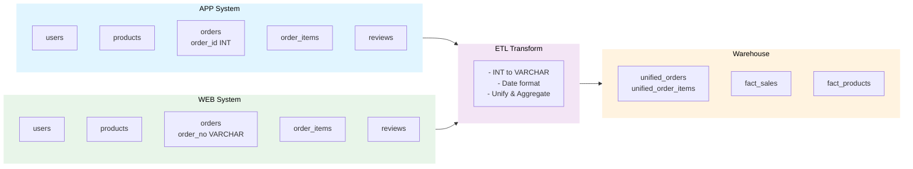

# 📊 数据库设计 - App/Web数据融合架构

## 系统架构概览



## 异构数据处理总览

| 特性           | ecommerce_source_app | ecommerce_source_web |
| -------------- | -------------------- | -------------------- |
| **渠道**       | 移动应用端           | 网站门户端           |
| **订单ID字段** | order_id             | order_no             |
| **ID数据类型** | INT (12345)          | VARCHAR (WEB-001)    |
| **日期格式**   | yyyy-MM-dd           | MM/dd/yyyy           |
| **示例日期**   | 2024-03-15           | 03/15/2024           |

**需要处理的ETL任务**：

- ✅ 字段名统一：order_id / order_no → 统一处理
- ✅ 数据类型转换：INT → VARCHAR
- ✅ 日期格式转换：MM/dd/yyyy → yyyy-MM-dd

---

## 数据库1：应用端源库 (ecommerce_source_app)

### 库的用途

- 存储移动应用渠道的所有业务数据
- 包含5张业务表
- 订单ID使用整数类型：`order_id INT`
- 日期格式：`yyyy-MM-dd`

### 表结构

#### 1. 用户表 (users)

```sql
CREATE TABLE users (
    user_id INT PRIMARY KEY AUTO_INCREMENT,
    name VARCHAR(100) NOT NULL,
    email VARCHAR(100) UNIQUE,
    phone VARCHAR(20),
    city VARCHAR(50),
    register_date DATE,
    created_at TIMESTAMP DEFAULT CURRENT_TIMESTAMP,
    updated_at TIMESTAMP DEFAULT CURRENT_TIMESTAMP ON UPDATE CURRENT_TIMESTAMP
) ENGINE=InnoDB DEFAULT CHARSET=utf8mb4 COLLATE=utf8mb4_unicode_ci;
```

#### 2. 商品表 (products)

```sql
CREATE TABLE products (
    product_id INT PRIMARY KEY AUTO_INCREMENT,
    name VARCHAR(200) NOT NULL,
    description TEXT,
    category VARCHAR(50) NOT NULL,
    price DECIMAL(10,2) NOT NULL,
    cost DECIMAL(10,2),
    brand VARCHAR(50),
    stock_qty INT DEFAULT 0,
    is_active BOOLEAN DEFAULT TRUE,
    created_at TIMESTAMP DEFAULT CURRENT_TIMESTAMP,
    updated_at TIMESTAMP DEFAULT CURRENT_TIMESTAMP ON UPDATE CURRENT_TIMESTAMP,
    INDEX idx_category (category),
    INDEX idx_brand (brand)
) ENGINE=InnoDB DEFAULT CHARSET=utf8mb4 COLLATE=utf8mb4_unicode_ci;
```

#### 3. 订单表 (orders)

```sql
CREATE TABLE orders (
    order_id INT PRIMARY KEY AUTO_INCREMENT,           -- 应用端使用整数
    user_id INT NOT NULL,
    order_date DATE NOT NULL,                          -- yyyy-MM-dd 格式
    total_amount DECIMAL(12,2) NOT NULL,
    status VARCHAR(20) DEFAULT 'completed',
    created_at TIMESTAMP DEFAULT CURRENT_TIMESTAMP,
    updated_at TIMESTAMP DEFAULT CURRENT_TIMESTAMP ON UPDATE CURRENT_TIMESTAMP,
    FOREIGN KEY (user_id) REFERENCES users(user_id),
    INDEX idx_user_id (user_id),
    INDEX idx_order_date (order_date)
) ENGINE=InnoDB DEFAULT CHARSET=utf8mb4 COLLATE=utf8mb4_unicode_ci;
```

#### 4. 订单明细表 (order_items)

```sql
CREATE TABLE order_items (
    item_id INT PRIMARY KEY AUTO_INCREMENT,
    order_id INT NOT NULL,
    product_id INT NOT NULL,
    quantity INT NOT NULL,
    unit_price DECIMAL(10,2) NOT NULL,
    line_total DECIMAL(12,2) NOT NULL,
    created_at TIMESTAMP DEFAULT CURRENT_TIMESTAMP,
    FOREIGN KEY (order_id) REFERENCES orders(order_id) ON DELETE CASCADE,
    FOREIGN KEY (product_id) REFERENCES products(product_id),
    INDEX idx_order_id (order_id),
    INDEX idx_product_id (product_id)
) ENGINE=InnoDB DEFAULT CHARSET=utf8mb4 COLLATE=utf8mb4_unicode_ci;
```

#### 5. 商品评论表 (product_reviews)

```sql
CREATE TABLE product_reviews (
    review_id INT PRIMARY KEY AUTO_INCREMENT,
    product_id INT NOT NULL,
    user_id INT,
    rating INT CHECK (rating >= 1 AND rating <= 5),
    comment TEXT,
    review_date DATE,
    created_at TIMESTAMP DEFAULT CURRENT_TIMESTAMP,
    FOREIGN KEY (product_id) REFERENCES products(product_id),
    FOREIGN KEY (user_id) REFERENCES users(user_id),
    INDEX idx_product_id (product_id),
    INDEX idx_rating (rating)
) ENGINE=InnoDB DEFAULT CHARSET=utf8mb4 COLLATE=utf8mb4_unicode_ci;
```

---

## 数据库2：网站端源库 (ecommerce_source_web)

### 库的用途

- 存储网站、H5等Web渠道的业务数据
- 包含5张业务表（结构与source_app相同，主要区别在订单表）
- 订单ID使用字符串类型：`order_no VARCHAR`
- 日期格式需要特殊处理：`MM/dd/yyyy`（ETL时转换为yyyy-MM-dd）

### 表结构主要区别

#### 3. 订单表 (orders) - Web渠道特殊处理

```sql
CREATE TABLE orders (
    order_no VARCHAR(50) PRIMARY KEY,                  -- Web端订单号为主键 (WEB-001等)
    user_id INT NOT NULL,
    order_date DATE NOT NULL,                          -- MM/dd/yyyy格式需在ETL转换为yyyy-MM-dd
    total_amount DECIMAL(12,2) NOT NULL,
    status VARCHAR(20) DEFAULT 'completed',
    created_at TIMESTAMP DEFAULT CURRENT_TIMESTAMP,
    updated_at TIMESTAMP DEFAULT CURRENT_TIMESTAMP ON UPDATE CURRENT_TIMESTAMP,
    FOREIGN KEY (user_id) REFERENCES users(user_id),
    INDEX idx_user_id (user_id),
    INDEX idx_order_date (order_date)
) ENGINE=InnoDB DEFAULT CHARSET=utf8mb4 COLLATE=utf8mb4_unicode_ci;
```

#### 4. 订单明细表 (order_items) - Web渠道

```sql
CREATE TABLE order_items (
    item_id INT PRIMARY KEY AUTO_INCREMENT,
    order_no VARCHAR(50) NOT NULL,                     -- 关联到orders.order_no
    product_id INT NOT NULL,
    quantity INT NOT NULL,
    unit_price DECIMAL(10,2) NOT NULL,
    line_total DECIMAL(12,2) NOT NULL,
    created_at TIMESTAMP DEFAULT CURRENT_TIMESTAMP,
    FOREIGN KEY (order_no) REFERENCES orders(order_no) ON DELETE CASCADE,
    FOREIGN KEY (product_id) REFERENCES products(product_id),
    INDEX idx_order_no (order_no),
    INDEX idx_product_id (product_id)
) ENGINE=InnoDB DEFAULT CHARSET=utf8mb4 COLLATE=utf8mb4_unicode_ci;
```

#### 5. 商品评论表 (product_reviews) - Web渠道

```sql
CREATE TABLE product_reviews (
    review_id INT PRIMARY KEY AUTO_INCREMENT,
    product_id INT NOT NULL,
    user_id INT,
    rating INT CHECK (rating >= 1 AND rating <= 5),
    comment TEXT,
    review_date DATE,
    created_at TIMESTAMP DEFAULT CURRENT_TIMESTAMP,
    FOREIGN KEY (product_id) REFERENCES products(product_id),
    FOREIGN KEY (user_id) REFERENCES users(user_id),
    INDEX idx_product_id (product_id),
    INDEX idx_rating (rating)
) ENGINE=InnoDB DEFAULT CHARSET=utf8mb4 COLLATE=utf8mb4_unicode_ci;
```

---

## 数据库3：分析数据仓库 (ecommerce_warehouse)

### 库的用途

- 存储ETL处理后的统一、清洁、分析就绪的数据
- 包含4张表：2张统一订单表（中间聚合）+ 2张分析事实表
- 整合App和Web两个渠道的数据，处理异构数据差异
- 统一订单表为后续分析表提供清洁、标准化的输入

### 表结构

#### 1. 统一订单表 (unified_orders)

将App和Web的订单数据统一存储在一个表中，通过`source`字段区分渠道。该表作为中间聚合层，无需每次都进行复杂的UNION操作。

```sql
CREATE TABLE unified_orders (
    -- 主键
    id INT PRIMARY KEY AUTO_INCREMENT COMMENT '统一订单主键',

    -- 渠道识别
    source ENUM('APP', 'WEB') NOT NULL COMMENT '订单来源（APP/WEB）',

    -- 原始订单ID（存储原渠道的订单号）
    app_order_id INT COMMENT 'App渠道订单ID（如source=APP则不为空）',
    web_order_no VARCHAR(50) COMMENT 'Web渠道订单号（如source=WEB则不为空）',

    -- 用户信息
    user_id INT NOT NULL COMMENT '用户ID',
    user_name VARCHAR(100) COMMENT '用户名称',
    user_email VARCHAR(100) COMMENT '用户邮箱',
    user_phone VARCHAR(20) COMMENT '用户联系电话',
    user_city VARCHAR(50) COMMENT '用户所在城市',

    -- 订单信息
    order_date DATE NOT NULL COMMENT '订单日期（统一格式：yyyy-MM-dd）',
    total_amount DECIMAL(12,2) NOT NULL COMMENT '订单总金额',
    status VARCHAR(20) DEFAULT 'completed' COMMENT '订单状态（completed/pending/cancelled）',

    -- 商品统计
    item_count INT DEFAULT 0 COMMENT '订单包含商品数量',
    total_quantity INT DEFAULT 0 COMMENT '订单包含商品总件数',

    -- 元数据
    created_at TIMESTAMP DEFAULT CURRENT_TIMESTAMP COMMENT '记录创建时间',
    updated_at TIMESTAMP DEFAULT CURRENT_TIMESTAMP ON UPDATE CURRENT_TIMESTAMP COMMENT '记录更新时间',

    -- 唯一性约束（确保不重复聚合）
    UNIQUE KEY uniq_order_source (source, app_order_id, web_order_no),

    -- 索引优化
    INDEX idx_source (source),
    INDEX idx_order_date (order_date),
    INDEX idx_user_id (user_id),
    INDEX idx_source_date (source, order_date),
    INDEX idx_status (status)

) ENGINE=InnoDB DEFAULT CHARSET=utf8mb4 COLLATE=utf8mb4_unicode_ci COMMENT='统一订单表：App+Web订单聚合';
```

**数据加载策略**：

统一订单表从App和Web源初始化，经过自动化ETL流程：

```sql
-- 从App源加载
INSERT INTO unified_orders (
    source, app_order_id, web_order_no,
    user_id, user_name, user_email, user_phone, user_city,
    order_date, total_amount, status, item_count, total_quantity
)
SELECT
    'APP' as source, o.order_id, NULL,
    o.user_id, u.name, u.email, u.phone, u.city,
    o.order_date, o.total_amount, o.status,
    COUNT(oi.item_id), SUM(oi.quantity)
FROM ecommerce_source_app.orders o
JOIN ecommerce_source_app.users u ON o.user_id = u.user_id
LEFT JOIN ecommerce_source_app.order_items oi ON o.order_id = oi.order_id
WHERE o.status = 'completed'
GROUP BY o.order_id;

-- 从Web源加载
INSERT INTO unified_orders (
    source, app_order_id, web_order_no,
    user_id, user_name, user_email, user_phone, user_city,
    order_date, total_amount, status, item_count, total_quantity
)
SELECT
    'WEB', NULL, o.order_no,
    o.user_id, u.name, u.email, u.phone, u.city,
    STR_TO_DATE(o.order_date, '%m/%d/%Y'), o.total_amount, o.status,
    COUNT(oi.item_id), SUM(oi.quantity)
FROM ecommerce_source_web.orders o
JOIN ecommerce_source_web.users u ON o.user_id = u.user_id
LEFT JOIN ecommerce_source_web.order_items oi ON o.order_no = oi.order_no
WHERE o.status = 'completed'
GROUP BY o.order_no;
```

#### 2. 统一订单明细表 (unified_order_items)

存储统一订单下的每条商品明细，支持订单+商品维度的分析。

```sql
CREATE TABLE unified_order_items (
    -- 主键
    id INT PRIMARY KEY AUTO_INCREMENT COMMENT '订单明细主键',

    -- 关联关系
    unified_order_id INT NOT NULL COMMENT '关联到unified_orders.id',

    -- 源数据ID
    source ENUM('APP', 'WEB') NOT NULL COMMENT '订单来源（用于追溯原始记录）',
    app_item_id INT COMMENT 'App端原始item_id',
    web_item_id INT COMMENT 'Web端原始item_id',

    -- 商品信息
    product_id INT NOT NULL COMMENT '商品ID',
    product_name VARCHAR(200) COMMENT '商品名称',
    category VARCHAR(50) COMMENT '商品分类',
    brand VARCHAR(50) COMMENT '商品品牌',

    -- 订单明细数据
    quantity INT NOT NULL COMMENT '购买数量',
    unit_price DECIMAL(10,2) NOT NULL COMMENT '单价',
    line_total DECIMAL(12,2) NOT NULL COMMENT '小计（数量*单价）',

    -- 元数据
    created_at TIMESTAMP DEFAULT CURRENT_TIMESTAMP COMMENT '记录创建时间',

    -- 外键关联
    FOREIGN KEY (unified_order_id) REFERENCES unified_orders(id) ON DELETE CASCADE,

    -- 索引优化
    INDEX idx_unified_order_id (unified_order_id),
    INDEX idx_source (source),
    INDEX idx_product_id (product_id),
    INDEX idx_category (category)

) ENGINE=InnoDB DEFAULT CHARSET=utf8mb4 COLLATE=utf8mb4_unicode_ci COMMENT='统一订单明细表：统一格式的订单行项目';
```

**数据加载策略**：

```sql
-- App端订单明细
INSERT INTO unified_order_items (
    unified_order_id, source, app_item_id, web_item_id,
    product_id, product_name, category, brand,
    quantity, unit_price, line_total
)
SELECT
    uo.id, 'APP', oi.item_id, NULL,
    oi.product_id, p.name, p.category, p.brand,
    oi.quantity, oi.unit_price, oi.line_total
FROM unified_orders uo
JOIN ecommerce_source_app.order_items oi ON uo.app_order_id = oi.order_id
JOIN ecommerce_source_app.products p ON oi.product_id = p.product_id
WHERE uo.source = 'APP';

-- Web端订单明细
INSERT INTO unified_order_items (
    unified_order_id, source, app_item_id, web_item_id,
    product_id, product_name, category, brand,
    quantity, unit_price, line_total
)
SELECT
    uo.id, 'WEB', NULL, oi.item_id,
    oi.product_id, p.name, p.category, p.brand,
    oi.quantity, oi.unit_price, oi.line_total
FROM unified_orders uo
JOIN ecommerce_source_web.order_items oi ON uo.web_order_no = oi.order_no
JOIN ecommerce_source_web.products p ON oi.product_id = p.product_id
WHERE uo.source = 'WEB';
```

#### 3. 按分类和时间的销量事实表 (fact_sales_by_category_time)

```sql
CREATE TABLE fact_sales_by_category_time (
    id INT PRIMARY KEY AUTO_INCREMENT,

    -- 维度
    category VARCHAR(50) NOT NULL,                     -- 商品分类
    year INT NOT NULL,                                 -- 年份
    month INT NOT NULL,                                -- 月份 (1-12)
    day INT,                                           -- 日期 (1-31)

    -- 指标
    total_quantity INT DEFAULT 0,                      -- 销量大于
    total_sales_amount DECIMAL(15,2) DEFAULT 0,        -- 销售额

    -- 元数据
    created_at TIMESTAMP DEFAULT CURRENT_TIMESTAMP,
    updated_at TIMESTAMP DEFAULT CURRENT_TIMESTAMP ON UPDATE CURRENT_TIMESTAMP,

    -- 索引优化
    UNIQUE KEY uniq_category_time (category, year, month, day),
    INDEX idx_category (category),
    INDEX idx_time (year, month, day)
) ENGINE=InnoDB DEFAULT CHARSET=utf8mb4 COLLATE=utf8mb4_unicode_ci;
```

**示例数据**：

```
Category: Electronics, Year: 2024, Month: 03, Day: 15, Quantity: 150, Amount: 45000
Category: Clothing, Year: 2024, Month: 03, Day: 15, Quantity: 200, Amount: 15000
```

#### 2. 按评分统计的Top商品表 (fact_top_rated_products)

```sql
CREATE TABLE fact_top_rated_products (
    id INT PRIMARY KEY AUTO_INCREMENT,

    -- 业务标识
    product_id INT NOT NULL,
    product_name VARCHAR(200) NOT NULL,
    category VARCHAR(50),

    -- 评价指标
    avg_rating DECIMAL(3,2),                          -- 平均评分 (0.00-5.00)
    review_count INT DEFAULT 0,                        -- 评论总数

    -- 时间维度
    year INT,
    month INT,
    day INT,

    -- 元数据
    created_at TIMESTAMP DEFAULT CURRENT_TIMESTAMP,
    updated_at TIMESTAMP DEFAULT CURRENT_TIMESTAMP ON UPDATE CURRENT_TIMESTAMP,

    -- 索引优化
    INDEX idx_product_id (product_id),
    INDEX idx_avg_rating (avg_rating DESC),
    INDEX idx_category (category)
) ENGINE=InnoDB DEFAULT CHARSET=utf8mb4 COLLATE=utf8mb4_unicode_ci;
```

**示例数据**：

```
Product: iPhone 14, Category: Electronics, Avg Rating: 4.8, Review Count: 150
Product: MacBook Pro, Category: Electronics, Avg Rating: 4.7, Review Count: 120
```

---

## ETL 数据转换方案

### 问题：异构数据格式不一致

| 问题           | App源       | Web源             | 解决方案          |
| -------------- | ----------- | ----------------- | ----------------- |
| **订单ID类型** | INT (12345) | VARCHAR (WEB-001) | 统一为VARCHAR存储 |
| **日期格式**   | yyyy-MM-dd  | MM/dd/yyyy        | 统一为yyyy-MM-dd  |
| **字段名**     | order_id    | order_no          | 映射处理          |

### ETL查询示例

**从App源提取**：

```sql
SELECT
    CAST(o.order_id AS CHAR) as order_id_unified,     -- 转换为VARCHAR
    o.order_date,                                      -- 已是yyyy-MM-dd格式
    oi.quantity,
    p.category
FROM app.orders o
JOIN app.order_items oi ON o.order_id = oi.order_id
JOIN app.products p ON oi.product_id = p.product_id;
```

**从Web源提取**：

```sql
SELECT
    o.order_no as order_id_unified,                    -- 已是VARCHAR格式
    STR_TO_DATE(o.order_date, '%m/%d/%Y') as order_date, -- 转换日期格式
    oi.quantity,
    p.category
FROM web.orders o
JOIN web.order_items oi ON o.order_no = oi.order_no
JOIN web.products p ON oi.product_id = p.product_id;
```

**ETL整合到仓库**（销量事实表）：

```sql
INSERT INTO warehouse.fact_sales_by_category_time (category, year, month, day, total_quantity, total_sales_amount)
SELECT
    p.category,
    YEAR(o.order_date) as year,
    MONTH(o.order_date) as month,
    DAY(o.order_date) as day,
    SUM(oi.quantity) as total_quantity,
    SUM(oi.line_total) as total_sales_amount
FROM
    (-- 合并App源
     SELECT o.order_date, oi.quantity, oi.line_total, p.category
     FROM app.orders o
     JOIN app.order_items oi ON o.order_id = oi.order_id
     JOIN app.products p ON oi.product_id = p.product_id
     WHERE o.status = 'completed'

     UNION ALL

     -- 合并Web源
     SELECT STR_TO_DATE(o.order_date, '%m/%d/%Y'), oi.quantity, oi.line_total, p.category
     FROM web.orders o
     JOIN web.order_items oi ON o.order_no = oi.order_no
     JOIN web.products p ON oi.product_id = p.product_id
     WHERE o.status = 'completed'
    ) as unified_data
GROUP BY p.category, year, month, day;
```

---

## 索引策略

### App源 (ecommerce_source_app)

- `orders(order_date)` - 时间序列查询
- `order_items(order_id, product_id)` - 订单明细查询
- `products(category)` - 分类统计

### Web源 (ecommerce_source_web)

- `orders(order_date)` - 时间序列查询
- `orders(order_no)` - 订单号查询
- `product_reviews(rating)` - 评分排序

### 仓库 (ecommerce_warehouse)

**统一订单表**:

- `idx_source` - 按渠道筛选
- `idx_order_date` - 按日期排序和范围查询
- `idx_user_id` - 查询用户订单
- `idx_source_date` - 复合筛选（渠道+日期）
- `idx_status` - 按状态筛选

**统一订单明细表**:

- `idx_unified_order_id` - 订单明细JOIN
- `idx_source` - 溯源原始记录
- `idx_product_id` - 商品维度分析
- `idx_category` - 分类统计分析

**分析表**:

- `fact_sales_by_category_time(category, year, month, day)` - 多维度聚合
- `fact_top_rated_products(avg_rating DESC)` - 排行榜查询

---

## 常见查询模式

### 统一订单查询

**获取所有统一订单（分页）**：

```sql
SELECT id, source, user_name, order_date, total_amount
FROM unified_orders
WHERE status = 'completed'
ORDER BY order_date DESC
LIMIT 20 OFFSET 0;
```

**获取订单详情含明细**：

```sql
SELECT o.*, i.product_name, i.category, i.quantity, i.unit_price
FROM unified_orders o
LEFT JOIN unified_order_items i ON o.id = i.unified_order_id
WHERE o.id = ?;
```

**App vs Web订单统计**：

```sql
SELECT source, COUNT(*) as count, SUM(total_amount) as sales
FROM unified_orders WHERE status = 'completed'
GROUP BY source;
```

**按分类统计**：

```sql
SELECT i.category, o.source, COUNT(DISTINCT o.id) as orders, SUM(i.quantity) as qty
FROM unified_orders o JOIN unified_order_items i ON o.id = i.unified_order_id
WHERE o.status = 'completed'
GROUP BY i.category, o.source
ORDER BY total_sales DESC;
```

### 分析查询

**分类销量趋势**：

```sql
SELECT category, year, month, total_quantity, total_sales_amount
FROM fact_sales_by_category_time
ORDER BY year DESC, month DESC;
```

**Top评分商品**：

```sql
SELECT product_name, category, avg_rating, review_count
FROM fact_top_rated_products
ORDER BY avg_rating DESC LIMIT 10;
```

---

## 数据架构总结

该数据库设计采用**三层仓库架构**：

| 层级 | 数据库 | 用途 | 核心特性 |
|------|--------|------|---------|
| **源数据层** | ecommerce_source_app, ecommerce_source_web | 存储原始交易数据 | 异构系统，数据格式不一致 |
| **中间聚合层** | unified_orders, unified_order_items | 统一订单数据 | 去重、聚合、格式统一 |
| **分析层** | fact_sales_by_category_time, fact_top_rated_products | 支持BI查询和报表 | 多维度聚合、预计算 |

**统一订单表的价值**：
- 消除异构数据差异（INT vs VARCHAR, 日期格式等）
- 提供高性能的订单查询接口
- 支持应用层快速展示统一订单视图
- 为后续分析表提供清洁的数据源
