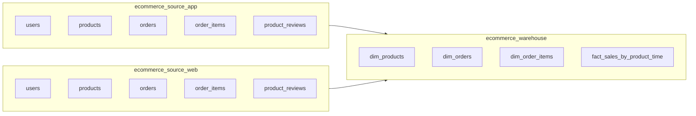

# 数据库设计文档（与SQL同步）

本文件已按以下3个SQL文件同步更新：

- `sql/01-app-schema.sql`
- `sql/02-web-schema.sql`
- `sql/03-warehouse-schema.sql`

## 1. 总体架构

系统包含三个数据库：

- `ecommerce_source_app`：APP 渠道源数据
- `ecommerce_source_web`：WEB 渠道源数据
- `ecommerce_warehouse`：数据仓库与分析模型

## 2. APP 与 WEB 源库差异

| 主题                       | APP (`ecommerce_source_app`)                        | WEB (`ecommerce_source_web`)                        |
| -------------------------- | --------------------------------------------------- | --------------------------------------------------- |
| 订单主键字段               | `orders.order_id`                                   | `orders.order_no`                                   |
| 订单主键类型               | `INT AUTO_INCREMENT`                                | `VARCHAR(50)`                                       |
| `order_items` 到订单的外键 | `order_items.order_id`                              | `order_items.order_no`                              |
| 业务表集合                 | `users/products/orders/order_items/product_reviews` | `users/products/orders/order_items/product_reviews` |

说明：两个源库中，`orders.order_date` 在DDL里都定义为 MySQL `DATE`。

## 3. `ecommerce_source_app`（来自 `01-app-schema.sql`）

### 3.1 表清单

1. `users`
2. `products`
3. `orders`
4. `order_items`
5. `product_reviews`

### 3.2 关键字段与约束

- `users`
  - 主键：`user_id`
  - 唯一键：`username`、`email`
- `products`
  - 主键：`product_id`
  - 索引：`idx_category`、`idx_product_name`
- `orders`
  - 主键：`order_id`
  - 外键：`user_id -> users.user_id`
  - 索引：`idx_order_date`、`idx_user_id`、`idx_status`
- `order_items`
  - 主键：`order_item_id`
  - 外键：`order_id -> orders.order_id`（级联删除）
  - 外键：`product_id -> products.product_id`
- `product_reviews`
  - 主键：`review_id`
  - 外键：`product_id -> products.product_id`
  - 外键：`user_id -> users.user_id`
  - 检查约束：`rating` 在 1 到 5 之间

## 4. `ecommerce_source_web`（来自 `02-web-schema.sql`）

### 4.1 表清单

1. `users`
2. `products`
3. `orders`
4. `order_items`
5. `product_reviews`

### 4.2 关键字段与约束

- `users`
  - 主键：`user_id`
  - 唯一键：`username`、`email`
- `products`
  - 主键：`product_id`
  - 索引：`idx_category`、`idx_product_name`
- `orders`
  - 主键：`order_no`（`VARCHAR(50)`）
  - 外键：`user_id -> users.user_id`
  - 索引：`idx_order_date`、`idx_user_id`、`idx_status`
- `order_items`
  - 主键：`order_item_id`
  - 外键：`order_no -> orders.order_no`（级联删除）
  - 外键：`product_id -> products.product_id`
- `product_reviews`
  - 主键：`review_id`
  - 外键：`product_id -> products.product_id`
  - 外键：`user_id -> users.user_id`
  - 检查约束：`rating` 在 1 到 5 之间

## 5. `ecommerce_warehouse`（来自 `03-warehouse-schema.sql`）

### 5.1 表清单

1. `dim_products`
2. `dim_orders`
3. `dim_order_items`
4. `fact_sales_by_product_time`

### 5.2 仓库模型说明

- `dim_products`
  - 主键：`product_key`（代理键）
  - 业务唯一键：`UNIQUE(source, product_id)`
  - 作用：同一个 `product_id` 在 APP/WEB 下可共存，通过 `source` 区分

- `dim_orders`
  - 主键：`order_id`（仓库内部订单键）
  - 统一订单标识字段：
    - APP：`app_order_id`
    - WEB：`web_order_no`
  - 唯一约束：`UNIQUE(source, app_order_id, web_order_no)`

- `dim_order_items`
  - 主键：`item_id`
  - 外键：`order_id -> dim_orders.order_id`（级联删除）
  - 额外保留分析字段：`product_name`、`category` 等

- `fact_sales_by_product_time`
  - 主键：`fact_id`
  - 外键：`product_key -> dim_products.product_key`
  - 粒度：`(product_key, year, month, day)`
  - 唯一约束：`UNIQUE(product_key, year, month, day)`

## 6. 关系摘要

### 6.1 APP 源库

- `users (1) -> (N) orders`
- `orders (1) -> (N) order_items`
- `products (1) -> (N) order_items`
- `users (1) -> (N) product_reviews`
- `products (1) -> (N) product_reviews`

### 6.2 WEB 源库

- `users (1) -> (N) orders`
- `orders (1) -> (N) order_items`（通过 `order_no`）
- `products (1) -> (N) order_items`
- `users (1) -> (N) product_reviews`
- `products (1) -> (N) product_reviews`

### 6.3 仓库

- `dim_orders (1) -> (N) dim_order_items`
- `dim_products (1) -> (N) fact_sales_by_product_time`

## 7. ETL 映射规则

### 7.1 订单标识映射

- APP 订单号：`orders.order_id -> dim_orders.app_order_id`
- WEB 订单号：`orders.order_no -> dim_orders.web_order_no`

### 7.2 商品映射

- 以 `(source, product_id)` 定位或写入 `dim_products`
- 在事实表中使用 `dim_products.product_key`

### 7.3 时间粒度

- 从订单日期拆分出 `year`、`month`、`day`
- 聚合指标写入 `fact_sales_by_product_time`：
  - `total_quantity`
  - `total_sales_amount`

## 8. 索引与性能要点

- 源库已具备常见查询索引（日期、用户、状态、外键连接路径）。
- 仓库核心索引：
  - `dim_orders.idx_source_date`
  - `dim_products.uk_source_product`
  - `fact_sales_by_product_time.uk_product_time`
  - `fact_sales_by_product_time.idx_year_month_day`

## 9. 文档范围说明

本文件只描述上述3个SQL文件中实际存在的对象。
若后续新增表（例如同步日志、审计表等），请在DDL变更合入后同步更新本文件。
