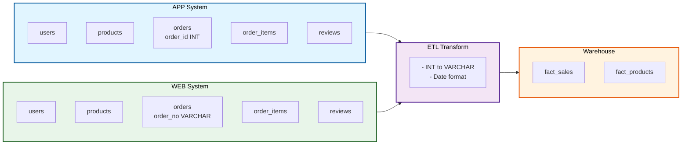

# 📊 数据库设计 - App/Web数据融合架构

## 系统架构概览



## 异构数据处理总览

| 特性           | ecommerce_source_app | ecommerce_source_web |
| -------------- | -------------------- | -------------------- |
| **渠道**       | 移动应用端           | 网站门户端           |
| **订单ID字段** | order_id             | order_no             |
| **ID数据类型** | INT (12345)          | VARCHAR (WEB-001)    |
| **日期格式**   | yyyy-MM-dd           | MM/dd/yyyy           |
| **示例日期**   | 2024-03-15           | 03/15/2024           |

**需要处理的ETL任务**：

- ✅ 字段名统一：order_id / order_no → 统一处理
- ✅ 数据类型转换：INT → VARCHAR
- ✅ 日期格式转换：MM/dd/yyyy → yyyy-MM-dd

---

## 数据库1：应用端源库 (ecommerce_source_app)

### 库的用途

- 存储移动应用渠道的所有业务数据
- 包含5张业务表
- 订单ID使用整数类型：`order_id INT`
- 日期格式：`yyyy-MM-dd`

### 表结构

#### 1. 用户表 (users)

```sql
CREATE TABLE users (
    user_id INT PRIMARY KEY AUTO_INCREMENT,
    name VARCHAR(100) NOT NULL,
    email VARCHAR(100) UNIQUE,
    phone VARCHAR(20),
    city VARCHAR(50),
    register_date DATE,
    created_at TIMESTAMP DEFAULT CURRENT_TIMESTAMP,
    updated_at TIMESTAMP DEFAULT CURRENT_TIMESTAMP ON UPDATE CURRENT_TIMESTAMP
) ENGINE=InnoDB DEFAULT CHARSET=utf8mb4 COLLATE=utf8mb4_unicode_ci;
```

#### 2. 商品表 (products)

```sql
CREATE TABLE products (
    product_id INT PRIMARY KEY AUTO_INCREMENT,
    name VARCHAR(200) NOT NULL,
    description TEXT,
    category VARCHAR(50) NOT NULL,
    price DECIMAL(10,2) NOT NULL,
    cost DECIMAL(10,2),
    brand VARCHAR(50),
    stock_qty INT DEFAULT 0,
    is_active BOOLEAN DEFAULT TRUE,
    created_at TIMESTAMP DEFAULT CURRENT_TIMESTAMP,
    updated_at TIMESTAMP DEFAULT CURRENT_TIMESTAMP ON UPDATE CURRENT_TIMESTAMP,
    INDEX idx_category (category),
    INDEX idx_brand (brand)
) ENGINE=InnoDB DEFAULT CHARSET=utf8mb4 COLLATE=utf8mb4_unicode_ci;
```

#### 3. 订单表 (orders)

```sql
CREATE TABLE orders (
    order_id INT PRIMARY KEY AUTO_INCREMENT,           -- 应用端使用整数
    user_id INT NOT NULL,
    order_date DATE NOT NULL,                          -- yyyy-MM-dd 格式
    total_amount DECIMAL(12,2) NOT NULL,
    status VARCHAR(20) DEFAULT 'completed',
    created_at TIMESTAMP DEFAULT CURRENT_TIMESTAMP,
    updated_at TIMESTAMP DEFAULT CURRENT_TIMESTAMP ON UPDATE CURRENT_TIMESTAMP,
    FOREIGN KEY (user_id) REFERENCES users(user_id),
    INDEX idx_user_id (user_id),
    INDEX idx_order_date (order_date)
) ENGINE=InnoDB DEFAULT CHARSET=utf8mb4 COLLATE=utf8mb4_unicode_ci;
```

#### 4. 订单明细表 (order_items)

```sql
CREATE TABLE order_items (
    item_id INT PRIMARY KEY AUTO_INCREMENT,
    order_id INT NOT NULL,
    product_id INT NOT NULL,
    quantity INT NOT NULL,
    unit_price DECIMAL(10,2) NOT NULL,
    line_total DECIMAL(12,2) NOT NULL,
    created_at TIMESTAMP DEFAULT CURRENT_TIMESTAMP,
    FOREIGN KEY (order_id) REFERENCES orders(order_id) ON DELETE CASCADE,
    FOREIGN KEY (product_id) REFERENCES products(product_id),
    INDEX idx_order_id (order_id),
    INDEX idx_product_id (product_id)
) ENGINE=InnoDB DEFAULT CHARSET=utf8mb4 COLLATE=utf8mb4_unicode_ci;
```

#### 5. 商品评论表 (product_reviews)

```sql
CREATE TABLE product_reviews (
    review_id INT PRIMARY KEY AUTO_INCREMENT,
    product_id INT NOT NULL,
    user_id INT,
    rating INT CHECK (rating >= 1 AND rating <= 5),
    comment TEXT,
    review_date DATE,
    created_at TIMESTAMP DEFAULT CURRENT_TIMESTAMP,
    FOREIGN KEY (product_id) REFERENCES products(product_id),
    FOREIGN KEY (user_id) REFERENCES users(user_id),
    INDEX idx_product_id (product_id),
    INDEX idx_rating (rating)
) ENGINE=InnoDB DEFAULT CHARSET=utf8mb4 COLLATE=utf8mb4_unicode_ci;
```

---

## 数据库2：网站端源库 (ecommerce_source_web)

### 库的用途

- 存储网站、H5等Web渠道的业务数据
- 包含5张业务表（结构与source_app相同，主要区别在订单表）
- 订单ID使用字符串类型：`order_no VARCHAR`
- 日期格式需要特殊处理：`MM/dd/yyyy`（ETL时转换为yyyy-MM-dd）

### 表结构主要区别

#### 3. 订单表 (orders) - Web渠道特殊处理

```sql
CREATE TABLE orders (
    order_id INT PRIMARY KEY AUTO_INCREMENT,           -- 内部标识
    order_no VARCHAR(50) NOT NULL UNIQUE,              -- Web端订单号 (WEB-001等)
    user_id INT NOT NULL,
    order_date DATE NOT NULL,                          -- MM/dd/yyyy格式需在ETL转换为yyyy-MM-dd
    total_amount DECIMAL(12,2) NOT NULL,
    status VARCHAR(20) DEFAULT 'completed',
    created_at TIMESTAMP DEFAULT CURRENT_TIMESTAMP,
    updated_at TIMESTAMP DEFAULT CURRENT_TIMESTAMP ON UPDATE CURRENT_TIMESTAMP,
    FOREIGN KEY (user_id) REFERENCES users(user_id),
    INDEX idx_user_id (user_id),
    INDEX idx_order_date (order_date)
) ENGINE=InnoDB DEFAULT CHARSET=utf8mb4 COLLATE=utf8mb4_unicode_ci;
```

**其他表结构与source_app相同**：users、products、order_items、product_reviews

---

## 数据库3：分析数据仓库 (ecommerce_warehouse)

### 库的用途

- 存储ETL处理后的统一、清洁、分析就绪的数据
- 包含2个核心分析表
- 整合App和Web两个渠道的数据，处理异构数据差异

### 表结构

#### 1. 按分类和时间的销量事实表 (fact_sales_by_category_time)

```sql
CREATE TABLE fact_sales_by_category_time (
    id INT PRIMARY KEY AUTO_INCREMENT,

    -- 维度
    category VARCHAR(50) NOT NULL,                     -- 商品分类
    year INT NOT NULL,                                 -- 年份
    month INT NOT NULL,                                -- 月份 (1-12)
    day INT,                                           -- 日期 (1-31)

    -- 指标
    total_quantity INT DEFAULT 0,                      -- 销量大于
    total_sales_amount DECIMAL(15,2) DEFAULT 0,        -- 销售额

    -- 元数据
    created_at TIMESTAMP DEFAULT CURRENT_TIMESTAMP,
    updated_at TIMESTAMP DEFAULT CURRENT_TIMESTAMP ON UPDATE CURRENT_TIMESTAMP,

    -- 索引优化
    UNIQUE KEY uniq_category_time (category, year, month, day),
    INDEX idx_category (category),
    INDEX idx_time (year, month, day)
) ENGINE=InnoDB DEFAULT CHARSET=utf8mb4 COLLATE=utf8mb4_unicode_ci;
```

**示例数据**：

```
Category: Electronics, Year: 2024, Month: 03, Day: 15, Quantity: 150, Amount: 45000
Category: Clothing, Year: 2024, Month: 03, Day: 15, Quantity: 200, Amount: 15000
```

#### 2. 按评分统计的Top商品表 (fact_top_rated_products)

```sql
CREATE TABLE fact_top_rated_products (
    id INT PRIMARY KEY AUTO_INCREMENT,

    -- 业务标识
    product_id INT NOT NULL,
    product_name VARCHAR(200) NOT NULL,
    category VARCHAR(50),

    -- 评价指标
    avg_rating DECIMAL(3,2),                          -- 平均评分 (0.00-5.00)
    review_count INT DEFAULT 0,                        -- 评论总数

    -- 时间维度
    year INT,
    month INT,
    day INT,

    -- 元数据
    created_at TIMESTAMP DEFAULT CURRENT_TIMESTAMP,
    updated_at TIMESTAMP DEFAULT CURRENT_TIMESTAMP ON UPDATE CURRENT_TIMESTAMP,

    -- 索引优化
    INDEX idx_product_id (product_id),
    INDEX idx_avg_rating (avg_rating DESC),
    INDEX idx_category (category)
) ENGINE=InnoDB DEFAULT CHARSET=utf8mb4 COLLATE=utf8mb4_unicode_ci;
```

**示例数据**：

```
Product: iPhone 14, Category: Electronics, Avg Rating: 4.8, Review Count: 150
Product: MacBook Pro, Category: Electronics, Avg Rating: 4.7, Review Count: 120
```

---

## ETL 数据转换方案

### 问题：异构数据格式不一致

| 问题           | App源       | Web源             | 解决方案          |
| -------------- | ----------- | ----------------- | ----------------- |
| **订单ID类型** | INT (12345) | VARCHAR (WEB-001) | 统一为VARCHAR存储 |
| **日期格式**   | yyyy-MM-dd  | MM/dd/yyyy        | 统一为yyyy-MM-dd  |
| **字段名**     | order_id    | order_no          | 映射处理          |

### ETL查询示例

**从App源提取**：

```sql
SELECT
    CAST(o.order_id AS CHAR) as order_id_unified,     -- 转换为VARCHAR
    o.order_date,                                      -- 已是yyyy-MM-dd格式
    oi.quantity,
    p.category
FROM app.orders o
JOIN app.order_items oi ON o.order_id = oi.order_id
JOIN app.products p ON oi.product_id = p.product_id;
```

**从Web源提取**：

```sql
SELECT
    o.order_no as order_id_unified,                    -- 已是VARCHAR格式
    STR_TO_DATE(o.order_date, '%m/%d/%Y') as order_date, -- 转换日期格式
    oi.quantity,
    p.category
FROM web.orders o
JOIN web.order_items oi ON o.order_id = oi.order_id
JOIN web.products p ON oi.product_id = p.product_id;
```

**ETL整合到仓库**（销量事实表）：

```sql
INSERT INTO warehouse.fact_sales_by_category_time (category, year, month, day, total_quantity, total_sales_amount)
SELECT
    p.category,
    YEAR(o.order_date) as year,
    MONTH(o.order_date) as month,
    DAY(o.order_date) as day,
    SUM(oi.quantity) as total_quantity,
    SUM(oi.line_total) as total_sales_amount
FROM
    (-- 合并App源
     SELECT o.order_date, oi.quantity, oi.line_total, p.category
     FROM app.orders o
     JOIN app.order_items oi ON o.order_id = oi.order_id
     JOIN app.products p ON oi.product_id = p.product_id
     WHERE o.status = 'completed'

     UNION ALL

     -- 合并Web源
     SELECT STR_TO_DATE(o.order_date, '%m/%d/%Y'), oi.quantity, oi.line_total, p.category
     FROM web.orders o
     JOIN web.order_items oi ON o.order_id = oi.order_id
     JOIN web.products p ON oi.product_id = p.product_id
     WHERE o.status = 'completed'
    ) as unified_data
GROUP BY p.category, year, month, day;
```

---

## 索引策略

### App源 (ecommerce_source_app)

- `orders(order_date)` - 时间序列查询
- `order_items(order_id, product_id)` - 订单明细查询
- `products(category)` - 分类统计

### Web源 (ecommerce_source_web)

- `orders(order_date)` - 时间序列查询
- `orders(order_no)` - 订单号查询
- `product_reviews(rating)` - 评分排序

### 仓库 (ecommerce_warehouse)

- `fact_sales_by_category_time(category, year, month, day)` - 多维度聚合
- `fact_top_rated_products(avg_rating DESC)` - 排行榜查询
