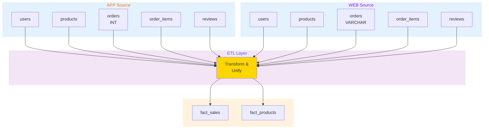

# E-Commerce Data Warehouse - Database Design Document

## System Architecture Diagram



---

## Heterogeneous Data Handling Overview

**Challenge:** Two source systems use different data formats and field naming conventions.

| Data Problem                    | App (source_app)  | Web (source_web)          | Solution                                                |
| ------------------------------- | ----------------- | ------------------------- | ------------------------------------------------------- |
| **Order ID Field Name**         | order_id          | order_no                  | Add `order_id` field in unified query; map both sources |
| **Order ID Data Type Mismatch** | INT (e.g., 12345) | VARCHAR (e.g., "WEB-001") | Convert both to VARCHAR in warehouse                    |
| **Order Date Format Mismatch**  | yyyy-MM-dd        | MM/dd/yyyy                | Unify to yyyy-MM-dd in warehouse; use STR_TO_DATE()     |

---

## Database 1: App Business System (ecommerce_source_app)

### Schema Overview

```sql
CREATE DATABASE IF NOT EXISTS ecommerce_source_app;
USE ecommerce_source_app;
```

### Table: users

```sql
CREATE TABLE users (
    user_id INT PRIMARY KEY AUTO_INCREMENT,
    name VARCHAR(100) NOT NULL,
    email VARCHAR(100) NOT NULL UNIQUE,
    city VARCHAR(50),
    register_date DATE NOT NULL
) ENGINE=InnoDB DEFAULT CHARSET=utf8mb4;

-- Sample data:
-- | user_id | name | email | city | register_date |
-- | 1 | Alice | alice@example.com | New York | 2024-01-15 |
-- | 2 | Bob | bob@example.com | Los Angeles | 2024-02-20 |
```

### Table: products

```sql
CREATE TABLE products (
    product_id INT PRIMARY KEY AUTO_INCREMENT,
    name VARCHAR(200) NOT NULL,
    category VARCHAR(50) NOT NULL,
    price DECIMAL(10,2) NOT NULL,
    brand VARCHAR(100)
) ENGINE=InnoDB DEFAULT CHARSET=utf8mb4;

-- Sample data:
-- | product_id | name | category | price | brand |
-- | 1 | iPhone 14 | Electronics | 999.99 | Apple |
-- | 2 | Samsung Galaxy | Electronics | 799.99 | Samsung |
-- | 3 | T-Shirt | Clothing | 29.99 | Nike |
```

### Table: orders

```sql
CREATE TABLE orders (
    order_id INT PRIMARY KEY AUTO_INCREMENT COMMENT 'Numeric order ID',
    user_id INT NOT NULL,
    order_date DATE NOT NULL COMMENT 'Format: yyyy-MM-dd',
    total_amount DECIMAL(10,2) NOT NULL,
    status VARCHAR(50) DEFAULT 'pending',
    FOREIGN KEY (user_id) REFERENCES users(user_id),
    KEY idx_user_id (user_id),
    KEY idx_order_date (order_date)
) ENGINE=InnoDB DEFAULT CHARSET=utf8mb4;

-- Sample data:
-- | order_id | user_id | order_date | total_amount | status |
-- | 1 | 1 | 2024-03-01 | 999.99 | completed |
-- | 2 | 2 | 2024-03-02 | 829.98 | completed |
```

### Table: order_items

```sql
CREATE TABLE order_items (
    item_id INT PRIMARY KEY AUTO_INCREMENT,
    order_id INT NOT NULL,
    product_id INT NOT NULL,
    quantity INT NOT NULL,
    unit_price DECIMAL(10,2) NOT NULL,
    FOREIGN KEY (order_id) REFERENCES orders(order_id),
    FOREIGN KEY (product_id) REFERENCES products(product_id),
    KEY idx_order_id (order_id),
    KEY idx_product_id (product_id)
) ENGINE=InnoDB DEFAULT CHARSET=utf8mb4;

-- Sample data:
-- | item_id | order_id | product_id | quantity | unit_price |
-- | 1 | 1 | 1 | 1 | 999.99 |
-- | 2 | 2 | 2 | 1 | 799.99 |
```

### Table: product_reviews

```sql
CREATE TABLE product_reviews (
    review_id INT PRIMARY KEY AUTO_INCREMENT,
    product_id INT NOT NULL,
    user_id INT NOT NULL,
    rating INT NOT NULL CHECK (rating >= 1 AND rating <= 5),
    review_date DATE NOT NULL,
    FOREIGN KEY (product_id) REFERENCES products(product_id),
    FOREIGN KEY (user_id) REFERENCES users(user_id),
    KEY idx_product_id (product_id),
    KEY idx_rating (rating)
) ENGINE=InnoDB DEFAULT CHARSET=utf8mb4;

-- Sample data:
-- | review_id | product_id | user_id | rating | review_date |
-- | 1 | 1 | 1 | 5 | 2024-03-05 |
-- | 2 | 1 | 2 | 4 | 2024-03-06 |
```

---

## Database 2: Web Business System (ecommerce_source_web)

### Schema Overview

```sql
CREATE DATABASE IF NOT EXISTS ecommerce_source_web;
USE ecommerce_source_web;
```

### Table: users

```sql
CREATE TABLE users (
    user_id INT PRIMARY KEY AUTO_INCREMENT,
    name VARCHAR(100) NOT NULL,
    email VARCHAR(100) NOT NULL UNIQUE,
    city VARCHAR(50),
    register_date DATE NOT NULL
) ENGINE=InnoDB DEFAULT CHARSET=utf8mb4;
```

### Table: products

```sql
CREATE TABLE products (
    product_id INT PRIMARY KEY AUTO_INCREMENT,
    name VARCHAR(200) NOT NULL,
    category VARCHAR(50) NOT NULL,
    price DECIMAL(10,2) NOT NULL,
    brand VARCHAR(100)
) ENGINE=InnoDB DEFAULT CHARSET=utf8mb4;
```

### Table: orders - ⚠️ **Key Difference from App Source**

```sql
CREATE TABLE orders (
    order_no VARCHAR(50) PRIMARY KEY COMMENT 'Alphanumeric order ID (e.g., WEB-001)',
    user_id INT NOT NULL,
    order_date VARCHAR(10) NOT NULL COMMENT 'Format: MM/dd/yyyy ← Different from App!',
    total_amount DECIMAL(10,2) NOT NULL,
    status VARCHAR(50) DEFAULT 'pending',
    FOREIGN KEY (user_id) REFERENCES users(user_id),
    KEY idx_user_id (user_id),
    KEY idx_order_date (order_date)
) ENGINE=InnoDB DEFAULT CHARSET=utf8mb4;

-- Sample data:
-- | order_no | user_id | order_date | total_amount | status |
-- | WEB-001 | 3 | 03/01/2024 | 999.99 | completed |
-- | WEB-002 | 4 | 03/02/2024 | 829.98 | completed |
```

**Key Difference - Field Name & Format:**

- App source: `order_id` (INT type, e.g., 12345)
- Web source: `order_no` (VARCHAR type, e.g., "WEB-001")
- App date format: `yyyy-MM-dd`
- Web date format: `MM/dd/yyyy`

### Table: order_items - Web Source

```sql
CREATE TABLE order_items (
    item_id INT PRIMARY KEY AUTO_INCREMENT,
    order_no VARCHAR(50) NOT NULL,
    product_id INT NOT NULL,
    quantity INT NOT NULL,
    unit_price DECIMAL(10,2) NOT NULL,
    FOREIGN KEY (order_no) REFERENCES orders(order_no),
    FOREIGN KEY (product_id) REFERENCES products(product_id),
    KEY idx_order_no (order_no),
    KEY idx_product_id (product_id)
) ENGINE=InnoDB DEFAULT CHARSET=utf8mb4;
```

### Table: product_reviews

```sql
CREATE TABLE product_reviews (
    review_id INT PRIMARY KEY AUTO_INCREMENT,
    product_id INT NOT NULL,
    user_id INT NOT NULL,
    rating INT NOT NULL CHECK (rating >= 1 AND rating <= 5),
    review_date DATE NOT NULL,
    FOREIGN KEY (product_id) REFERENCES products(product_id),
    FOREIGN KEY (user_id) REFERENCES users(user_id),
    KEY idx_product_id (product_id),
    KEY idx_rating (rating)
) ENGINE=InnoDB DEFAULT CHARSET=utf8mb4;
```

---

## Database 3: Data Warehouse (ecommerce_warehouse)

### Schema Overview

```sql
CREATE DATABASE IF NOT EXISTS ecommerce_warehouse;
USE ecommerce_warehouse;
```

**Purpose:** Store cleaned, transformed, and unified data optimized for analytics queries.

### Table: fact_sales_by_category_time

**Purpose:** Sales quantity statistics by product category and time dimensions.

```sql
CREATE TABLE fact_sales_by_category_time (
    sale_id INT PRIMARY KEY AUTO_INCREMENT,
    category VARCHAR(50) NOT NULL,
    year INT NOT NULL,
    month INT NOT NULL,
    day INT NOT NULL,
    total_quantity INT NOT NULL DEFAULT 0,
    total_sales_amount DECIMAL(12,2) NOT NULL DEFAULT 0.00,
    created_at DATETIME DEFAULT CURRENT_TIMESTAMP,
    UNIQUE KEY uk_category_time (category, year, month, day),
    KEY idx_category (category),
    KEY idx_year_month (year, month)
) ENGINE=InnoDB DEFAULT CHARSET=utf8mb4;

-- Sample data:
-- | category | year | month | day | total_quantity | total_sales_amount |
-- | Electronics | 2024 | 3 | 1 | 250 | 125000.00 |
-- | Clothing | 2024 | 3 | 1 | 450 | 22500.00 |
-- | Books | 2024 | 3 | 1 | 120 | 4800.00 |
```

### Table: fact_top_rated_products

**Purpose:** Top-rated products with average ratings and review counts by time period.

```sql
CREATE TABLE fact_top_rated_products (
    rank_id INT PRIMARY KEY AUTO_INCREMENT,
    product_id INT NOT NULL,
    product_name VARCHAR(200) NOT NULL,
    category VARCHAR(50) NOT NULL,
    year INT NOT NULL,
    month INT NOT NULL,
    day INT NOT NULL,
    avg_rating DECIMAL(3,2) NOT NULL,
    review_count INT NOT NULL DEFAULT 0,
    created_at DATETIME DEFAULT CURRENT_TIMESTAMP,
    UNIQUE KEY uk_product_time (product_id, year, month, day),
    KEY idx_category (category),
    KEY idx_avg_rating (avg_rating),
    KEY idx_year_month (year, month)
) ENGINE=InnoDB DEFAULT CHARSET=utf8mb4;

-- Sample data:
-- | product_id | product_name | category | year | month | day | avg_rating | review_count |
-- | 1 | iPhone 14 | Electronics | 2024 | 3 | 15 | 4.80 | 250 |
-- | 2 | Samsung Galaxy | Electronics | 2024 | 3 | 15 | 4.70 | 200 |
```

---

## ETL Data Transformation Strategy

### 1. ETL Data Extraction

**Query from App Source System:**

```sql
-- Extract from: ecommerce_source_app
SELECT
    CAST(a.order_id AS CHAR) AS order_id,  -- Normalize to VARCHAR
    a.user_id,
    a.order_date,  -- Already in yyyy-MM-dd format
    p.category,
    oi.quantity,
    oi.unit_price,
    (oi.quantity * oi.unit_price) AS line_amount,
    r.rating,
    'APP' AS source_channel
FROM ecommerce_source_app.orders a
INNER JOIN ecommerce_source_app.order_items oi ON a.order_id = oi.order_id
INNER JOIN ecommerce_source_app.products p ON oi.product_id = p.product_id
LEFT JOIN ecommerce_source_app.product_reviews r ON p.product_id = r.product_id
    AND a.user_id = r.user_id
WHERE a.status = 'completed'
    AND a.order_date >= '2024-01-01';
```

**Query from Web Source System:**

```sql
-- Extract from: ecommerce_source_web
SELECT
    w.order_no AS order_id,  -- Already VARCHAR
    w.user_id,
    STR_TO_DATE(w.order_date, '%m/%d/%Y') AS order_date,  -- Convert MM/dd/yyyy → yyyy-MM-dd
    p.category,
    oi.quantity,
    oi.unit_price,
    (oi.quantity * oi.unit_price) AS line_amount,
    r.rating,
    'WEB' AS source_channel
FROM ecommerce_source_web.orders w
INNER JOIN ecommerce_source_web.order_items oi ON w.order_no = oi.order_no
INNER JOIN ecommerce_source_web.products p ON oi.product_id = p.product_id
LEFT JOIN ecommerce_source_web.product_reviews r ON p.product_id = r.product_id
    AND w.user_id = r.user_id
WHERE w.status = 'completed'
    AND STR_TO_DATE(w.order_date, '%m/%d/%Y') >= '2024-01-01';
```

### 2. ETL Data Unification

**Combined Data Transformation Query (UNION ALL):**

```sql
-- Unified data extraction from both sources
SELECT
    order_id,
    user_id,
    order_date,
    category,
    quantity,
    unit_price,
    line_amount,
    rating,
    source_channel
FROM (
    -- App source
    SELECT
        CAST(a.order_id AS CHAR) AS order_id,
        a.user_id,
        a.order_date,
        p.category,
        oi.quantity,
        oi.unit_price,
        (oi.quantity * oi.unit_price) AS line_amount,
        r.rating,
        'APP' AS source_channel
    FROM ecommerce_source_app.orders a
    INNER JOIN ecommerce_source_app.order_items oi ON a.order_id = oi.order_id
    INNER JOIN ecommerce_source_app.products p ON oi.product_id = p.product_id
    LEFT JOIN ecommerce_source_app.product_reviews r ON p.product_id = r.product_id
        AND a.user_id = r.user_id
    WHERE a.status = 'completed'

    UNION ALL

    -- Web source
    SELECT
        w.order_no AS order_id,
        w.user_id,
        STR_TO_DATE(w.order_date, '%m/%d/%Y') AS order_date,
        p.category,
        oi.quantity,
        oi.unit_price,
        (oi.quantity * oi.unit_price) AS line_amount,
        r.rating,
        'WEB' AS source_channel
    FROM ecommerce_source_web.orders w
    INNER JOIN ecommerce_source_web.order_items oi ON w.order_no = oi.order_no
    INNER JOIN ecommerce_source_web.products p ON oi.product_id = p.product_id
    LEFT JOIN ecommerce_source_web.product_reviews r ON p.product_id = r.product_id
        AND w.user_id = r.user_id
    WHERE w.status = 'completed'
) unified_data
ORDER BY order_date, source_channel;
```

### 3. ETL Data Load into Warehouse

**Populate fact_sales_by_category_time:**

```sql
INSERT INTO ecommerce_warehouse.fact_sales_by_category_time
(category, year, month, day, total_quantity, total_sales_amount)
SELECT
    category,
    YEAR(order_date) AS year,
    MONTH(order_date) AS month,
    DAY(order_date) AS day,
    SUM(quantity) AS total_quantity,
    SUM(line_amount) AS total_sales_amount
FROM (
    -- Insert unified extraction query here
) unified_data
GROUP BY category, YEAR(order_date), MONTH(order_date), DAY(order_date)
ON DUPLICATE KEY UPDATE
    total_quantity = VALUES(total_quantity),
    total_sales_amount = VALUES(total_sales_amount);
```

**Populate fact_top_rated_products:**

```sql
INSERT INTO ecommerce_warehouse.fact_top_rated_products
(product_id, product_name, category, year, month, day, avg_rating, review_count)
SELECT
    p.product_id,
    p.name AS product_name,
    p.category,
    YEAR(r.review_date) AS year,
    MONTH(r.review_date) AS month,
    DAY(r.review_date) AS day,
    AVG(r.rating) AS avg_rating,
    COUNT(r.review_id) AS review_count
FROM (
    SELECT product_id, name, category FROM ecommerce_source_app.products
    UNION ALL
    SELECT product_id, name, category FROM ecommerce_source_web.products
) p
LEFT JOIN (
    SELECT product_id, rating, review_date FROM ecommerce_source_app.product_reviews
    UNION ALL
    SELECT product_id, rating, review_date FROM ecommerce_source_web.product_reviews
) r ON p.product_id = r.product_id
WHERE r.rating IS NOT NULL
GROUP BY p.product_id, p.name, p.category, YEAR(r.review_date), MONTH(r.review_date), DAY(r.review_date)
ON DUPLICATE KEY UPDATE
    avg_rating = VALUES(avg_rating),
    review_count = VALUES(review_count);
```

---

## Indexing Strategy

### ecommerce_source_app - Indexes

```sql
-- Already defined in FOREIGN KEY constraints and table definitions
-- Key indexes for common queries:
ALTER TABLE ecommerce_source_app.orders
ADD KEY idx_user_order_date (user_id, order_date);

ALTER TABLE ecommerce_source_app.products
ADD KEY idx_category (category);

ALTER TABLE ecommerce_source_app.product_reviews
ADD KEY idx_product_user (product_id, user_id);
```

### ecommerce_source_web - Indexes

```sql
ALTER TABLE ecommerce_source_web.orders
ADD KEY idx_user_order_date (user_id, order_date);

ALTER TABLE ecommerce_source_web.products
ADD KEY idx_category (category);

ALTER TABLE ecommerce_source_web.product_reviews
ADD KEY idx_product_user (product_id, user_id);
```

### ecommerce_warehouse - Indexes

```sql
-- Fact table indexes for fast aggregation queries
ALTER TABLE ecommerce_warehouse.fact_sales_by_category_time
ADD KEY idx_category_year_month (category, year, month, day);

ALTER TABLE ecommerce_warehouse.fact_top_rated_products
ADD KEY idx_rating_review_count (avg_rating DESC, review_count DESC);

ALTER TABLE ecommerce_warehouse.fact_top_rated_products
ADD KEY idx_category_year_month (category, year, month, day);
```

---

## Summary

**Three-Database Architecture:**

1. **ecommerce_source_app**: Mobile app channel with 5 tables (order_id: INT, date: yyyy-MM-dd)
2. **ecommerce_source_web**: Web portal channel with 5 tables (order_no: VARCHAR, date: MM/dd/yyyy)
3. **ecommerce_warehouse**: Analytics warehouse with 2 fact tables (unified data format)

**ETL Workflow:**

1. Extract from both App and Web sources
2. Transform: Unify field names, convert data types, format dates
3. Clean: Validate data integrity, handle nulls, deduplication
4. Load: Populate warehouse fact tables for analytics

**Query Principle:**

✅ **All analytics queries MUST use warehouse tables** (fact_sales_by_category_time, fact_top_rated_products)

❌ **Never query source systems directly** for analytics
