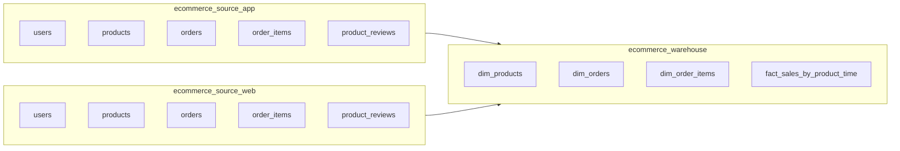

# Database Design (SQL-Synced)

This document is fully synchronized with the following schema files:

- `sql/01-app-schema.sql`
- `sql/02-web-schema.sql`
- `sql/03-warehouse-schema.sql`

## 1. Architecture Overview

The project uses three MySQL databases:

- `ecommerce_source_app`: source data from APP channel
- `ecommerce_source_web`: source data from WEB channel
- `ecommerce_warehouse`: integrated warehouse model for analytics

## 2. Source Schema Differences (APP vs WEB)

| Topic                      | APP (`ecommerce_source_app`)                                    | WEB (`ecommerce_source_web`)                                    |
| -------------------------- | --------------------------------------------------------------- | --------------------------------------------------------------- |
| Order PK field             | `orders.order_id`                                               | `orders.order_no`                                               |
| Order PK type              | `INT AUTO_INCREMENT`                                            | `VARCHAR(50)`                                                   |
| `order_items` FK to orders | `order_items.order_id`                                          | `order_items.order_no`                                          |
| Shared business tables     | `users`, `products`, `orders`, `order_items`, `product_reviews` | `users`, `products`, `orders`, `order_items`, `product_reviews` |

Note: in both source schemas, `orders.order_date` is defined as MySQL `DATE`.

## 3. `ecommerce_source_app` (from `01-app-schema.sql`)

### 3.1 Tables

1. `users`
2. `products`
3. `orders`
4. `order_items`
5. `product_reviews`

### 3.2 Key Columns and Constraints

- `users`
  - PK: `user_id`
  - Unique: `username`, `email`
- `products`
  - PK: `product_id`
  - Indexes: `idx_category`, `idx_product_name`
- `orders`
  - PK: `order_id`
  - FK: `user_id -> users.user_id`
  - Indexes: `idx_order_date`, `idx_user_id`, `idx_status`
- `order_items`
  - PK: `order_item_id`
  - FK: `order_id -> orders.order_id` (ON DELETE CASCADE)
  - FK: `product_id -> products.product_id`
- `product_reviews`
  - PK: `review_id`
  - FK: `product_id -> products.product_id`
  - FK: `user_id -> users.user_id`
  - Check: `rating` between 1 and 5

## 4. `ecommerce_source_web` (from `02-web-schema.sql`)

### 4.1 Tables

1. `users`
2. `products`
3. `orders`
4. `order_items`
5. `product_reviews`

### 4.2 Key Columns and Constraints

- `users`
  - PK: `user_id`
  - Unique: `username`, `email`
- `products`
  - PK: `product_id`
  - Indexes: `idx_category`, `idx_product_name`
- `orders`
  - PK: `order_no` (`VARCHAR(50)`)
  - FK: `user_id -> users.user_id`
  - Indexes: `idx_order_date`, `idx_user_id`, `idx_status`
- `order_items`
  - PK: `order_item_id`
  - FK: `order_no -> orders.order_no` (ON DELETE CASCADE)
  - FK: `product_id -> products.product_id`
- `product_reviews`
  - PK: `review_id`
  - FK: `product_id -> products.product_id`
  - FK: `user_id -> users.user_id`
  - Check: `rating` between 1 and 5

## 5. `ecommerce_warehouse` (from `03-warehouse-schema.sql`)

### 5.1 Tables

1. `dim_products`
2. `dim_orders`
3. `dim_order_items`
4. `fact_sales_by_product_time`

### 5.2 Warehouse Model

- `dim_products`
  - PK: `product_key` (surrogate key)
  - Business uniqueness: `UNIQUE(source, product_id)`
  - Purpose: distinguish same `product_id` across APP and WEB by `source`

- `dim_orders`
  - PK: `order_id` (warehouse surrogate order key)
  - Unified order identifiers:
    - `app_order_id` for APP
    - `web_order_no` for WEB
  - Uniqueness: `UNIQUE(source, app_order_id, web_order_no)`

- `dim_order_items`
  - PK: `item_id`
  - FK: `order_id -> dim_orders.order_id` (ON DELETE CASCADE)
  - Stores denormalized item attributes used by analytics (`product_name`, `category`, etc.)

- `fact_sales_by_product_time`
  - PK: `fact_id`
  - FK: `product_key -> dim_products.product_key`
  - Grain: one row per `(product_key, year, month, day)`
  - Uniqueness: `UNIQUE(product_key, year, month, day)`

## 6. Entity Relationship Summary

### 6.1 APP Source

- `users (1) -> (N) orders`
- `orders (1) -> (N) order_items`
- `products (1) -> (N) order_items`
- `users (1) -> (N) product_reviews`
- `products (1) -> (N) product_reviews`

### 6.2 WEB Source

- `users (1) -> (N) orders`
- `orders (1) -> (N) order_items` (via `order_no`)
- `products (1) -> (N) order_items`
- `users (1) -> (N) product_reviews`
- `products (1) -> (N) product_reviews`

### 6.3 Warehouse

- `dim_orders (1) -> (N) dim_order_items`
- `dim_products (1) -> (N) fact_sales_by_product_time`

## 7. Mapping Rules for ETL

### 7.1 Order Identity Mapping

- APP order identifier: `orders.order_id -> dim_orders.app_order_id`
- WEB order identifier: `orders.order_no -> dim_orders.web_order_no`

### 7.2 Product Identity Mapping

- Use `(source, product_id)` to find/create a row in `dim_products`
- Use `dim_products.product_key` in fact table (`fact_sales_by_product_time`)

### 7.3 Time Grain for Fact Table

- Derive `year`, `month`, `day` from order date
- Aggregate metrics into:
  - `total_quantity`
  - `total_sales_amount`

## 8. Index and Performance Notes

- Source schemas already include practical indexes for date, user, status, and FK join paths.
- Warehouse has key analytical indexes:
  - `dim_orders.idx_source_date`
  - `dim_products.uk_source_product`
  - `fact_sales_by_product_time.uk_product_time`
  - `fact_sales_by_product_time.idx_year_month_day`

## 9. Scope Clarification

This documentation intentionally describes only objects that exist in the three SQL files listed above.
If new tables are added later (for example, operational sync/audit tables), update this document after schema changes are merged.
