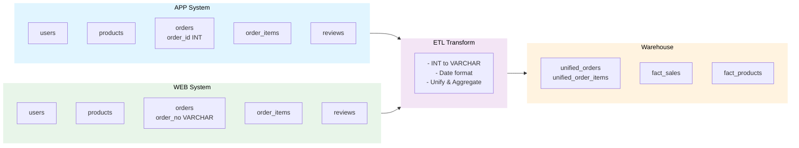

# 📊 Database Design - App/Web Data Integration Architecture

## System Architecture Overview



## Heterogeneous Data Handling Overview

| Characteristic     | ecommerce_source_app | ecommerce_source_web |
| ------------------ | -------------------- | -------------------- |
| **Channel**        | Mobile Application   | Web Portal           |
| **Order ID Field** | order_id             | order_no             |
| **ID Data Type**   | INT (12345)          | VARCHAR (WEB-001)    |
| **Date Format**    | yyyy-MM-dd           | MM/dd/yyyy           |
| **Sample Date**    | 2024-03-15           | 03/15/2024           |

**ETL Tasks to Handle**:

- ✅ Unify field names: order_id / order_no → unified processing
- ✅ Type conversion: INT → VARCHAR
- ✅ Date format conversion: MM/dd/yyyy → yyyy-MM-dd

---

## Database 1: App Source System (ecommerce_source_app)

### Database Purpose

- Stores all business data from mobile application channel
- Contains 5 business tables
- Order ID uses integer type: `order_id INT`
- Date format: `yyyy-MM-dd`

### Table Structures

#### 1. Users Table (users)

```sql
CREATE TABLE users (
    user_id INT PRIMARY KEY AUTO_INCREMENT,
    name VARCHAR(100) NOT NULL,
    email VARCHAR(100) UNIQUE,
    phone VARCHAR(20),
    city VARCHAR(50),
    register_date DATE,
    created_at TIMESTAMP DEFAULT CURRENT_TIMESTAMP,
    updated_at TIMESTAMP DEFAULT CURRENT_TIMESTAMP ON UPDATE CURRENT_TIMESTAMP
) ENGINE=InnoDB DEFAULT CHARSET=utf8mb4 COLLATE=utf8mb4_unicode_ci;
```

#### 2. Products Table (products)

```sql
CREATE TABLE products (
    product_id INT PRIMARY KEY AUTO_INCREMENT,
    name VARCHAR(200) NOT NULL,
    description TEXT,
    category VARCHAR(50) NOT NULL,
    price DECIMAL(10,2) NOT NULL,
    cost DECIMAL(10,2),
    brand VARCHAR(50),
    stock_qty INT DEFAULT 0,
    is_active BOOLEAN DEFAULT TRUE,
    created_at TIMESTAMP DEFAULT CURRENT_TIMESTAMP,
    updated_at TIMESTAMP DEFAULT CURRENT_TIMESTAMP ON UPDATE CURRENT_TIMESTAMP,
    INDEX idx_category (category),
    INDEX idx_brand (brand)
) ENGINE=InnoDB DEFAULT CHARSET=utf8mb4 COLLATE=utf8mb4_unicode_ci;
```

#### 3. Orders Table (orders)

```sql
CREATE TABLE orders (
    order_id INT PRIMARY KEY AUTO_INCREMENT,
    user_id INT NOT NULL,
    order_date DATE NOT NULL,
    total_amount DECIMAL(12,2) NOT NULL,
    status VARCHAR(20) DEFAULT 'completed',
    created_at TIMESTAMP DEFAULT CURRENT_TIMESTAMP,
    updated_at TIMESTAMP DEFAULT CURRENT_TIMESTAMP ON UPDATE CURRENT_TIMESTAMP,
    FOREIGN KEY (user_id) REFERENCES users(user_id),
    INDEX idx_user_id (user_id),
    INDEX idx_order_date (order_date)
) ENGINE=InnoDB DEFAULT CHARSET=utf8mb4 COLLATE=utf8mb4_unicode_ci;
```

#### 4. Order Items Table (order_items)

```sql
CREATE TABLE order_items (
    item_id INT PRIMARY KEY AUTO_INCREMENT,
    order_id INT NOT NULL,
    product_id INT NOT NULL,
    quantity INT NOT NULL,
    unit_price DECIMAL(10,2) NOT NULL,
    line_total DECIMAL(12,2) NOT NULL,
    created_at TIMESTAMP DEFAULT CURRENT_TIMESTAMP,
    FOREIGN KEY (order_id) REFERENCES orders(order_id) ON DELETE CASCADE,
    FOREIGN KEY (product_id) REFERENCES products(product_id),
    INDEX idx_order_id (order_id),
    INDEX idx_product_id (product_id)
) ENGINE=InnoDB DEFAULT CHARSET=utf8mb4 COLLATE=utf8mb4_unicode_ci;
```

#### 5. Product Reviews Table (product_reviews)

```sql
CREATE TABLE product_reviews (
    review_id INT PRIMARY KEY AUTO_INCREMENT,
    product_id INT NOT NULL,
    user_id INT,
    rating INT CHECK (rating >= 1 AND rating <= 5),
    comment TEXT,
    review_date DATE,
    created_at TIMESTAMP DEFAULT CURRENT_TIMESTAMP,
    FOREIGN KEY (product_id) REFERENCES products(product_id),
    FOREIGN KEY (user_id) REFERENCES users(user_id),
    INDEX idx_product_id (product_id),
    INDEX idx_rating (rating)
) ENGINE=InnoDB DEFAULT CHARSET=utf8mb4 COLLATE=utf8mb4_unicode_ci;
```

---

## Database 2: Web Source System (ecommerce_source_web)

### Database Purpose

- Stores all business data from web channel (website, mobile web, etc.)
- Contains 5 business tables (same structure as source_app, main difference in orders table)
- Order ID uses string type: `order_no VARCHAR`
- Date format requires special handling: `MM/dd/yyyy` (convert to yyyy-MM-dd during ETL)

### Key Table Differences

#### 3. Orders Table (orders) - Web Channel Specific

```sql
CREATE TABLE orders (
    order_no VARCHAR(50) PRIMARY KEY,
    user_id INT NOT NULL,
    order_date DATE NOT NULL,
    total_amount DECIMAL(12,2) NOT NULL,
    status VARCHAR(20) DEFAULT 'completed',
    created_at TIMESTAMP DEFAULT CURRENT_TIMESTAMP,
    updated_at TIMESTAMP DEFAULT CURRENT_TIMESTAMP ON UPDATE CURRENT_TIMESTAMP,
    FOREIGN KEY (user_id) REFERENCES users(user_id),
    INDEX idx_user_id (user_id),
    INDEX idx_order_date (order_date)
) ENGINE=InnoDB DEFAULT CHARSET=utf8mb4 COLLATE=utf8mb4_unicode_ci;
```

#### 4. Order Items Table (order_items) - Web Channel

```sql
CREATE TABLE order_items (
    item_id INT PRIMARY KEY AUTO_INCREMENT,
    order_no VARCHAR(50) NOT NULL,
    product_id INT NOT NULL,
    quantity INT NOT NULL,
    unit_price DECIMAL(10,2) NOT NULL,
    line_total DECIMAL(12,2) NOT NULL,
    created_at TIMESTAMP DEFAULT CURRENT_TIMESTAMP,
    FOREIGN KEY (order_no) REFERENCES orders(order_no) ON DELETE CASCADE,
    FOREIGN KEY (product_id) REFERENCES products(product_id),
    INDEX idx_order_no (order_no),
    INDEX idx_product_id (product_id)
) ENGINE=InnoDB DEFAULT CHARSET=utf8mb4 COLLATE=utf8mb4_unicode_ci;
```

#### 5. Product Reviews Table (product_reviews) - Web Channel

```sql
CREATE TABLE product_reviews (
    review_id INT PRIMARY KEY AUTO_INCREMENT,
    product_id INT NOT NULL,
    user_id INT,
    rating INT CHECK (rating >= 1 AND rating <= 5),
    comment TEXT,
    review_date DATE,
    created_at TIMESTAMP DEFAULT CURRENT_TIMESTAMP,
    FOREIGN KEY (product_id) REFERENCES products(product_id),
    FOREIGN KEY (user_id) REFERENCES users(user_id),
    INDEX idx_product_id (product_id),
    INDEX idx_rating (rating)
) ENGINE=InnoDB DEFAULT CHARSET=utf8mb4 COLLATE=utf8mb4_unicode_ci;
```

---

## Database 3: Analytics Data Warehouse (ecommerce_warehouse)

### Database Purpose

- Stores ETL-processed, unified, and analysis-ready data
- Contains 4 tables: 2 unified order tables (intermediate aggregation) + 2 analysis fact tables
- Integrates data from both App and Web channels, handling heterogeneous data differences
- Unified order tables provide clean, standardized input for subsequent analysis tables

### Table Structures

#### 1. Unified Orders Table (unified_orders)

Consolidates orders from both App and Web channels in a single table, using `source` field to distinguish channels. This table serves as an intermediate aggregation layer, eliminating complex UNION operations.

```sql
CREATE TABLE unified_orders (
    id INT PRIMARY KEY AUTO_INCREMENT COMMENT 'Unified order primary key',
    source ENUM('APP', 'WEB') NOT NULL COMMENT 'Order source',
    app_order_id INT COMMENT 'App channel order ID',
    web_order_no VARCHAR(50) COMMENT 'Web channel order number',
    user_id INT NOT NULL COMMENT 'User ID',
    user_name VARCHAR(100) COMMENT 'User name',
    user_email VARCHAR(100) COMMENT 'User email',
    user_phone VARCHAR(20) COMMENT 'User phone',
    user_city VARCHAR(50) COMMENT 'User city',
    order_date DATE NOT NULL COMMENT 'Order date (yyyy-MM-dd)',
    total_amount DECIMAL(12,2) NOT NULL COMMENT 'Order total', status VARCHAR(20) DEFAULT 'completed' COMMENT 'Order status',
    item_count INT DEFAULT 0 COMMENT 'Number of items',
    total_quantity INT DEFAULT 0 COMMENT 'Total quantity',
    created_at TIMESTAMP DEFAULT CURRENT_TIMESTAMP,
    updated_at TIMESTAMP DEFAULT CURRENT_TIMESTAMP ON UPDATE CURRENT_TIMESTAMP,
    UNIQUE KEY uniq_order_source (source, app_order_id, web_order_no),
    INDEX idx_source (source),
    INDEX idx_order_date (order_date),
    INDEX idx_user_id (user_id),
    INDEX idx_source_date (source, order_date),
    INDEX idx_status (status)
) ENGINE=InnoDB DEFAULT CHARSET=utf8mb4 COLLATE=utf8mb4_unicode_ci;
```

#### 2. Unified Order Items Table (unified_order_items)

```sql
CREATE TABLE unified_order_items (
    id INT PRIMARY KEY AUTO_INCREMENT,
    unified_order_id INT NOT NULL,
    source ENUM('APP', 'WEB') NOT NULL,
    app_item_id INT,
    web_item_id INT,
    product_id INT NOT NULL,
    product_name VARCHAR(200),
    category VARCHAR(50),
    brand VARCHAR(50),
    quantity INT NOT NULL,
    unit_price DECIMAL(10,2) NOT NULL,
    line_total DECIMAL(12,2) NOT NULL,
    created_at TIMESTAMP DEFAULT CURRENT_TIMESTAMP,
    FOREIGN KEY (unified_order_id) REFERENCES unified_orders(id) ON DELETE CASCADE,
    INDEX idx_unified_order_id (unified_order_id),
    INDEX idx_source (source),
    INDEX idx_product_id (product_id),
    INDEX idx_category (category)
) ENGINE=InnoDB DEFAULT CHARSET=utf8mb4 COLLATE=utf8mb4_unicode_ci;
```

#### 3. Sales by Category and Time Fact Table (fact_sales_by_category_time)

```sql
CREATE TABLE fact_sales_by_category_time (
    id INT PRIMARY KEY AUTO_INCREMENT,
    category VARCHAR(50) NOT NULL,
    year INT NOT NULL,
    month INT NOT NULL,
    day INT,
    total_quantity INT DEFAULT 0,
    total_sales_amount DECIMAL(15,2) DEFAULT 0,
    created_at TIMESTAMP DEFAULT CURRENT_TIMESTAMP,
    updated_at TIMESTAMP DEFAULT CURRENT_TIMESTAMP ON UPDATE CURRENT_TIMESTAMP,
    UNIQUE KEY uniq_category_time (category, year, month, day),
    INDEX idx_category (category),
    INDEX idx_time (year, month, day)
) ENGINE=InnoDB DEFAULT CHARSET=utf8mb4 COLLATE=utf8mb4_unicode_ci;
```

#### 4. Top Rated Products Fact Table (fact_top_rated_products)

```sql
CREATE TABLE fact_top_rated_products (
    id INT PRIMARY KEY AUTO_INCREMENT,
    product_id INT NOT NULL,
    product_name VARCHAR(200) NOT NULL,
    category VARCHAR(50),
    avg_rating DECIMAL(3,2),
    review_count INT DEFAULT 0,
    year INT,
    month INT,
    day INT,
    created_at TIMESTAMP DEFAULT CURRENT_TIMESTAMP,
    updated_at TIMESTAMP DEFAULT CURRENT_TIMESTAMP ON UPDATE CURRENT_TIMESTAMP,
    INDEX idx_product_id (product_id),
    INDEX idx_avg_rating (avg_rating DESC),
    INDEX idx_category (category)
) ENGINE=InnoDB DEFAULT CHARSET=utf8mb4 COLLATE=utf8mb4_unicode_ci;
```

---

## ETL Data Transformation

### ETL Query Examples

**Extract from App Source**:

```sql
SELECT CAST(o.order_id AS CHAR) as order_id_unified, o.order_date, oi.quantity, p.category
FROM ecommerce_source_app.orders o
JOIN ecommerce_source_app.order_items oi ON o.order_id = oi.order_id
JOIN ecommerce_source_app.products p ON oi.product_id = p.product_id;
```

**Extract from Web Source**:

```sql
SELECT o.order_no as order_id_unified, STR_TO_DATE(o.order_date, '%m/%d/%Y') as order_date, oi.quantity, p.category
FROM ecommerce_source_web.orders o
JOIN ecommerce_source_web.order_items oi ON o.order_no = oi.order_no
JOIN ecommerce_source_web.products p ON oi.product_id = p.product_id;
```

---

## Indexing Strategy

### Warehouse (ecommerce_warehouse)

**Unified Orders Table**:

- `idx_source` - Filter by channel
- `idx_order_date` - Sort and range queries
- `idx_user_id` - User order lookup
- `idx_source_date` - Combined filtering
- `idx_status` - Status-based filtering

**Analysis Tables**:

- `fact_sales_by_category_time` - Multi-dimensional aggregation
- `fact_top_rated_products` - Ranking queries

---

## Common Query Patterns

### Unified Orders

**Get all unified orders**:

```sql
SELECT id, source, user_name, order_date, total_amount
FROM unified_orders WHERE status = 'completed'
ORDER BY order_date DESC LIMIT 20 OFFSET 0;
```

**App vs Web statistics**:

```sql
SELECT source, COUNT(*) as count, SUM(total_amount) as sales
FROM unified_orders WHERE status = 'completed' GROUP BY source;
```

**By category**:

```sql
SELECT i.category, o.source, COUNT(DISTINCT o.id) as orders, SUM(i.quantity) as qty
FROM unified_orders o JOIN unified_order_items i ON o.id = i.unified_order_id
WHERE o.status = 'completed' GROUP BY i.category, o.source
ORDER BY total_sales DESC;
```

### Analysis

**Category trends**:

```sql
SELECT category, year, month, total_quantity, total_sales_amount
FROM fact_sales_by_category_time ORDER BY year DESC, month DESC;
```

**Top products**:

```sql
SELECT product_name, category, avg_rating, review_count
FROM fact_top_rated_products ORDER BY avg_rating DESC LIMIT 10;
```

---

## Three-Layer Warehouse Architecture

| Layer           | Database                                             | Purpose              |
| --------------- | ---------------------------------------------------- | -------------------- |
| **Source**      | ecommerce_source_app, ecommerce_source_web           | Raw transaction data |
| **Aggregation** | unified_orders, unified_order_items                  | Unified order data   |
| **Analysis**    | fact_sales_by_category_time, fact_top_rated_products | BI and reporting     |

**Value of Unified Orders**:

- Eliminate heterogeneous data differences
- High-performance order queries
- Quick unified view on application tier
- Clean data source for analysis tables
