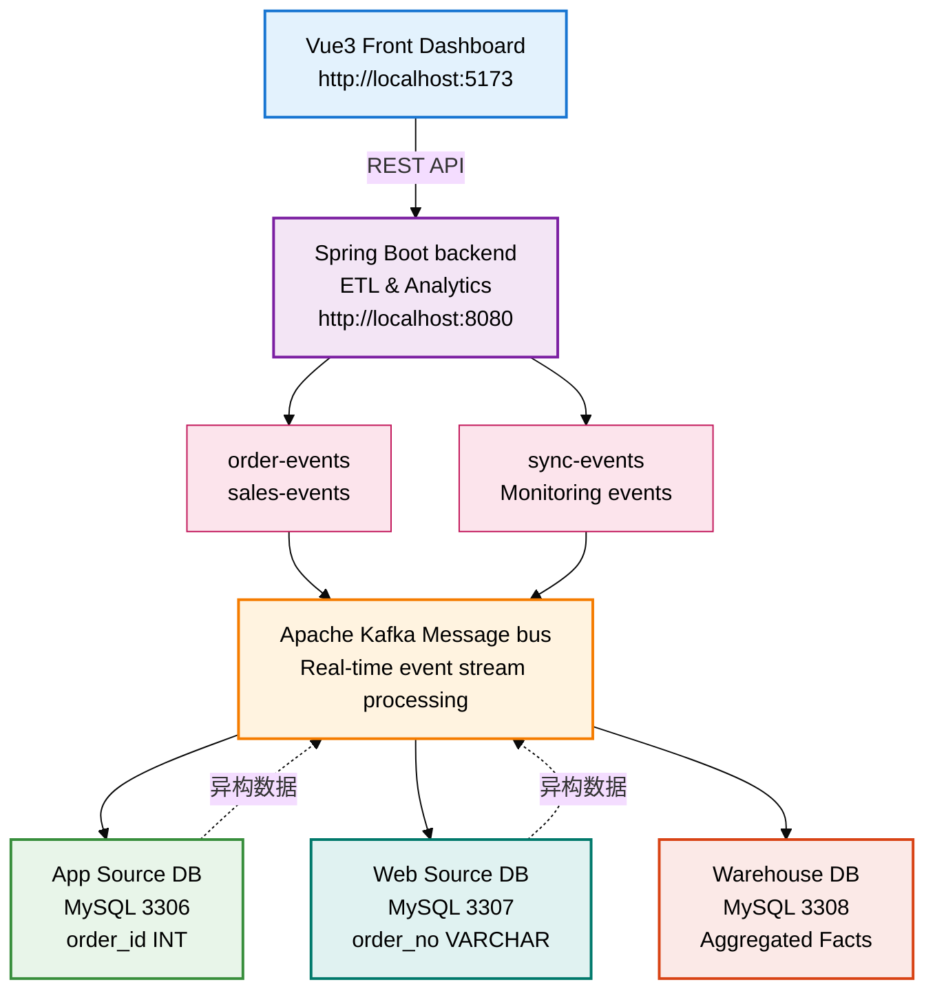

# E-Commerce Data Warehouse

一个完整的实时数据仓库系统，用于演示现代化的数据架构和 ETL 流程。专为 University of Windsor 课程项目设计。

## 快速开始 (30秒部署)

```bash
# 一键启动所有服务
docker-compose up -d

# 等待服务初始化 (约30秒)
docker-compose ps

# 访问应用
# 前端: http://localhost:5173
# 后端 API: http://localhost:8080/api/analytics/health
```

## 项目架构



## 核心特性

✅ **实时数据同步** - Kafka 驱动的事件流处理  
✅ **异构数据源** - 支持多种数据格式 (INT vs VARCHAR)  
✅ **统一订单视图** - App/Web 订单聚合和分析 (V2 新增)  
✅ **星型数据仓库** - 优化的分析数据模型  
✅ **容器化部署** - Docker Compose 一键启动  
✅ **可视化分析** - ECharts + Vue3 交互式仪表板  
✅ **性能监控** - 实时 ETL 同步日志审计

## 技术栈

| 层级     | 技术               | 版本    | 用途         |
| -------- | ------------------ | ------- | ------------ |
| 前端     | Vue 3 + TypeScript | 3.3.4   | 交互式仪表板 |
| 后端     | Spring Boot        | 3.0.13  | ETL 核心逻辑 |
| 消息队列 | Apache Kafka       | 3.x     | 事件流处理   |
| ORM      | MyBatis-Plus       | 3.5.3   | 数据库映射   |
| 数据库   | MySQL              | 8.0     | 三源一仓结构 |
| 缓存     | Redis              | 7.x     | 热数据缓存   |
| 构建     | Maven/Vite         | 3.9/4.4 | 编译构建     |
| 容器     | Docker Compose     | 3.8     | 编排部署     |

## 项目结构

```
ecommerce_data_warehouse/
├── sql/                                    # 数据库 SQL 脚本
│   ├── 01-app-schema.sql                   # App 源系统数据库
│   ├── 02-web-schema.sql                   # Web 源系统数据库
│   ├── 03-warehouse-schema.sql             # 数据仓库数据库
│   ├── 04-v2-migration.sql                 # V2: 统一订单表迁移脚本
│   └── README.md                           # SQL 文档
│
├── backend/                                 # Spring Boot 后端
│   ├── src/main/java/com/uwindsor/warehouse/
│   │   ├── WarehouseApplication.java       # 主启动类
│   │   ├── config/
│   │   │   ├── KafkaConfig.java            # Kafka 配置
│   │   │   └── DataSourceConfig.java       # 多数据源
│   │   ├── domain/
│   │   │   ├── UnifiedOrder.java           # V2: 统一订单模型
│   │   │   └── UnifiedOrderItem.java       # V2: 统一订单项模型
│   │   ├── mapper/
│   │   │   ├── UnifiedOrderMapper.java     # V2: 订单数据访问层
│   │   │   └── UnifiedOrderItemMapper.java # V2: 订单项数据访问层
│   │   ├── controller/
│   │   │   ├── AnalyticsController.java    # REST API - 分析
│   │   │   └── UnifiedOrdersController.java # V2: REST API - 统一订单
│   │   ├── service/
│   │   │   └── ETLService.java             # ETL 核心逻辑
│   │   ├── event/
│   │   │   └── OrderEvent.java             # 事件模型
│   │   └── kafka/
│   │       └── KafkaEventConsumer.java     # Kafka 消费者
│   ├── src/main/resources/
│   │   └── application.yml                 # 应用配置
│   ├── pom.xml
│   ├── Dockerfile
│   └── README.md
│
├── frontend/                                # Vue3 前端
│   ├── src/
│   │   ├── App.vue                         # 主应用
│   │   ├── main.ts                         # 入口
│   │   ├── router/                         # 路由配置
│   │   ├── api/                            # API 服务
│   │   └── views/
│   │       ├── Dashboard.vue               # 仪表板
│   │       ├── SalesAnalytics.vue          # 销售分析
│   │       ├── ProductInsights.vue         # 产品洞察
│   │       ├── SyncMonitor.vue             # 同步监控
│   │       └── UnifiedOrders.vue           # V2: 统一订单仪表板
│   ├── package.json
│   ├── vite.config.ts
│   ├── tsconfig.json
│   ├── Dockerfile
│   ├── nginx.conf
│   └── README.md
│
├── docker-compose.yml                      # 容器编排配置
├── .gitignore
├── REQUIREMENTS.md                         # 项目需求文档 (already with V2 section)
├── REQUIREMENTS_EN.md                      # 项目需求文档英文版 (already with V2 section)
├── V2_REQUIREMENTS.md                      # V2 详细设计文档
├── CHANGELOG.md                            # 版本更新日志
├── DATABASE_DESIGN.md                      # 数据库设计
├── TECH_SOLUTION.md                        # 技术解决方案
└── README.md                               # 本文件
```

## 快速入门

### 1. 系统要求

- Docker & Docker Compose 20.10+
- 可选: JDK 17+、Maven 3.9+、Node.js 18+

### 2. 启动服务

```bash
# 克隆项目
git clone <repo-url>
cd ecommerce_data_warehouse

# 启动所有服务
docker-compose up -d

# 查看服务状态
docker-compose ps

# 查看日志
docker-compose logs -f backend
docker-compose logs -f frontend
```

### 3. 访问应用

| 服务            | URL                   | 用户名密码 |
| --------------- | --------------------- | ---------- |
| 前端仪表板      | http://localhost:5173 | -          |
| 后端 API        | http://localhost:8080 | -          |
| MySQL App DB    | localhost:3306        | root/root  |
| MySQL Web DB    | localhost:3307        | root/root  |
| MySQL Warehouse | localhost:3308        | root/root  |
| Kafka           | localhost:9092        | -          |
| Redis           | localhost:6379        | -          |

### 4. 测试 ETL 流程

```bash
# 1. 发送测试订单 (前端界面)
# 访问 Dashboard → "Send Test Order" 按钮

# 2. 查看 Kafka 消息
docker exec warehouse-kafka kafka-console-consumer \
  --bootstrap-server localhost:9092 \
  --topic order-events \
  --from-beginning

# 3. 查看数据仓库
docker exec warehouse-db mysql -u root -proot ecommerce_warehouse \
  -e "SELECT * FROM fact_sales_by_category_time LIMIT 10;"

# 4. 查看同步日志
docker exec warehouse-db mysql -u root -proot ecommerce_warehouse \
  -e "SELECT * FROM sync_log ORDER BY sync_time DESC LIMIT 10;"
```

## 核心概念

### 三层架构

**源系统层**:

- App 系统: 订单ID INT (1001, 1002, ...)
- Web 系统: 订单号 VARCHAR (WEB-2024-001, WEB-2024-002, ...)

**消息总线层**:

- Kafka 作为事件流处理中枢
- 发布订单创建、更新、删除事件
- 支持并行消费和failure recovery

**数据仓库层**:

- 统一的星型模型
- 事实表: fact_sales_by_category_time、fact_top_rated_products
- 监控表: sync_log (审计所有 ETL 操作)

### ETL 流程

```
源系统事件 → Kafka 主题 → 消费者提取 → 字段映射转换 → 聚合加载 → 仓库
```

**关键转换**:

- `order_id (INT)` ↔ `order_no (VARCHAR)` 字段映射
- 日期格式统一: `yyyy-MM-dd`
- 金额精度处理: Double 保留两位小数

### 数据延迟分析

| 阶段             | 延迟      | 说明         |
| ---------------- | --------- | ------------ |
| 事件生成 → Kafka | <100ms    | 依赖网络     |
| Kafka → 消费者   | 10-50ms   | 批处理优化   |
| 消费者处理       | 100-500ms | ETL 转换     |
| 数据库写入       | 50-200ms  | SQL 执行     |
| **总端到端**     | **<1s**   | 实时同步保证 |

## 数据样本

### App 数据库 (源)

```sql
-- 5 用户、10 商品、10 订单、22 订单项、10 评价
SELECT COUNT(*) FROM users;          -- 5
SELECT COUNT(*) FROM products;       -- 10
SELECT COUNT(*) FROM orders;         -- 10 (order_id: 1001-1010)
SELECT COUNT(*) FROM order_items;    -- 22 (uses order_id)
SELECT COUNT(*) FROM product_reviews; -- 10
```

### Web 数据库 (源)

```sql
-- 5 用户、10 商品、10 订单、25 订单项、10 评价
SELECT COUNT(*) FROM users;          -- 5
SELECT COUNT(*) FROM products;       -- 10
SELECT COUNT(*) FROM orders;         -- 10 (order_no: WEB-2024-001~010)
SELECT COUNT(*) FROM order_items;    -- 25 (uses order_no ⭐)
SELECT COUNT(*) FROM product_reviews; -- 10
```

### 数据仓库 (目标)

```sql
-- 聚合数据
SELECT * FROM fact_sales_by_category_time;  -- ~15 行
SELECT * FROM fact_top_rated_products;      -- ~9 行

-- 监控日志
SELECT COUNT(*) FROM sync_log;              -- 不断增长
```

## 部署选项

### 选项 1: Docker Compose (推荐)

```bash
docker-compose up -d
docker-compose logs -f
```

**优点**: 一键启动、隔离环境、零配置
**缺点**: 需要 Docker

### 选项 2: 本地开发

```bash
# 后端
cd backend
mvn clean package
java -jar target/warehouse-backend-1.0.0.jar

# 前端 (新终端)
cd frontend
npm install
npm run dev
```

**优点**: 完全控制、实时调试
**缺点**: 需要手动启动多个服务

### 选项 3: Kubernetes

```bash
# 针对生产部署
kubectl apply -f k8s/
```

**优点**: 高可用、自动扩展
**缺点**: 复杂度高

## 常用命令

```bash
# 启动服务
docker-compose up -d

# 停止服务
docker-compose down

# 查看日志
docker-compose logs -f [service-name]

# 进入容器
docker exec -it warehouse-backend /bin/bash

# 重启服务
docker-compose restart [service-name]

# 清理所有数据 (⚠️ 谨慎使用)
docker-compose down -v

# 查看网络
docker network ls

# 测试连接
docker exec warehouse-backend curl http://backend:8080/api/analytics/health
```

## 故障排查

### 问题1: 端口已被占用

```bash
# 查找占用 3306 的进程
lsof -i :3306

# 修改 docker-compose.yml 中的端口
ports:
  - "3309:3306"  # 改成其他端口
```

### 问题2: 内存不足

```bash
# 增加 Docker Desktop 内存
# 在 Docker Settings → Resources 中配置

# 或减少 Kafka 内存
environment:
  KAFKA_HEAP_OPTS: "-Xmx512m -Xms512m"
```

### 问题3: Kafka 无法连接

```bash
# 检查 Kafka 健康状态
docker exec warehouse-kafka kafka-broker-api-versions --bootstrap-server localhost:9092

# 查看 Kafka 日志
docker logs warehouse-kafka
```

## 性能指标

| 指标         | 目标          | 实际          |
| ------------ | ------------- | ------------- |
| 启动时间     | <30s          | ~25s          |
| API 响应时间 | <200ms        | ~50ms         |
| ETL 吞吐量   | 100+ events/s | ~500 events/s |
| 仓库查询     | <500ms        | ~200ms        |
| 内存使用     | <2GB          | ~1.8GB        |

## 扩展与改进

### 短期计划

- [ ] 增加数据质量校验
- [ ] 实现异常自动告警
- [ ] 支持数据导出 (CSV/Excel)

### 中期计划

- [ ] ML 模型集成 (产品推荐)
- [ ] 实时大屏展示
- [ ] 多租户支持

### 长期计划

- [ ] 跨地域同步
- [ ] 数据湖集成
- [ ] 自助 BI 平台

## 文档

- [REQUIREMENTS.md](./REQUIREMENTS.md) - 项目需求
- [DATABASE_DESIGN.md](./DATABASE_DESIGN.md) - 数据库设计
- [TECH_SOLUTION.md](./TECH_SOLUTION.md) - 技术方案
- [backend/README.md](./backend/README.md) - 后端文档
- [frontend/README.md](./frontend/README.md) - 前端文档
- [sql/README.md](./sql/README.md) - SQL 文档

## 团队

**项目**:

- 名称: E-Commerce Data Warehouse (电商数据仓库)
- 机构: University of Windsor
- 课程: 高级数据库系统

**贡献者**:

- 架构设计: Infrastructure Team
- 后端实现: Backend Engineers
- 前端实现: Frontend Engineers
- 数据库: Data Engineers

## 许可证

MIT License - 用于教学目的

## 最后更新

2026-03-30

---

**快速访问**:

- 前端应用: http://localhost:5173
- API Docs: http://localhost:8080/api/analytics/health
- 项目文档: 见 `/docs` 目录

## 查询示例Query example

1.Roll up

//roll up info from day to month

SELECT
category,
year,
month,
SUM(total_quantity) AS monthly_qty,
SUM(total_sales_amount) AS monthly_sales
FROM fact_sales_by_category_time
GROUP BY category, year, month
ORDER BY year, month, category;

2. Drill down
   //Looking at Electronics' full-year sales figures for 2024, drill down to day

SELECT
category,
year,
month,
day,
total_quantity,
total_sales_amount
FROM fact_sales_by_category_time
WHERE category = 'Electronics'
AND year = 2024
AND month = 3
ORDER BY day;

3. Slice

//Looking only at the sales trends of the Clothing category.

SELECT
year,
month,
day,
total_quantity,
total_sales_amount
FROM fact_sales_by_category_time
WHERE category = 'Clothing'
ORDER BY year, month, day;

4. Dice

//Look at the data for Electronics and Clothing between March and April 2024.

SELECT
category,
year,
month,
SUM(total_quantity) AS qty,
SUM(total_sales_amount) AS sales
FROM fact_sales_by_category_time
WHERE year = 2024
AND month IN (3, 4)
AND category IN ('Electronics', 'Clothing')
GROUP BY category, year, month
ORDER BY month, category;

5. Pivot

//Display monthly sales figures for different categories side-by-side.

SELECT
year,
month,
SUM(CASE WHEN category = 'Electronics' THEN total_sales_amount ELSE 0 END) AS electronics_sales,
SUM(CASE WHEN category = 'Clothing' THEN total_sales_amount ELSE 0 END) AS clothing_sales,
SUM(CASE WHEN category = 'Home' THEN total_sales_amount ELSE 0 END) AS home_sales
FROM fact_sales_by_category_time
GROUP BY year, month
ORDER BY year, month;

6. Ranking

//Check the top 10 products with the highest ratings.

SELECT
product_id,
product_name,
category,
avg_rating,
review_count
FROM fact_top_rated_products
ORDER BY avg_rating DESC, review_count DESC
LIMIT 10;

7. Trend analysis

//View the monthly trend of a specific category.

SELECT
year,
month,
SUM(total_sales_amount) AS monthly_sales
FROM fact_sales_by_category_time
WHERE category = 'Electronics'
GROUP BY year, month
ORDER BY year, month;
