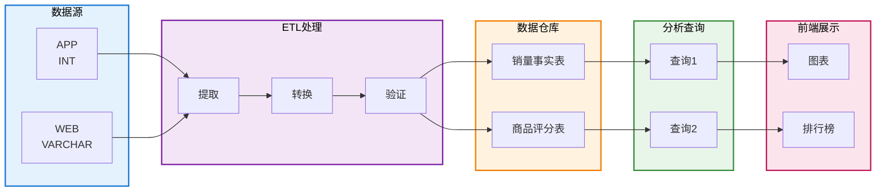

# 电商数据仓库 - 业务需求文档

## 项目目标

构建一个数据仓库系统，从两个不同来源的业务数据库（App和Web）进行数据清理、ETL处理，最后展示**销量分析**和**评论排行**数据。

---

## 数据源架构

### 数据库1：App业务系统 (ecommerce_source_app)

**表结构：**

| 表名                | 字段                                                | 说明       |
| ------------------- | --------------------------------------------------- | ---------- |
| **users**           | user_id, name, email, city, register_date           | 用户表     |
| **products**        | product_id, name, category, price, brand            | 商品表     |
| **orders**          | order_id, user_id, order_date, total_amount, status | 订单表     |
| **order_items**     | item_id, order_id, product_id, quantity, unit_price | 订单明细表 |
| **product_reviews** | review_id, product_id, user_id, rating, review_date | 商品评论表 |

**数据格式特征：**

- orders.**order_id**：数字类型（INT）
- orders.**order_date**：日期格式 `yyyy-MM-dd`

### 数据库2：Web业务系统 (ecommerce_source_web)

**表结构：** 与App相同，但订单表字段名不同

| 表名                | 字段                                                | 说明                     |
| ------------------- | --------------------------------------------------- | ------------------------ |
| **users**           | user_id, name, email, city, register_date           | 用户表                   |
| **products**        | product_id, name, category, price, brand            | 商品表                   |
| **orders**          | order_no, user_id, order_date, total_amount, status | 订单表（注：字段名不同） |
| **order_items**     | item_id, order_id, product_id, quantity, unit_price | 订单明细表               |
| **product_reviews** | review_id, product_id, user_id, rating, review_date | 商品评论表               |

**数据格式特征：**

- orders.**order_no**：字符+数字混合（VARCHAR，如 "WEB-001"）
- orders.**order_date**：日期格式 `MM/dd/yyyy`

**两个源库的关键差异：**

| 维度              | App (source_app) | Web (source_web)  |
| ----------------- | ---------------- | ----------------- |
| Order ID 字段名   | order_id         | order_no          |
| Order ID 数据格式 | 12345 (INT)      | WEB-001 (VARCHAR) |
| Order 日期格式    | 2024-03-01       | 03/01/2024        |

### 数据库3：分析数据仓库 (ecommerce_warehouse)

用于存储清理、转换后的统计数据。

**核心表：**

| 表名                            | 用途                           |
| ------------------------------- | ------------------------------ |
| **fact_sales_by_category_time** | 按商品种类和时间维度的销量统计 |
| **fact_top_rated_products**     | 按评价统计的Top商品            |

---

## 统计需求清单

### 需求1：按商品种类和时间维度分析销量

**数据源**：`ecommerce_warehouse.fact_sales_by_category_time` （仓库表）

**维度：**

- 商品种类（category）
- 时间维度：年、月、日

**指标：**

- 销量（total_quantity）
- 销售额（total_sales_amount）

**输出展示：**

- 热力图（X轴：时间，Y轴：分类，值：销量）
- 柱状图（按分类或时间段对比）

**示例查询**：

```sql
-- 查询必须基于数据仓库表
SELECT
    category,
    CONCAT(year, '-', LPAD(month, 2, '0')) as time_period,
    total_quantity,
    total_sales_amount
FROM ecommerce_warehouse.fact_sales_by_category_time
WHERE year = 2024
ORDER BY category, year, month, day;
```

**示例结果**：

```
Category: Electronics, Time: 2024-03, Quantity: 150, Amount: 45000
Category: Clothing,    Time: 2024-03, Quantity: 200, Amount: 15000
Category: Books,       Time: 2024-03, Quantity: 80,  Amount: 3200
```

---

### 需求2：按评论统计Top5商品

**数据源**：`ecommerce_warehouse.fact_top_rated_products` （仓库表）

**维度：**

- 商品种类（category）
- 时间维度：年、月、日

**指标：**

- 平均评分（avg_rating）
- 评论数（review_count）

**输出展示：**

- 排行榜（显示Top 5商品及其评分）

**示例查询**：

```sql
-- 查询必须基于数据仓库表
SELECT
    product_name,
    category,
    avg_rating,
    review_count
FROM ecommerce_warehouse.fact_top_rated_products
WHERE year = 2024 AND month = 3
ORDER BY avg_rating DESC, review_count DESC
LIMIT 5;
```

**示例结果**：

```
Product: iPhone 14,       Category: Electronics, Avg Rating: 4.8, Reviews: 150
Product: MacBook Pro,     Category: Electronics, Avg Rating: 4.7, Reviews: 120
Product: Samsung Galaxy,  Category: Electronics, Avg Rating: 4.6, Reviews: 100
...
```

---

## 数据处理流程 - ETL 架构



**流程说明：**

| 层级           | 组件               | 颜色 | 详细说明               |
| -------------- | ------------------ | ---- | ---------------------- |
| **数据源层**   | App / Web 源库     | 蓝色 | 两个异构的业务系统     |
| **ETL 处理层** | 提取 → 转换 → 清理 | 紫色 | 数据清理和格式转换     |
| **数据仓库层** | 两个核心事实表     | 橙色 | **所有查询的数据源**   |
| **分析查询层** | 基于仓库的查询     | 绿色 | **必须基于仓库表查询** |
| **前端展示层** | 图表和仪表板       | 粉色 | 最终用户界面           |

---

## 关键原则

### 所有分析查询都基于数据仓库

**重点强调**：

- Forbidden to directly query `ecommerce_source_app` or `ecommerce_source_web`
- Required to query from the two fact tables in `ecommerce_warehouse`
- All data must go through ETL processing, format unification, and quality validation before use
- Warehouse tables automatically handle App/Web data format differences

**原因**：

1. Data Consistency - Ensures data formats are unified across both channels
2. Data Quality - Data is cleaned, deduplicated, and validated
3. Performance Optimization - Warehouse tables are index-optimized for query efficiency
4. Unified Business Logic - All analyses are based on the same data processing rules

---

## 技术要求

- **后端**：Spring Boot + MyBatis，支持多数据源查询和数据转换
- **前端**：Vue 3，使用图表库展示热力图、柱状图、排行榜
- **数据库**：MySQL 8.0
- **部署**：Docker Compose 一键启动

---

## 工作流程

1. Requirements Confirmation (Current stage) - Confirm data model and statistical requirements
2. Database DDL Development - Create tables in source and warehouse databases
3. Sample Data Insertion - Insert test data into source systems (for demonstration)
4. ETL Logic Development - Data cleaning, transformation, and warehouse loading
5. API Development - Backend query endpoints
6. UI Development - Frontend dashboard
7. Testing and Deployment - Docker deployment verification
