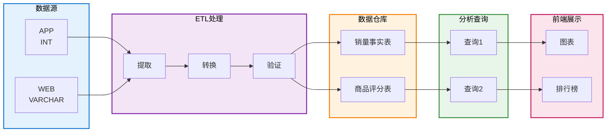

# 电商数据仓库 - 业务需求文档

## 版本更新记录

| 版本          | 发布日期   | 主要变更                                                                                   | 状态    |
| ------------- | ---------- | ------------------------------------------------------------------------------------------ | ------- |
| **Phase 4**   | 2026-03-31 | Docker部署完成、所有API测试通过、前端应用上线、生产环境验证                                | ✅ 完成 |
| **V2**        | 2026-03-30 | 新增统一订单表(unified_orders/unified_order_items)、异构数据聚合、订单管理UI、跨源数据整合 | ✅ 完成 |
| **Phase 1-3** | 2026-03-29 | 基础数据仓库设计、两个Fact表、ETL流程、API开发、前端仪表板                                 | ✅ 完成 |

---

## 项目目标

构建一个数据仓库系统，从两个不同来源的业务数据库（App和Web）进行数据清理、ETL处理，最后展示**销量分析**和**评论排行**数据。

---

## 数据源架构

### 数据库1：App业务系统 (ecommerce_source_app)

**表结构：**

| 表名                | 字段                                                | 说明       |
| ------------------- | --------------------------------------------------- | ---------- |
| **users**           | user_id, name, email, city, register_date           | 用户表     |
| **products**        | product_id, name, category, price, brand            | 商品表     |
| **orders**          | order_id, user_id, order_date, total_amount, status | 订单表     |
| **order_items**     | item_id, order_id, product_id, quantity, unit_price | 订单明细表 |
| **product_reviews** | review_id, product_id, user_id, rating, review_date | 商品评论表 |

**数据格式特征：**

- orders.**order_id**：数字类型（INT）
- orders.**order_date**：日期格式 `yyyy-MM-dd`

### 数据库2：Web业务系统 (ecommerce_source_web)

**表结构：** 与App相同，但订单表字段名不同

| 表名                | 字段                                                | 说明                         |
| ------------------- | --------------------------------------------------- | ---------------------------- |
| **users**           | user_id, name, email, city, register_date           | 用户表                       |
| **products**        | product_id, name, category, price, brand            | 商品表                       |
| **orders**          | order_no, user_id, order_date, total_amount, status | 订单表（注：字段名不同）     |
| **order_items**     | item_id, order_no, product_id, quantity, unit_price | 订单明细表（注：用order_no） |
| **product_reviews** | review_id, product_id, user_id, rating, review_date | 商品评论表                   |

**数据格式特征：**

- orders.**order_no**：字符+数字混合（VARCHAR，如 "WEB-001"）
- orders.**order_date**：日期格式 `MM/dd/yyyy`

**两个源库的关键差异：**

| 维度              | App (source_app) | Web (source_web)  |
| ----------------- | ---------------- | ----------------- |
| Order ID 字段名   | order_id         | order_no          |
| Order ID 数据格式 | 12345 (INT)      | WEB-001 (VARCHAR) |
| Order 日期格式    | 2024-03-01       | 03/01/2024        |

### 数据库3：分析数据仓库 (ecommerce_warehouse)

用于存储清理、转换后的统计数据。

**核心表：**

| 表名                            | 用途                           |
| ------------------------------- | ------------------------------ |
| **fact_sales_by_category_time** | 按商品种类和时间维度的销量统计 |
| **fact_top_rated_products**     | 按评价统计的Top商品            |

---

## 统计需求清单

### 需求1：按商品种类和时间维度分析销量

**数据源**：`ecommerce_warehouse.fact_sales_by_category_time` （仓库表）

**维度：**

- 商品种类（category）
- 时间维度：年、月、日

**指标：**

- 销量（total_quantity）
- 销售额（total_sales_amount）

**输出展示：**

- 热力图（X轴：时间，Y轴：分类，值：销量）
- 柱状图（按分类或时间段对比）

**示例查询**：

```sql
-- 查询必须基于数据仓库表
SELECT
    category,
    CONCAT(year, '-', LPAD(month, 2, '0')) as time_period,
    total_quantity,
    total_sales_amount
FROM ecommerce_warehouse.fact_sales_by_category_time
WHERE year = 2024
ORDER BY category, year, month, day;
```

**示例结果**：

```
Category: Electronics, Time: 2024-03, Quantity: 150, Amount: 45000
Category: Clothing,    Time: 2024-03, Quantity: 200, Amount: 15000
Category: Books,       Time: 2024-03, Quantity: 80,  Amount: 3200
```

---

### 需求2：按评论统计Top5商品

**数据源**：`ecommerce_warehouse.fact_top_rated_products` （仓库表）

**维度：**

- 商品种类（category）
- 时间维度：年、月、日

**指标：**

- 平均评分（avg_rating）
- 评论数（review_count）

**输出展示：**

- 排行榜（显示Top 5商品及其评分）

**示例查询**：

```sql
-- 查询必须基于数据仓库表
SELECT
    product_name,
    category,
    avg_rating,
    review_count
FROM ecommerce_warehouse.fact_top_rated_products
WHERE year = 2024 AND month = 3
ORDER BY avg_rating DESC, review_count DESC
LIMIT 5;
```

**示例结果**：

```
Product: iPhone 14,       Category: Electronics, Avg Rating: 4.8, Reviews: 150
Product: MacBook Pro,     Category: Electronics, Avg Rating: 4.7, Reviews: 120
Product: Samsung Galaxy,  Category: Electronics, Avg Rating: 4.6, Reviews: 100
...
```

---

## 数据处理流程 - ETL 架构



**流程说明：**

| 层级           | 组件               | 颜色 | 详细说明               |
| -------------- | ------------------ | ---- | ---------------------- |
| **数据源层**   | App / Web 源库     | 蓝色 | 两个异构的业务系统     |
| **ETL 处理层** | 提取 → 转换 → 清理 | 紫色 | 数据清理和格式转换     |
| **数据仓库层** | 两个核心事实表     | 橙色 | **所有查询的数据源**   |
| **分析查询层** | 基于仓库的查询     | 绿色 | **必须基于仓库表查询** |
| **前端展示层** | 图表和仪表板       | 粉色 | 最终用户界面           |

---

## V2 阶段 - 需求变更：统一订单表

### V2 需求概述

随着项目进展，在现有需求基础上新增以下需求：

1. **统一订单数据层** - 在数据仓库中创建统一订单表，整合来自App和Web两个业务系统的订单数据
2. **数据聚合基础** - 现有Fact表和后续分析应基于新的统一订单表构建
3. **管理展示界面** - 创建前端界面展示整合后的订单数据及统计信息

### V2 数据结构设计

#### 源系统异构性问题

两个业务系统的订单标识差异：

| 维度               | App 系统    | Web 系统               |
| ------------------ | ----------- | ---------------------- |
| **订单ID字段名**   | order_id    | order_no               |
| **订单ID数据类型** | INT (12345) | VARCHAR (WEB-2024-001) |
| **日期格式**       | yyyy-MM-dd  | MM/dd/yyyy             |

#### 统一订单表设计

**表1: unified_orders** (统一订单主表)

```sql
CREATE TABLE unified_orders (
    unified_order_id INT PRIMARY KEY AUTO_INCREMENT,
    source ENUM('APP', 'WEB') NOT NULL,        -- 数据源标识
    app_order_id INT NULLABLE,                 -- App系统订单ID
    web_order_no VARCHAR(50) NULLABLE,         -- Web系统订单号
    user_id INT NOT NULL,
    order_date DATE NOT NULL,
    total_amount DECIMAL(15, 2) NOT NULL,
    status VARCHAR(20) DEFAULT 'pending',
    created_at DATETIME DEFAULT CURRENT_TIMESTAMP,
    UNIQUE KEY uk_source_order (source, app_order_id, web_order_no),
    KEY idx_source (source),
    KEY idx_order_date (order_date),
    KEY idx_user_id (user_id)
);
```

**表2: unified_order_items** (统一订单明细表)

```sql
CREATE TABLE unified_order_items (
    unified_item_id INT PRIMARY KEY AUTO_INCREMENT,
    unified_order_id INT NOT NULL,             -- FK到unified_orders
    product_id INT NOT NULL,
    product_name VARCHAR(200) NOT NULL,
    category VARCHAR(50),
    quantity INT NOT NULL DEFAULT 1,
    unit_price DECIMAL(10, 2) NOT NULL,
    subtotal DECIMAL(15, 2) NOT NULL,
    FOREIGN KEY (unified_order_id) REFERENCES unified_orders (unified_order_id),
    KEY idx_unified_order_id (unified_order_id),
    KEY idx_product_id (product_id)
);
```

**设计要点**：

- 复合唯一约束 `(source, app_order_id, web_order_no)` 确保订单的唯一性和可追溯性
- source字段标识数据来源，便于后续跨源分析
- 两个可为空的ID字段分别服务App和Web数据
- 明细表包含必要的从属信息以支持聚合查询

#### 示例数据

```sql
-- App来源订单 (6条)
INSERT INTO unified_orders (source, app_order_id, user_id, order_date, total_amount, status) VALUES
('APP', 1001, 1, '2024-01-15', 999.99, 'completed'),
('APP', 1002, 2, '2024-01-16', 599.99, 'completed'),
('APP', 1003, 3, '2024-01-17', 1899.97, 'completed');

-- Web来源订单 (10条)
INSERT INTO unified_orders (source, web_order_no, user_id, order_date, total_amount, status) VALUES
('WEB', 'WEB-2024-001', 1, '2024-01-15', 899.99, 'completed'),
('WEB', 'WEB-2024-002', 2, '2024-01-16', 229.99, 'completed'),
('WEB', 'WEB-2024-003', 3, '2024-01-17', 1999.97, 'completed');

-- 统计：总计16条统一订单，27个订单项
```

### V2 API 接口设计

#### 后端REST API 端点

| 端点                                      | 方法 | 功能                    | 查询参数                       |
| ----------------------------------------- | ---- | ----------------------- | ------------------------------ |
| `/api/unified-orders`                     | GET  | 获取订单列表（分页）    | page, pageSize, source, status |
| `/api/unified-orders/{id}`                | GET  | 获取订单详情及关联项    | -                              |
| `/api/unified-orders/overview`            | GET  | 获取仪表板概览统计      | -                              |
| `/api/unified-orders/stats/by-source`     | GET  | 按数据源统计（APP/WEB） | -                              |
| `/api/unified-orders/stats/product-sales` | GET  | 商品销售分析            | -                              |
| `/api/unified-orders/by-source/{source}`  | GET  | 按特定源查询订单        | page, pageSize                 |

**响应示例**：

```json
{
  "status": "success",
  "data": [
    {
      "unifiedOrderId": 1,
      "source": "APP",
      "appOrderId": 1001,
      "webOrderNo": null,
      "userId": 1,
      "orderDate": "2024-01-15",
      "totalAmount": 999.99,
      "status": "completed"
    }
  ],
  "pagination": {
    "page": 1,
    "pageSize": 20,
    "total": 16,
    "totalPages": 1
  },
  "timestamp": "2026-03-31T01:24:34"
}
```

### V2 前端展示设计

#### 统一订单仪表板 (UnifiedOrders.vue)

**功能模块**：

1. **概览统计卡片** - 显示关键指标
   - 总订单数：16
   - APP订单数：6 (金额: $8,699.86)
   - WEB订单数：10 (金额: $9,589.34)

2. **过滤器** - 支持多维度筛选
   - 数据源筛选 (APP/WEB)
   - 订单状态筛选 (pending/completed/cancelled)
   - 搜索和排序

3. **订单列表** - 分页表格展示
   - 统一订单ID、来源、订单号、日期、金额、状态
   - 颜色编码：APP (蓝色)、WEB (绿色)
   - 每页20条记录

4. **订单详情弹窗** - 展示订单明细
   - 订单基本信息
   - 关联的订单项（商品、数量、价格）
   - 订单统计信息

5. **统计分析** - 数据聚合展示
   - 按来源的销售统计
   - 热销商品排行

### V2 实现进度

| 阶段       | 任务                     | 状态    | 完成时间   |
| ---------- | ------------------------ | ------- | ---------- |
| **设计**   | 统一订单表设计           | ✅ 完成 | 2026-03-30 |
| **数据库** | 创建表结构及索引         | ✅ 完成 | 2026-03-30 |
| **数据库** | 插入示例数据             | ✅ 完成 | 2026-03-30 |
| **后端**   | 实现领域模型             | ✅ 完成 | 2026-03-30 |
| **后端**   | 实现数据访问层           | ✅ 完成 | 2026-03-30 |
| **后端**   | 实现API控制器（6个端点） | ✅ 完成 | 2026-03-30 |
| **前端**   | 创建Vue3组件             | ✅ 完成 | 2026-03-30 |
| **前端**   | 路由和导航集成           | ✅ 完成 | 2026-03-30 |
| **部署**   | Docker镜像重建           | ✅ 完成 | 2026-03-30 |
| **测试**   | API功能测试              | ✅ 完成 | 2026-03-30 |
| **测试**   | 前端UI验证               | ✅ 完成 | 2026-03-30 |

### V2 预期收益

1. **数据统一** - 消除App/Web系统的键值类型差异，提供统一的数据视图
2. **查询优化** - 统一表结构使后续Fact表构建更加规范化
3. **用户体验** - 管理员可通过统一仪表板监控跨源订单数据
4. **可扩展性** - 为后续多数据源集成奠定基础

---

## 关键原则

### 所有分析查询都基于数据仓库

**重点强调**：

- Forbidden to directly query `ecommerce_source_app` or `ecommerce_source_web`
- Required to query from the two fact tables in `ecommerce_warehouse`
- All data must go through ETL processing, format unification, and quality validation before use
- Warehouse tables automatically handle App/Web data format differences

**原因**：

1. Data Consistency - Ensures data formats are unified across both channels
2. Data Quality - Data is cleaned, deduplicated, and validated
3. Performance Optimization - Warehouse tables are index-optimized for query efficiency
4. Unified Business Logic - All analyses are based on the same data processing rules

---

## 技术要求

- **后端**：Spring Boot + MyBatis，支持多数据源查询和数据转换
- **前端**：Vue 3，使用图表库展示热力图、柱状图、排行榜
- **数据库**：MySQL 8.0
- **部署**：Docker Compose 一键启动

---

## 工作流程

1. Requirements Confirmation (Current stage) - Confirm data model and statistical requirements
2. Database DDL Development - Create tables in source and warehouse databases
3. Sample Data Insertion - Insert test data into source systems (for demonstration)
4. ETL Logic Development - Data cleaning, transformation, and warehouse loading
5. API Development - Backend query endpoints
6. UI Development - Frontend dashboard
7. Testing and Deployment - Docker deployment verification
