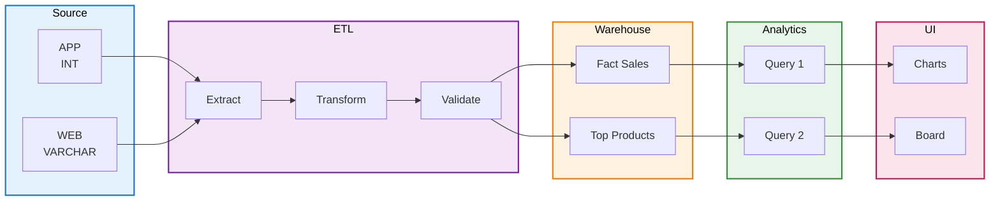

# E-Commerce Data Warehouse - Business Requirements Document

## Project Objective

Build a data warehouse system that extracts data from two different business data sources (App and Web), performs data cleaning and ETL processing, and finally displays **sales analysis** and **product ratings ranking** data.

---

## Data Source Architecture

### Database 1: App Business System (ecommerce_source_app)

**Table Structure:**

| Table Name          | Fields                                              | Description          |
| ------------------- | --------------------------------------------------- | -------------------- |
| **users**           | user_id, name, email, city, register_date           | User table           |
| **products**        | product_id, name, category, price, brand            | Product table        |
| **orders**          | order_id, user_id, order_date, total_amount, status | Order table          |
| **order_items**     | item_id, order_id, product_id, quantity, unit_price | Order details table  |
| **product_reviews** | review_id, product_id, user_id, rating, review_date | Product review table |

**Data Format Characteristics:**

- orders.**order_id**: Numeric type (INT)
- orders.**order_date**: Date format `yyyy-MM-dd`

### Database 2: Web Business System (ecommerce_source_web)

**Table Structure:** Same as App, but with different order table field names

| Table Name          | Fields                                              | Description                            |
| ------------------- | --------------------------------------------------- | -------------------------------------- |
| **users**           | user_id, name, email, city, register_date           | User table                             |
| **products**        | product_id, name, category, price, brand            | Product table                          |
| **orders**          | order_no, user_id, order_date, total_amount, status | Order table (Note: field name differs) |
| **order_items**     | item_id, order_id, product_id, quantity, unit_price | Order details table                    |
| **product_reviews** | review_id, product_id, user_id, rating, review_date | Product review table                   |

**Data Format Characteristics:**

- orders.**order_no**: Alphanumeric mixed (VARCHAR, e.g., "WEB-001")
- orders.**order_date**: Date format `MM/dd/yyyy`

**Key Differences Between Source Systems:**

| Dimension           | App (source_app) | Web (source_web)  |
| ------------------- | ---------------- | ----------------- |
| Order ID Field Name | order_id         | order_no          |
| Order ID Data Type  | 12345 (INT)      | WEB-001 (VARCHAR) |
| Order Date Format   | 2024-03-01       | 03/01/2024        |

### Database 3: Analytics Data Warehouse (ecommerce_warehouse)

Stores cleaned and transformed statistical data.

**Core Tables:**

| Table Name                      | Purpose                                        |
| ------------------------------- | ---------------------------------------------- |
| **fact_sales_by_category_time** | Sales quantity statistics by category and time |
| **fact_top_rated_products**     | Top products by rating statistics              |

---

## Requirements List

### Requirement 1: Analyze Sales by Product Category and Time Dimension

**Data Source**: `ecommerce_warehouse.fact_sales_by_category_time` (Warehouse table)

**Dimensions:**

- Product category (category)
- Time dimension: year, month, day

**Metrics:**

- Sales quantity (total_quantity)
- Sales amount (total_sales_amount)

**Output Display:**

- Heatmap (X-axis: time, Y-axis: category, value: quantity)
- Bar chart (comparison by category or time period)

**Example Query:**

```sql
-- Query must be based on warehouse table
SELECT
    category,
    CONCAT(year, '-', LPAD(month, 2, '0')) as time_period,
    total_quantity,
    total_sales_amount
FROM ecommerce_warehouse.fact_sales_by_category_time
WHERE year = 2024
ORDER BY category, year, month, day;
```

**Example Result:**

```
Category: Electronics, Time: 2024-03, Quantity: 150, Amount: 45000
Category: Clothing,    Time: 2024-03, Quantity: 200, Amount: 15000
Category: Books,       Time: 2024-03, Quantity: 80,  Amount: 3200
```

---

### Requirement 2: Top 5 Products by Review Rating

**Data Source**: `ecommerce_warehouse.fact_top_rated_products` (Warehouse table)

**Dimensions:**

- Product category (category)
- Time dimension: year, month, day

**Metrics:**

- Average rating (avg_rating)
- Review count (review_count)

**Output Display:**

- Ranking leaderboard (displaying Top 5 products with their ratings)

**Example Query:**

```sql
-- Query must be based on warehouse table
SELECT
    product_name,
    category,
    avg_rating,
    review_count
FROM ecommerce_warehouse.fact_top_rated_products
WHERE year = 2024 AND month = 3
ORDER BY avg_rating DESC, review_count DESC
LIMIT 5;
```

**Example Result:**

```
Product: iPhone 14,       Category: Electronics, Avg Rating: 4.8, Reviews: 150
Product: MacBook Pro,     Category: Electronics, Avg Rating: 4.7, Reviews: 120
Product: Samsung Galaxy,  Category: Electronics, Avg Rating: 4.6, Reviews: 100
...
```

---

## Data Processing Flow - ETL Architecture



**Process Description:**

| Layer                  | Components                  | Color     | Details                             |
| ---------------------- | --------------------------- | --------- | ----------------------------------- |
| 📊 **Source Layer**    | App / Web Sources           | 🔵 Blue   | Two heterogeneous business systems  |
| ⚙️ **ETL Layer**       | Extract → Transform → Clean | 🟣 Purple | Data cleaning and format conversion |
| 📈 **Warehouse Layer** | Two core fact tables        | 🟠 Orange | **Data source for all queries**     |
| 📊 **Analytics Layer** | Warehouse-based queries     | 🟢 Green  | **Must query warehouse tables**     |
| 🖥️ **UI Layer**        | Charts and dashboards       | 🔴 Pink   | Final user interface                |

---

## Key Principles

### All Analytics Queries Must Use the Data Warehouse

**Key Points:**

- Forbidden to directly query `ecommerce_source_app` or `ecommerce_source_web`
- Required to query from the two fact tables in `ecommerce_warehouse`
- All data must go through ETL processing, format unification, and quality validation before use
- Warehouse tables automatically handle App/Web data format differences

**Reasons:**

1. **Data Consistency** - Ensures data formats are unified across both channels
2. **Data Quality** - Data is cleaned, deduplicated, and validated
3. **Performance Optimization** - Warehouse tables are index-optimized for query efficiency
4. **Unified Business Logic** - All analyses are based on the same data processing rules

---

## Technical Requirements

- **Backend**: Spring Boot + MyBatis, supporting multi-source queries and data transformation
- **Frontend**: Vue 3, using charting libraries for heatmaps, bar charts, and leaderboards
- **Database**: MySQL 8.0
- **Deployment**: Docker Compose one-click startup

---

## Workflow

1. Requirements Confirmation (Current stage) - Confirm data model and statistical requirements
2. Database DDL Development - Create tables in source and warehouse databases
3. Sample Data Insertion - Insert test data into source systems (for demonstration)
4. ETL Logic Development - Data cleaning, transformation, and warehouse loading
5. API Development - Backend query endpoints
6. UI Development - Frontend dashboard
7. Testing and Deployment - Docker deployment verification
