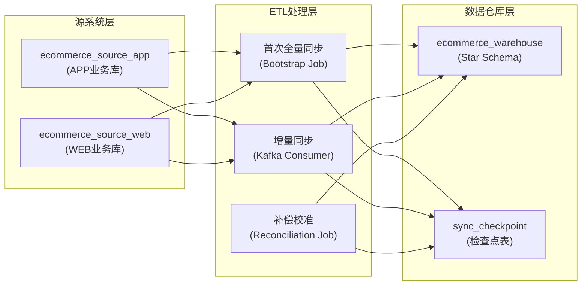

# 数据同步技术设计方案

## 1. 整体架构



---

## 2. 三个核心机制

### 2.1 首次全量同步 (Bootstrap)

**触发时机**

- 系统启动时自动检测
- 或通过管理接口手动触发重新同步
- 不作为定时 job 执行（避免重复初始化）

**执行流程**

```
1. 检查 sync_checkpoint: bootstrap_completed = 0
   ├─ 已完成 → 跳过全量，进入增量模式
   └─ 未完成 → 继续下一步

2. 开启事务，锁定检查点表
   └─ 防止并发执行多个全量任务

3. 全量装载三个源：
   ├─ ecommerce_source_app 全表读取
   │  ├─ 所有 products → dim_products (source='APP')
   │  ├─ 所有 orders → dim_orders (source='APP')
   │  └─ 所有 order_items → dim_order_items
   │
   ├─ ecommerce_source_web 全表读取
   │  ├─ 所有 products → dim_products (source='WEB')
   │  ├─ 所有 orders → dim_orders (source='WEB')
   │  └─ 所有 order_items → dim_order_items
   │
   └─ 聚合计算 fact_sales_by_product_time
      └─ group by product_key, year, month, day

4. 写入检查点
   ├─ bootstrap_completed = 1
   ├─ last_full_sync_time = now()
   ├─ app_max_order_id = (SELECT MAX(order_id) FROM ecommerce_source_app.orders)
   ├─ web_max_order_no = (SELECT MAX(order_no) FROM ecommerce_source_web.orders)
   └─ checkpoint_timestamp = now()

5. 提交事务
```

**幂等性保证**

- 使用 `UNIQUE KEY (source, product_id)` 和 `UNIQUE KEY (source, app_order_id, web_order_no)` 作为 upsert 条件
- 所有 INSERT 使用 `ON DUPLICATE KEY UPDATE` 逻辑
- 确保重跑全量不会产生重复数据

**伪代码**

```java
@Transactional
public void bootstrapFullSync() {
    // 1. 检查是否已完成
    SyncCheckpoint checkpoint = checkpointRepo.findLatest();
    if (checkpoint != null && checkpoint.isBootstrapCompleted()) {
        log.info("Bootstrap already completed, skip full sync");
        return;
    }

    // 2. 原子地开始全量同步
    checkpoint = new SyncCheckpoint();
    checkpoint.setStatus("IN_PROGRESS");
    checkpoint.setPhase("BOOTSTRAP");
    checkpoint.setStartTime(LocalDateTime.now());
    checkpointRepo.save(checkpoint);

    try {
        // 3. 全量装载
        loadProductsFromApp();
        loadProductsFromWeb();
        loadOrdersFromApp();
        loadOrdersFromWeb();
        loadOrderItemsFromApp();
        loadOrderItemsFromWeb();
        aggregateFactSales();

        // 4. 记录检查点
        checkpoint.setStatus("COMPLETED");
        checkpoint.setBootstrapCompleted(true);
        checkpoint.setAppMaxOrderId(getMaxAppOrderId());
        checkpoint.setWebMaxOrderNo(getMaxWebOrderNo());
        checkpoint.setCheckpointTimestamp(LocalDateTime.now());
        checkpointRepo.save(checkpoint);

        log.info("✓ Bootstrap full sync completed");
    } catch (Exception e) {
        checkpoint.setStatus("FAILED");
        checkpoint.setErrorMessage(e.getMessage());
        checkpointRepo.save(checkpoint);
        throw e;
    }
}
```

---

### 2.2 增量同步 (Kafka Consumer)

**实时处理流程**

```
Kafka Topic: order-events, product-events
    ↓
Kafka Consumer (KafkaEventConsumer)
    ├─ 1. 反序列化事件
    ├─ 2. 从源库查询完整数据
    ├─ 3. 字段映射转换
    ├─ 4. UPSERT 到仓库表
    │  ├─ dim_orders (source, app_order_id, web_order_no)
    │  ├─ dim_order_items
    │  ├─ dim_products (source, product_id)
    │  └─ fact_sales_by_product_time
    │
    ├─ 5. 记录 sync_log（审计）
    ├─ 6. 更新检查点（last_event_id, last_event_timestamp）
    └─ 7. 提交偏移量
```

**幂等性保证**

- 每条事件都标记 event_id 和 event_timestamp
- sync_checkpoint 记录 `last_processed_event_id`
- 消费者启动时从上次记录的位置继续消费
- 如果同一事件被重复消费，通过 UNIQUE KEY 和 ON DUPLICATE KEY UPDATE 保证只更新一次

**检查点更新逻辑**

```sql
-- 每处理完一批事件后
UPDATE sync_checkpoint
SET last_processed_event_id = ?,
    last_incremental_sync_time = NOW(),
    last_kafka_offset = ?
WHERE checkpoint_id = (SELECT MAX(checkpoint_id) FROM sync_checkpoint);
```

---

### 2.3 补偿校准 (Reconciliation Job)

**触发机制**

- 可选：每晚 2 AM 执行一次
- 或手动触发检查数据一致性

**执行流程**

```
1. 对账三个数据集
   ├─ APP: 行数对账
   │  ├─ SELECT COUNT(*) FROM ecommerce_source_app.orders → cnt_app
   │  ├─ SELECT COUNT(*) FROM ecommerce_warehouse.dim_orders
   │  │        WHERE source='APP' → cnt_warehouse
   │  └─ if cnt_app > cnt_warehouse → 补同步缺失数据
   │
   ├─ WEB: 行数对账
   │  └─ 同上
   │
   ├─ 产品: 行数对账
   │  └─ 同上
   │
   └─ 金额: 合计对账
      ├─ SELECT SUM(total_amount) FROM app/web orders
      ├─ SELECT SUM(total_sales_amount) FROM fact_sales_by_product_time
      └─ if 差额 > threshold → 警告日志

2. 检测"孤立数据"
   ├─ 仓库中有，但源库中已删除的订单 (可选标记)
   └─ 记录到特殊表 orphaned_records

3. 补偿缺失数据
   └─ 如果发现源库有但仓库没有的订单，手动触发重新同步

4. 更新对账日志
   └─ recon_log: timestamp, source, record_count, amount_total, status
```

**伪代码**

```java
@Scheduled(cron = "0 0 2 * * ?")  // 每天 2 AM
public void reconciliationJob() {
    log.info("Starting reconciliation job");

    // 1. 对账 APP
    int appCount = appOrderRepo.count();
    int warehouseAppCount = warehouseOrderRepo.countBySource("APP");
    if (appCount > warehouseAppCount) {
        log.warn("Mismatch detected for APP: {} vs {}", appCount, warehouseAppCount);
        List<AppOrder> missing = findMissingOrders("APP");
        for (AppOrder order : missing) {
            etlService.syncSingleOrder("APP", order.getOrderId());
        }
    }

    // 2. 对账金额
    BigDecimal appTotal = appOrderRepo.sumTotalAmount();
    BigDecimal warehouseTotal = warehouseSalesRepo.sumTotalAmount();
    if (appTotal.subtract(warehouseTotal).abs().compareTo(BigDecimal.valueOf(0.01)) > 0) {
        log.warn("Amount mismatch: {} vs {}", appTotal, warehouseTotal);
    }

    // 3. 记录对账结果
    reconLogRepo.save(new ReconLog(
        LocalDateTime.now(),
        appCount,
        warehouseAppCount,
        appTotal,
        warehouseTotal
    ));
}
```

---

## 3. 检查点表设计

### sync_checkpoint 表结构

```sql
CREATE TABLE sync_checkpoint (
    checkpoint_id BIGINT PRIMARY KEY AUTO_INCREMENT,

    -- Bootstrap 阶段
    bootstrap_completed TINYINT(1) DEFAULT 0,
    bootstrap_start_time DATETIME,
    bootstrap_complete_time DATETIME,

    -- 全量同步检查点
    last_full_sync_time DATETIME,
    app_max_order_id INT,
    web_max_order_no VARCHAR(50),

    -- 增量同步检查点
    last_processed_event_id VARCHAR(128),
    last_incremental_sync_time DATETIME,
    last_kafka_offset BIGINT,

    -- 对账检查点
    last_reconciliation_time DATETIME,
    last_reconciliation_status VARCHAR(20),  -- PASSED, WARNING, FAILED

    -- 元数据
    checkpoint_timestamp DATETIME DEFAULT CURRENT_TIMESTAMP,
    status VARCHAR(20) DEFAULT 'COMPLETED',  -- IN_PROGRESS, COMPLETED, FAILED
    error_message TEXT,

    PRIMARY KEY (checkpoint_id),
    INDEX idx_status (status),
    INDEX idx_timestamp (checkpoint_timestamp)
) COMMENT='数据同步检查点表';
```

### recon_log 表结构

```sql
CREATE TABLE recon_log (
    recon_log_id BIGINT PRIMARY KEY AUTO_INCREMENT,

    recon_time DATETIME NOT NULL,
    source VARCHAR(10),  -- APP, WEB, OVERALL

    -- 行数统计
    source_record_count INT,
    warehouse_record_count INT,
    record_count_diff INT,

    -- 金额统计
    source_total_amount DECIMAL(15,2),
    warehouse_total_amount DECIMAL(15,2),
    amount_diff DECIMAL(15,2),

    -- 结果和反馈
    status VARCHAR(20),  -- PASSED, WARNING, FAILED
    issues TEXT,  -- 发现的问题描述

    created_at DATETIME DEFAULT CURRENT_TIMESTAMP,
    updated_at DATETIME DEFAULT CURRENT_TIMESTAMP ON UPDATE CURRENT_TIMESTAMP,

    PRIMARY KEY (recon_log_id),
    INDEX idx_recon_time (recon_time),
    INDEX idx_source (source)
) COMMENT='数据对账日志表';
```

---

## 4. 幂等性保证策略

### 4.1 维表层面

**方案：在 INSERT 时使用 UNIQUE KEY + ON DUPLICATE KEY UPDATE**

```sql
-- dim_orders 的 UNIQUE KEY 确保了同一源的同一订单号只能有一条
UNIQUE KEY `uk_source_order` (`source`, `app_order_id`, `web_order_no`)

-- 全量和增量都用这个语句：
INSERT INTO dim_orders
(source, app_order_id, web_order_no, user_id, order_date, total_amount, status, created_at, updated_at)
VALUES (?, ?, ?, ?, ?, ?, 'pending', NOW(), NOW())
ON DUPLICATE KEY UPDATE
  user_id = VALUES(user_id),
  order_date = VALUES(order_date),
  total_amount = VALUES(total_amount),
  updated_at = NOW();
```

**优点**

- 自动去重
- 重跑不产生重复数据
- 更新时间戳便于后续审计

### 4.2 事件层面

**方案：记录 event_id 和 last_processed_event_id**

```sql
-- sync_log 记录已处理的每个事件
CREATE TABLE sync_log (
    sync_log_id BIGINT PRIMARY KEY AUTO_INCREMENT,
    event_id VARCHAR(128) UNIQUE,  -- 确保每个事件只记录一次
    event_type VARCHAR(50),
    source VARCHAR(10),
    order_id VARCHAR(50),
    status VARCHAR(20),
    error_message TEXT,
    sync_time DATETIME DEFAULT CURRENT_TIMESTAMP,

    INDEX idx_event_id (event_id),
    INDEX idx_status (status)
);

-- 消费者启动时：
SELECT last_processed_event_id FROM sync_checkpoint ORDER BY checkpoint_id DESC LIMIT 1;
-- 从 Kafka offset 恢复到这个 event_id 之后的位置
```

**工作流程**

1. 消费者从 Kafka 读取事件（带 event_id）
2. 检查 sync_log 是否已记录这个 event_id
3. 如果已记录，跳过（去重）
4. 如果未记录，处理并插入 sync_log
5. 定期更新 sync_checkpoint.last_processed_event_id

### 4.3 分布式一致性

**方案：使用检查点表的分布式锁**

```java
// 伪代码
@Transactional
public void safeBootstrap() {
    // 1. 尝试获取分布式锁（通过 SELECT ... FOR UPDATE）
    SyncCheckpoint checkpoint = repo.findLatestForUpdate();  // FOR UPDATE

    if (checkpoint.isBootstrapCompleted()) {
        // 另一个实例已完成，退出
        return;
    }

    if ("IN_PROGRESS".equals(checkpoint.getStatus())) {
        // 有其他实例在执行，等待或退出
        return;
    }

    // 2. 标记为进行中
    checkpoint.setStatus("IN_PROGRESS");
    repo.save(checkpoint);

    // 3. 执行全量同步
    try {
        doFullSync();
        checkpoint.setStatus("COMPLETED");
    } catch (Exception e) {
        checkpoint.setStatus("FAILED");
        throw e;
    } finally {
        repo.save(checkpoint);
    }
}
```

---

## 5. 失败重试和补偿

### 5.1 全量同步失败

| 失败原因     | 处理策略                               | 备注         |
| ------------ | -------------------------------------- | ------------ |
| 网络超时     | 重试 3 次，指数退避                    | 2s → 4s → 8s |
| 源库不可用   | 等待 5 分钟后重试，最多 10 次          | 日志告警     |
| 仓库磁盘满   | 人工介入                               | 需管理员清理 |
| 字段映射错误 | 打印详细日志，标记为 FAILED，不重试    | 需开发修复   |
| 部分行失败   | 跳过失败行，继续处理，最后生成失败报告 | 补偿脚本修复 |

### 5.2 增量同步失败

| 失败原因         | 处理策略                                                  | 备注                 |
| ---------------- | --------------------------------------------------------- | -------------------- |
| 单条事件处理异常 | 1. 写入 DLQ（死信队列）; 2. 记录 sync_log status='FAILED' | Kafka 消费继续       |
| 批量提交失败     | 回滚当前批次，记录失败位置                                | 下次从该位置重新开始 |
| 事件 ID 冲突     | 检查是否重复消费，使用 last_processed_event_id 去重       | 正常                 |

### 5.3 补偿机制

**自动补偿（每天 2 AM）**

```
1. 检测数据差异
2. 如果 source > warehouse，automatically re-sync 缺失的条数
3. 如果差异过大（如 > 10%），生成告警而不自动修复
```

**手动补偿**

```java
// 补偿特定源的缺失数据
POST /api/admin/reconciliation/sync-missing?source=APP

// 重新同步特定订单
POST /api/admin/reconciliation/sync-order?orderId=1001&source=APP

// 查看对账报告
GET /api/admin/reconciliation/logs?days=7
```

---

## 6. 流程时序图

### 系统启动

```
System Start
    ↓
Check sync_checkpoint bootstrap_completed
    ├─ YES → Skip bootstrap, start Kafka consumer
    └─ NO → Execute bootstrap
             ├─ Lock checkpoint table
             ├─ Full sync: APP + WEB
             ├─ Aggregate: fact_sales
             ├─ Update checkpoint: bootstrap_completed=1
             ├─ Release lock
             └─ Start Kafka consumer
```

### 正常运行

```
                Timeline
┌─────────────────────────────────────────────────┐
│                                                 │
│  Every second (Kafka Consumer)                 │
│  ├─ Poll events from Kafka                     │
│  ├─ Upsert to warehouse                        │
│  ├─ Record sync_log                            │
│  └─ Update checkpoint: last_processed_event_id │
│                                                 │
│  Every day 2 AM (Reconciliation Job)           │
│  ├─ Count comparison (APP, WEB, OVERALL)       │
│  ├─ Sum comparison (total_amount)              │
│  ├─ Detect missing data                        │
│  └─ Auto-sync missing or Alert if large diff   │
│                                                 │
└─────────────────────────────────────────────────┘
```

---

## 7. 监控指标

### 关键指标

| 指标           | 阈值      | 告警条件          |
| -------------- | --------- | ----------------- |
| Bootstrap 耗时 | < 5 分钟  | > 10 分钟         |
| 增量延迟 (E2E) | < 1 秒    | > 5 秒            |
| Kafka 消费落后 | < 10 事件 | > 100 事件        |
| 同步成功率     | > 99.9%   | < 99%             |
| 数据对账差异   | < 0.01%   | > 1%              |
| 最后同步时间   | < 1 小时  | > 6 小时 (无消费) |

### 查询语句

```sql
-- 1. 查看最新检查点
SELECT * FROM sync_checkpoint ORDER BY checkpoint_id DESC LIMIT 1;

-- 2. 查看增量同步进度
SELECT last_processed_event_id, last_incremental_sync_time, last_kafka_offset
FROM sync_checkpoint ORDER BY checkpoint_id DESC LIMIT 1;

-- 3. 查看同步日志统计
SELECT
  source,
  COUNT(*) as total_events,
  SUM(CASE WHEN status='SUCCESS' THEN 1 ELSE 0 END) as success_count,
  SUM(CASE WHEN status='FAILED' THEN 1 ELSE 0 END) as failed_count,
  ROUND(100.0 * SUM(CASE WHEN status='SUCCESS' THEN 1 ELSE 0 END) / COUNT(*), 2) as success_rate
FROM sync_log
WHERE sync_time > DATE_SUB(NOW(), INTERVAL 24 HOUR)
GROUP BY source;

-- 4. 查看对账报告（最近7天）
SELECT * FROM recon_log WHERE recon_time > DATE_SUB(NOW(), INTERVAL 7 DAY) ORDER BY recon_time DESC;

-- 5. 数据一致性检查
SELECT
  'APP' as source,
  COUNT(*) as source_count,
  (SELECT COUNT(*) FROM dim_orders WHERE source='APP') as warehouse_count
FROM ecommerce_source_app.orders
UNION ALL
SELECT
  'WEB' as source,
  COUNT(*) as source_count,
  (SELECT COUNT(*) FROM dim_orders WHERE source='WEB') as warehouse_count
FROM ecommerce_source_web.orders;
```

---

## 8. 实施建议

### 第一阶段：基础设施

- [ ] 创建 sync_checkpoint 表
- [ ] 创建 recon_log 表
- [ ] 集成检查点管理逻辑

### 第二阶段：首次全量同步

- [ ] 实现 BootstrapService
- [ ] 实现全量装载 SQL 和幂等 upsert
- [ ] 添加启动检查

### 第三阶段：增量同步改进

- [ ] 在 KafkaEventConsumer 中集成 sync_checkpoint 更新
- [ ] 实现消费者启动位置恢复
- [ ] DLQ 集成

### 第四阶段：对账和补偿

- [ ] 实现 ReconciliationService
- [ ] 定时任务配置
- [ ] 补偿接口开发

### 第五阶段：监控和告警

- [ ] 仪表板（关键指标展示）
- [ ] 日志聚合
- [ ] 告警通知（邮件/Slack）

---

## 9. 参考文献

- [Kafka Exactly-Once Semantics](https://kafka.apache.org/documentation/#semantics)
- [Change Data Capture (CDC) Patterns](https://martinfowler.com/articles/patterns-of-distributed-systems/changeDataCapture.html)
- [Two-Phase Commit vs. Saga Pattern](https://microservices.io/patterns/data/saga.html)
