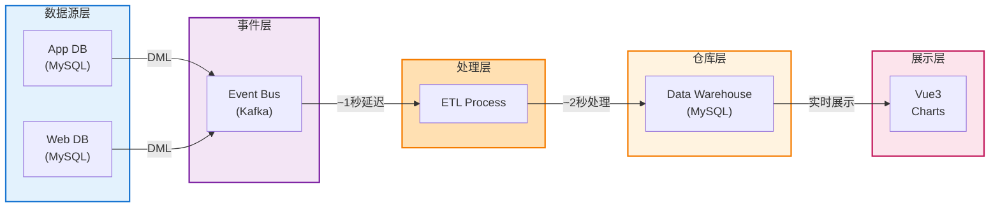
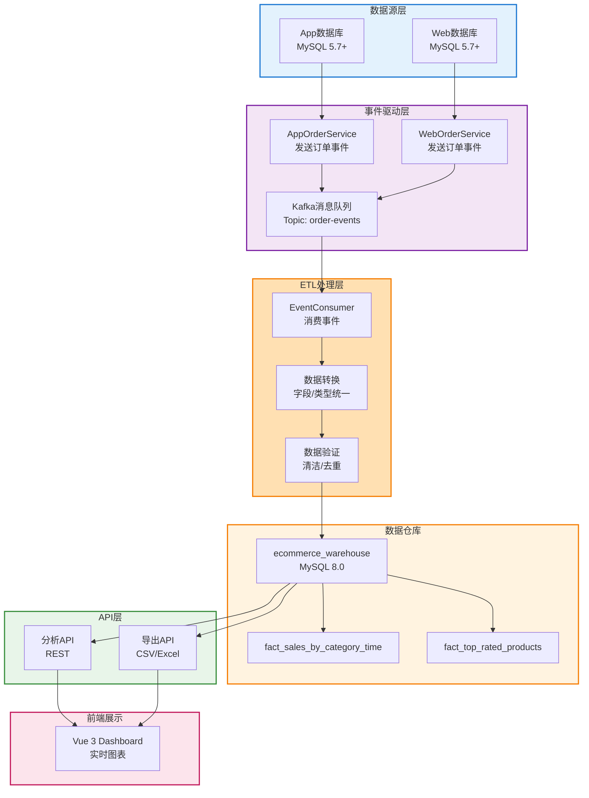
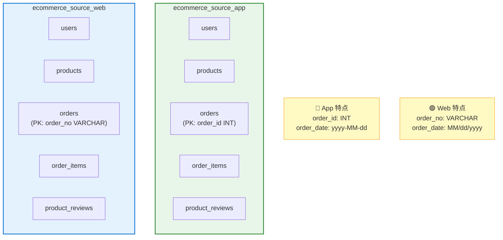
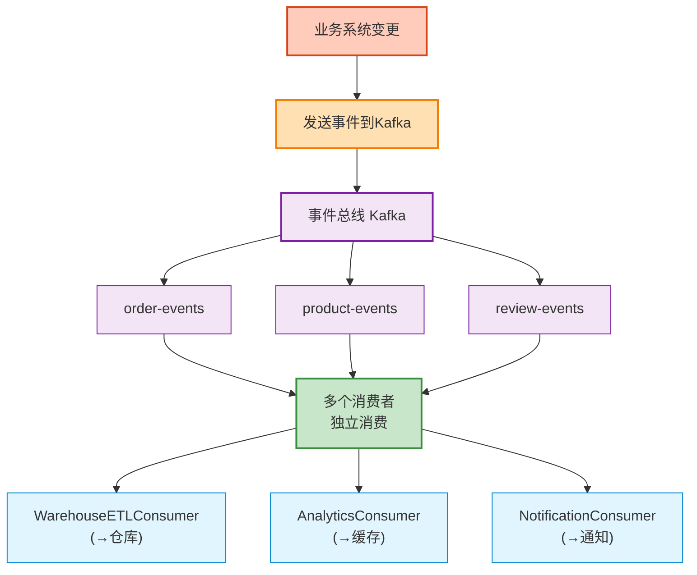
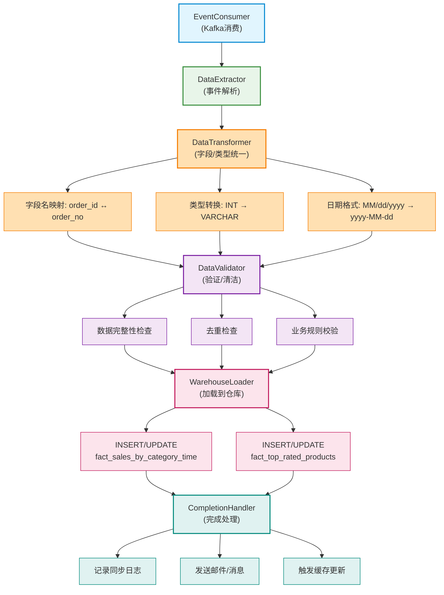
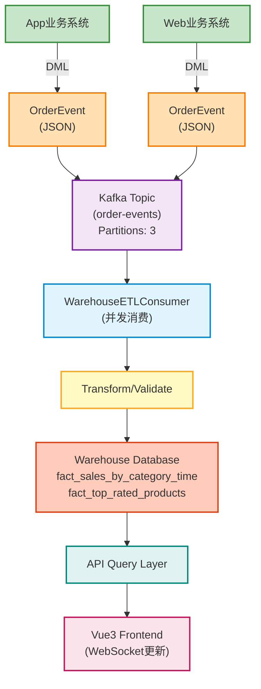
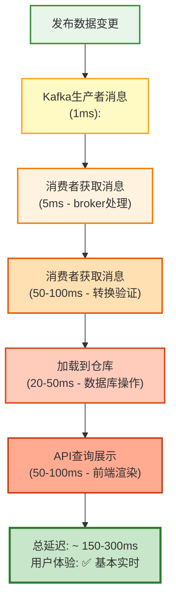
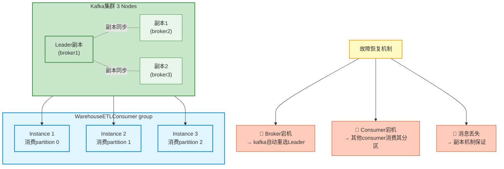

# E-Commerce Data Warehouse - 技术方案文档

**项目名称：** 电商数据仓库系统  
**版本：** 1.0  
**日期：** 2026年  
**状态：** 最终方案

---

## 📋 目录

1. [项目概述](#项目概述)
2. [业务架构](#业务架构)
3. [技术架构](#技术架构)
4. [技术栈选择](#技术栈选择)
5. [分层详细设计](#分层详细设计)
6. [实时同步方案](#实时同步方案方案d)
7. [部署架构](#部署架构)
8. [实现步骤](#实现步骤)
9. [风险与对策](#风险与对策)

---

## 项目概述

### 目标

构建一个实时数据仓库系统，从两个异构业务数据源（App和Web）**实时**同步数据，进行数据清理、ETL处理，最终支持销量分析和评论排行两个核心分析需求。

### 核心特性

- 🔄 **实时同步**：基于事件驱动，数据变更秒级响应
- 🔗 **异构数据融合**：统一处理App (INT/DATE) 和 Web (VARCHAR/STRING) 数据格式
- 📊 **多维分析**：支持按类别、时间的销量分析和评论排行
- 🏗️ **可扩展架构**：模块化设计，易于添加新的业务需求
- 🚀 **高可用部署**：容器化运行，支持快速扩展

---

## 业务架构



---

## 技术架构

### 高层架构视图



### 第1层：数据源层



### 第2层：事件驱动层 ⭐ 核心创新



### 第3层：ETL处理层



---

## 技术栈选择

### 推荐技术栈

| 层次         | 组件       | 技术选型       | 版本  | 原因               |
| ------------ | ---------- | -------------- | ----- | ------------------ |
| **后端框架** | 应用服务器 | Spring Boot    | 3.0+  | 成熟稳定、生态完善 |
| **ORM框架**  | 数据访问   | MyBatis-Plus   | 3.5+  | 功能强大、上手快   |
| **消息队列** | 事件总线   | Apache Kafka   | 3.x   | 高吞吐、可靠性高   |
| **事件框架** | 事件处理   | Spring Kafka   | 3.0+  | Spring生态集成     |
| **缓存**     | 热数据缓存 | Redis          | 7.0+  | 性能最优（可选）   |
| **数据库**   | 数据存储   | MySQL          | 8.0+  | 可靠性最高         |
| **前端框架** | Web应用    | Vue 3          | 3.3+  | 易用、高效         |
| **图表库**   | 数据可视化 | ECharts        | 5.4+  | 功能完整、无版税   |
| **UI组件库** | 界面组件   | Ant Design Vue | 4.0+  | 企业级、组件丰富   |
| **容器化**   | 部署工具   | Docker         | 24.0+ | 标准化部署         |
| **编排工具** | 容器管理   | Docker Compose | 2.20+ | 本地快速部署       |

### 技术选型对比

#### 消息队列对比

| 对比项   | Kafka                   | RabbitMQ      | Redis            | ActiveMQ   |
| -------- | ----------------------- | ------------- | ---------------- | ---------- |
| 吞吐量   | 极高(百万+/s)           | 中等(万/s)    | 高(十万/s)       | 中等(万/s) |
| 延迟     | 毫秒级                  | 微秒级        | 微秒级           | 毫秒级     |
| 可靠性   | 高(副本机制)            | 极高          | 中等             | 高         |
| 持久化   | 磁盘存储                | 内存+持久化   | 内存为主         | 支持       |
| 学习成本 | 中等                    | 低            | 低               | 中等       |
| 推荐指数 | ⭐⭐⭐⭐⭐              | ⭐⭐⭐⭐      | ⭐⭐⭐           | ⭐⭐⭐     |
| 选择原因 | ✅ 高吞吐、消费者可扩展 | 功能丰富但OTT | 只用缓存不用队列 | 过时       |

---

## 分层详细设计

### 第1层：数据源层（业务系统改造）

#### App业务系统改造

```java
// 原有代码
@Service
public class AppOrderService {
    @Autowired
    private OrderRepository orderRepository;

    public Order createOrder(Order order) {
        return orderRepository.save(order);
    }
}

// ↓ 改造后

@Service
public class AppOrderService {
    @Autowired
    private OrderRepository orderRepository;

    @Autowired
    private KafkaTemplate<String, OrderEvent> kafkaTemplate;

    public Order createOrder(Order order) {
        // 1. 保存到本地数据库
        Order savedOrder = orderRepository.save(order);

        // 2. 发送事件到Kafka
        OrderEvent event = new OrderEvent(
            "ORDER_CREATED",
            savedOrder,
            "APP",
            LocalDateTime.now()
        );
        kafkaTemplate.send("order-events",
            String.valueOf(savedOrder.getOrderId()),
            event);

        return savedOrder;
    }

    public Order updateOrder(Order order) {
        Order updated = orderRepository.save(order);

        // 发送更新事件
        OrderEvent event = new OrderEvent(
            "ORDER_UPDATED",
            updated,
            "APP",
            LocalDateTime.now()
        );
        kafkaTemplate.send("order-events",
            String.valueOf(updated.getOrderId()),
            event);

        return updated;
    }
}
```

#### Web业务系统改造（完全相同方式）

```java
@Service
public class WebOrderService {
    @Autowired
    private OrderRepository orderRepository;

    @Autowired
    private KafkaTemplate<String, OrderEvent> kafkaTemplate;

    public Order createOrder(Order order) {
        Order savedOrder = orderRepository.save(order);

        OrderEvent event = new OrderEvent(
            "ORDER_CREATED",
            savedOrder,
            "WEB",
            LocalDateTime.now()
        );
        kafkaTemplate.send("order-events",
            savedOrder.getOrderNo(),
            event);

        return savedOrder;
    }
    // ... 类似的updateOrder方法
}
```

#### 事件定义

```java
@Data
@AllArgsConstructor
public class OrderEvent {
    private String eventType;        // ORDER_CREATED, ORDER_UPDATED
    private Order order;
    private String source;           // APP 或 WEB
    private LocalDateTime timestamp;

    // 用于序列化
    public static OrderEvent fromJson(String json) {
        return JsonUtils.parse(json, OrderEvent.class);
    }
}
```

### 第2层：事件驱动层（消息队列）

#### Kafka配置

```yaml
# application.yml
kafka:
  bootstrap-servers: localhost:9092

  producer:
    key-serializer: org.apache.kafka.common.serialization.StringSerializer
    value-serializer: org.springframework.kafka.support.serializer.JsonSerializer
    acks: all
    retries: 3

  consumer:
    bootstrap-servers: localhost:9092
    group-id: warehouse-etl-consumer
    key-deserializer: org.apache.kafka.common.serialization.StringDeserializer
    value-deserializer: org.springframework.kafka.support.serializer.JsonDeserializer
    properties:
      spring.json.trusted.packages: "*"
    max-poll-records: 100

  topics:
    order-events: order-events
    partitions: 3
    replication-factor: 1
```

#### Kafka Topic创建

```bash
# 创建 order-events topic
kafka-topics.sh --create \
  --bootstrap-server localhost:9092 \
  --topic order-events \
  --partitions 3 \
  --replication-factor 1 \
  --config retention.ms=604800000
```

### 第3层：ETL处理层 ⭐ 核心处理

#### 事件消费者

```java
@Service
public class WarehouseETLConsumer {

    @Autowired
    private WarehouseService warehouseService;

    @Autowired
    private OrderTransformer orderTransformer;

    @Autowired
    private OrderValidator orderValidator;

    @Autowired
    private WarehouseLoader warehouseLoader;

    @Autowired
    private SyncLogMapper syncLogMapper;

    // 消费订单事件
    @KafkaListener(
        topics = "order-events",
        groupId = "warehouse-etl-consumer",
        concurrency = "3"
    )
    public void consumeOrderEvent(
        @Payload OrderEvent event,
        @Headers(KafkaHeaders.RECEIVED_PARTITION_ID) int partition,
        @Headers(KafkaHeaders.OFFSET) long offset
    ) {
        try {
            log.info("Consuming order event: {} from partition {}, offset {}",
                event.getEventType(), partition, offset);

            // 1. 提取并转换
            UnifiedOrder unifiedOrder = orderTransformer.transform(event);

            // 2. 验证
            if (!orderValidator.validate(unifiedOrder)) {
                log.error("Order validation failed: {}", unifiedOrder);
                recordSyncLog(event, "VALIDATION_FAILED");
                return;
            }

            // 3. 加载到仓库
            warehouseLoader.load(unifiedOrder);

            // 4. 记录同步日志
            recordSyncLog(event, "SUCCESS");

            // 5. 发送通知（可选）
            notifySync(event);

        } catch (Exception e) {
            log.error("Error processing order event", e);
            recordSyncLog(event, "ERROR: " + e.getMessage());
        }
    }

    private void recordSyncLog(OrderEvent event, String status) {
        SyncLog log = new SyncLog();
        log.setEventType(event.getEventType());
        log.setSource(event.getSource());
        log.setOrderId(event.getOrder().getId());
        log.setStatus(status);
        log.setSyncTime(LocalDateTime.now());
        syncLogMapper.insert(log);
    }
}
```

#### 数据转换器

```java
@Component
public class OrderTransformer {

    /**
     * 将原始订单事件转换为统一格式
     */
    public UnifiedOrder transform(OrderEvent event) {
        Order sourceOrder = event.getOrder();
        UnifiedOrder unified = new UnifiedOrder();

        // 处理订单ID（关键转换）
        if ("APP".equals(event.getSource())) {
            // App: INT → VARCHAR
            unified.setOrderId(String.valueOf(sourceOrder.getOrderId()));
            unified.setSource("APP");
        } else if ("WEB".equals(event.getSource())) {
            // Web: 本身就是VARCHAR
            unified.setOrderId(sourceOrder.getOrderNo());
            unified.setSource("WEB");
        }

        // 处理日期格式
        if ("APP".equals(event.getSource())) {
            // App已是yyyy-MM-dd，直接使用
            unified.setOrderDate(sourceOrder.getOrderDate());
        } else {
            // Web: MM/dd/yyyy → yyyy-MM-dd
            LocalDate parsedDate = LocalDate.parse(
                sourceOrder.getOrderDate(),
                DateTimeFormatter.ofPattern("MM/dd/yyyy")
            );
            unified.setOrderDate(parsedDate);
        }

        // 其他字段映射
        unified.setUserId(sourceOrder.getUserId());
        unified.setTotalAmount(sourceOrder.getTotalAmount());
        unified.setStatus(sourceOrder.getStatus());
        unified.setEventTimestamp(event.getTimestamp());

        return unified;
    }
}
```

#### 数据验证器

```java
@Component
public class OrderValidator {

    public boolean validate(UnifiedOrder order) {
        // 1. 必填字段检查
        if (order.getOrderId() == null || order.getOrderId().trim().isEmpty()) {
            log.error("Order ID is empty");
            return false;
        }

        if (order.getUserId() == null) {
            log.error("User ID is empty");
            return false;
        }

        // 2. 金额验证
        if (order.getTotalAmount() == null || order.getTotalAmount().compareTo(BigDecimal.ZERO) < 0) {
            log.error("Invalid order amount: {}", order.getTotalAmount());
            return false;
        }

        // 3. 日期验证
        if (order.getOrderDate() == null) {
            log.error("Order date is empty");
            return false;
        }

        // 4. 去重检查
        if (isDuplicate(order)) {
            log.warn("Duplicate order detected: {}", order.getOrderId());
            return true; // 允许但标记为重复
        }

        return true;
    }

    private boolean isDuplicate(UnifiedOrder order) {
        // 查询仓库中是否已存在相同订单
        Integer count = warehouseMapper.countByOrderId(order.getOrderId());
        return count > 0;
    }
}
```

#### 仓库加载器

```java
@Component
public class WarehouseLoader {

    @Autowired
    private SalesFactMapper salesFactMapper;

    @Autowired
    private ProductFactMapper productFactMapper;

    public void load(UnifiedOrder order) {
        // 处理订单项（行级数据）
        for (OrderItem item : order.getItems()) {
            loadSalesFact(order, item);
        }

        // 处理评论（如果有）
        if (order.getReviews() != null) {
            for (Review review : order.getReviews()) {
                loadProductFact(review);
            }
        }
    }

    /**
     * 加载销量事实表
     */
    private void loadSalesFact(UnifiedOrder order, OrderItem item) {
        LocalDate orderDate = order.getOrderDate();

        SalesFactByCategory fact = new SalesFactByCategory();
        fact.setCategory(item.getProduct().getCategory());
        fact.setYear(orderDate.getYear());
        fact.setMonth(orderDate.getMonthValue());
        fact.setDay(orderDate.getDayOfMonth());
        fact.setQuantity(item.getQuantity());
        fact.setSalesAmount(item.getUnitPrice().multiply(
            new BigDecimal(item.getQuantity())
        ));

        // 使用 upsert 逻辑（如果存在则更新，不存在则插入）
        salesFactMapper.upsert(fact);
    }

    /**
     * 加载商品评分事实表
     */
    private void loadProductFact(Review review) {
        LocalDate reviewDate = review.getReviewDate();

        // 计算该商品的平均评分和评论数
        AggregatedReview agg = productFactMapper.aggregateReviews(
            review.getProductId(),
            reviewDate.getYear(),
            reviewDate.getMonthValue(),
            reviewDate.getDayOfMonth()
        );

        ProductFactTopRated fact = new ProductFactTopRated();
        fact.setProductId(review.getProductId());
        fact.setProductName(review.getProduct().getName());
        fact.setCategory(review.getProduct().getCategory());
        fact.setAvgRating(agg.getAvgRating());
        fact.setReviewCount(agg.getReviewCount());
        fact.setYear(reviewDate.getYear());
        fact.setMonth(reviewDate.getMonthValue());
        fact.setDay(reviewDate.getDayOfMonth());

        productFactMapper.upsert(fact);
    }
}
```

### 第4层：数据仓库层

#### 表结构

```sql
-- 销量事实表
CREATE TABLE fact_sales_by_category_time (
    id INT PRIMARY KEY AUTO_INCREMENT,
    category VARCHAR(50) NOT NULL,
    year INT NOT NULL,
    month INT NOT NULL,
    day INT NOT NULL,
    total_quantity INT NOT NULL DEFAULT 0,
    total_sales_amount DECIMAL(15,2) NOT NULL DEFAULT 0,
    created_at DATETIME DEFAULT CURRENT_TIMESTAMP,
    updated_at DATETIME DEFAULT CURRENT_TIMESTAMP ON UPDATE CURRENT_TIMESTAMP,
    UNIQUE KEY uk_category_time (category, year, month, day),
    KEY idx_category (category),
    KEY idx_year_month (year, month)
) ENGINE=InnoDB DEFAULT CHARSET=utf8mb4;

-- 商品评分事实表
CREATE TABLE fact_top_rated_products (
    id INT PRIMARY KEY AUTO_INCREMENT,
    product_id INT NOT NULL,
    product_name VARCHAR(200) NOT NULL,
    category VARCHAR(50),
    year INT NOT NULL,
    month INT NOT NULL,
    day INT NOT NULL,
    avg_rating DECIMAL(3,2),
    review_count INT NOT NULL DEFAULT 0,
    created_at DATETIME DEFAULT CURRENT_TIMESTAMP,
    updated_at DATETIME DEFAULT CURRENT_TIMESTAMP ON UPDATE CURRENT_TIMESTAMP,
    UNIQUE KEY uk_product_time (product_id, year, month, day),
    KEY idx_category (category),
    KEY idx_avg_rating (avg_rating DESC),
    KEY idx_year_month (year, month)
) ENGINE=InnoDB DEFAULT CHARSET=utf8mb4;

-- 同步日志表（用于监控和调试）
CREATE TABLE sync_log (
    id INT PRIMARY KEY AUTO_INCREMENT,
    event_type VARCHAR(50),
    source VARCHAR(20),
    order_id VARCHAR(50),
    status VARCHAR(30),
    error_message TEXT,
    sync_time DATETIME,
    KEY idx_source_time (source, sync_time),
    KEY idx_status (status)
) ENGINE=InnoDB DEFAULT CHARSET=utf8mb4;
```

### 第5层：API层

#### REST API 设计

```java
@RestController
@RequestMapping("/api/analytics")
public class AnalyticsController {

    @Autowired
    private AnalyticsService analyticsService;

    /**
     * 获取销量分析数据
     */
    @GetMapping("/sales")
    public ResponseEntity<List<SalesAnalysis>> getSalesAnalytics(
        @RequestParam(required = false) String category,
        @RequestParam(required = false) Integer year,
        @RequestParam(required = false) Integer month,
        @RequestParam(required = false) Integer day
    ) {
        List<SalesAnalysis> result = analyticsService.querySalesAnalytics(
            category, year, month, day
        );
        return ResponseEntity.ok(result);
    }

    /**
     * 获取Top产品排行
     */
    @GetMapping("/top-products")
    public ResponseEntity<List<TopProductAnalysis>> getTopProducts(
        @RequestParam(required = false) String category,
        @RequestParam(required = false) Integer year,
        @RequestParam(required = false) Integer month,
        @RequestParam(defaultValue = "5") Integer limit
    ) {
        List<TopProductAnalysis> result = analyticsService.queryTopProducts(
            category, year, month, limit
        );
        return ResponseEntity.ok(result);
    }

    /**
     * 导出数据为CSV
     */
    @GetMapping("/export/sales")
    public void exportSalesData(
        HttpServletResponse response,
        @RequestParam(required = false) Integer year
    ) throws IOException {
        response.setContentType("text/csv;charset=UTF-8");
        response.setHeader("Content-Disposition",
            "attachment;filename=sales_data.csv");

        List<SalesAnalysis> data = analyticsService.querySalesAnalytics(
            null, year, null, null
        );

        String csv = analyticsService.convertToCSV(data);
        response.getWriter().write(csv);
    }
}

@Service
public class AnalyticsService {

    @Autowired
    private SalesFactMapper salesFactMapper;

    @Autowired
    private ProductFactMapper productFactMapper;

    public List<SalesAnalysis> querySalesAnalytics(
        String category, Integer year, Integer month, Integer day
    ) {
        return salesFactMapper.querySalesAnalytics(
            category, year, month, day
        );
    }

    public List<TopProductAnalysis> queryTopProducts(
        String category, Integer year, Integer month, Integer limit
    ) {
        return productFactMapper.queryTopProducts(
            category, year, month, limit
        );
    }
}
```

### 第6层：前端展示层

#### Vue3 组件结构

```typescript
// src/pages/Dashboard.vue
<template>
  <div class="dashboard">
    <!-- 销量分析 -->
    <div class="sales-section">
      <div class="filters">
        <RangeSelector v-model="dateRange" />
        <CategoryFilter v-model="selectedCategory" />
      </div>

      <div class="charts">
        <Heatmap :data="salesHeatmapData" />
        <BarChart :data="salesBarChartData" />
      </div>
    </div>

    <!-- Top产品排行 -->
    <div class="products-section">
      <ProductRankingTable
        :products="topProducts"
        :loading="loading"
      />
    </div>

    <!-- 实时同步状态 -->
    <div class="sync-status">
      <SyncMonitor :status="syncStatus" />
    </div>
  </div>
</template>

<script setup lang="ts">
import { ref, onMounted, onBeforeUnmount } from 'vue'
import { AnalyticsAPI } from '@/api/analytics'
import { WebSocketService } from '@/services/websocket'

const salesHeatmapData = ref([])
const salesBarChartData = ref([])
const topProducts = ref([])
const syncStatus = ref({})

// 实时更新（通过WebSocket）
const wsService = new WebSocketService()

onMounted(() => {
  // 初始加载数据
  loadAnalyticsData()

  // 订阅实时更新
  wsService.subscribe('/topic/warehouse-updates', (event) => {
    syncStatus.value = event
    // 刷新数据
    loadAnalyticsData()
  })
})

const loadAnalyticsData = async () => {
  const sales = await AnalyticsAPI.getSalesAnalytics()
  salesHeatmapData.value = transformToHeatmap(sales)
  salesBarChartData.value = transformToBarChart(sales)

  const products = await AnalyticsAPI.getTopProducts()
  topProducts.value = products
}

onBeforeUnmount(() => {
  wsService.disconnect()
})
</script>
```

---

## 实时同步方案（方案D）

### 架构流程图



### 关键特性

| 特性             | 说明                         | 优势           |
| ---------------- | ---------------------------- | -------------- |
| **事件驱动**     | 业务系统数据变更立即发送事件 | 无延迟感知     |
| **消息队列解耦** | Kafka作为事件总线            | 系统间松耦合   |
| **消费者可扩展** | 多个消费者独立消费           | 易于添加新需求 |
| **并发处理**     | 3个分区并发消费              | 高吞吐能力     |
| **实时通知**     | WebSocket推送前端            | 用户即时反馈   |

### 端到端延迟分析



### 高可用设计



---

## 部署架构

### Docker Compose 配置

```yaml
version: "3.8"

services:
  # Kafka
  zookeeper:
    image: confluentinc/cp-zookeeper:7.4.0
    environment:
      ZOOKEEPER_CLIENT_PORT: 2181
    ports:
      - "2181:2181"
    networks:
      - warehouse-network

  kafka:
    image: confluentinc/cp-kafka:7.4.0
    depends_on:
      - zookeeper
    ports:
      - "9092:9092"
    environment:
      KAFKA_BROKER_ID: 1
      KAFKA_ZOOKEEPER_CONNECT: zookeeper:2181
      KAFKA_ADVERTISED_LISTENERS: PLAINTEXT://kafka:29092,PLAINTEXT_HOST://kafka:9092
      KAFKA_LISTENER_SECURITY_PROTOCOL_MAP: PLAINTEXT:PLAINTEXT,PLAINTEXT_HOST:PLAINTEXT
      KAFKA_INTER_BROKER_LISTENER_NAME: PLAINTEXT
      KAFKA_OFFSETS_TOPIC_REPLICATION_FACTOR: 1
      KAFKA_CREATE_TOPICS: "order-events:3:1"
    networks:
      - warehouse-network

  # MySQL 数据库
  app-db:
    image: mysql:8.0
    environment:
      MYSQL_DATABASE: ecommerce_source_app
      MYSQL_ROOT_PASSWORD: root
    ports:
      - "3306:3306"
    volumes:
      - app-db-data:/var/lib/mysql
      - ./sql/app-schema.sql:/docker-entrypoint-initdb.d/schema.sql
    networks:
      - warehouse-network

  web-db:
    image: mysql:8.0
    environment:
      MYSQL_DATABASE: ecommerce_source_web
      MYSQL_ROOT_PASSWORD: root
    ports:
      - "3307:3306"
    volumes:
      - web-db-data:/var/lib/mysql
      - ./sql/web-schema.sql:/docker-entrypoint-initdb.d/schema.sql
    networks:
      - warehouse-network

  warehouse-db:
    image: mysql:8.0
    environment:
      MYSQL_DATABASE: ecommerce_warehouse
      MYSQL_ROOT_PASSWORD: root
    ports:
      - "3308:3306"
    volumes:
      - warehouse-db-data:/var/lib/mysql
      - ./sql/warehouse-schema.sql:/docker-entrypoint-initdb.d/schema.sql
    networks:
      - warehouse-network

  # Redis (可选）
  redis:
    image: redis:7-alpine
    ports:
      - "6379:6379"
    networks:
      - warehouse-network

  # Spring Boot 应用
  backend:
    build:
      context: ./backend
      dockerfile: Dockerfile
    ports:
      - "8080:8080"
    depends_on:
      - kafka
      - app-db
      - web-db
      - warehouse-db
      - redis
    environment:
      SPRING_KAFKA_BOOTSTRAP_SERVERS: kafka:29092
      SPRING_DATASOURCE_URL_APP: jdbc:mysql://app-db:3306/ecommerce_source_app
      SPRING_DATASOURCE_URL_WEB: jdbc:mysql://web-db:3306/ecommerce_source_web
      SPRING_DATASOURCE_URL_WAREHOUSE: jdbc:mysql://warehouse-db:3306/ecommerce_warehouse
      SPRING_REDIS_HOST: redis
    networks:
      - warehouse-network
    healthcheck:
      test: ["CMD", "curl", "-f", "http://localhost:8080/actuator/health"]
      interval: 10s
      timeout: 5s
      retries: 5

  # Vue3 前端
  frontend:
    build:
      context: ./frontend
      dockerfile: Dockerfile
    ports:
      - "5173:5173"
    depends_on:
      - backend
    networks:
      - warehouse-network

  # Nginx 代理 (可选)
  nginx:
    image: nginx:latest
    ports:
      - "80:80"
    volumes:
      - ./nginx.conf:/etc/nginx/nginx.conf:ro
    depends_on:
      - backend
      - frontend
    networks:
      - warehouse-network

volumes:
  app-db-data:
  web-db-data:
  warehouse-db-data:

networks:
  warehouse-network:
    driver: bridge
```

---

## 实现步骤

### Phase 1：环境准备 (第1周)

```bash
# Step 1：初始化项目结构
mkdir -p ecommerce-warehouse/{backend,frontend,infra}
cd ecommerce-warehouse

# Step 2：初始化Spring Boot项目
spring boot:create \
  --name warehouse-backend \
  --dependencies=web,kafka,mysql,mybatis,redis

# Step 3：初始化Vue3前端
npm create vite@latest warehouse-frontend -- --template vue-ts

# Step 4：启动Docker容器
docker-compose up -d

# Step 5：创建数据库和表
mysql -h 127.0.0.1 -u root -p < sql/app-schema.sql
mysql -h 127.0.0.1 -u root -p < sql/web-schema.sql
mysql -h 127.0.0.1 -u root -p < sql/warehouse-schema.sql
```

### Phase 2：后端开发 (第2-3周)

```bash
# Step 1：添加Kafka依赖
# pom.xml
<dependency>
    <groupId>org.springframework.kafka</groupId>
    <artifactId>spring-kafka</artifactId>
</dependency>

# Step 2：实现事件类
# src/main/java/com/example/event/OrderEvent.java
# src/main/java/com/example/event/ReviewEvent.java

# Step 3：实现生产者 (在App和Web service中)
# src/main/java/com/example/service/AppOrderService.java
# src/main/java/com/example/service/WebOrderService.java

# Step 4：实现消费者
# src/main/java/com/example/consumer/WarehouseETLConsumer.java

# Step 5：实现转换验证加载
# src/main/java/com/example/transformer/OrderTransformer.java
# src/main/java/com/example/validator/OrderValidator.java
# src/main/java/com/example/loader/WarehouseLoader.java

# Step 6：实现API层
# src/main/java/com/example/controller/AnalyticsController.java
# src/main/java/com/example/service/AnalyticsService.java

# Step 7：测试
mvn test
```

### Phase 3：前端开发 (第4周)

```bash
cd warehouse-frontend

# Step 1：安装依赖
npm install
npm install echarts ant-design-vue axios pinia ws

# Step 2：创建API层
# src/api/analytics.ts

# Step 3：创建WebSocket服务
# src/services/websocket.ts

# Step 4：创建组件
# src/components/SalesAnalytics.vue
# src/components/TopProducts.vue
# src/components/SyncMonitor.vue

# Step 5：创建页面
# src/pages/Dashboard.vue

# Step 6：运行开发服务器
npm run dev
```

### Phase 4：测试与优化 (第5周)

```bash
# Step 1：性能测试
jmeter -t test/warehouse-load-test.jmx

# Step 2：集成测试
mvn integration-test

# Step 3：监控配置
# 配置Prometheus + Grafana

# Step 4：文档编写
# 部署文档、API文档、运维手册

# Step 5：生产部署
docker-compose -f docker-compose.prod.yml up -d
```

---

## 风险与对策

### 技术风险

| 风险                 | 影响       | 概率 | 对策                       |
| -------------------- | ---------- | ---- | -------------------------- |
| **Kafka消息丢失**    | 数据不同步 | 中   | ✅ 配置副本因子=3, ACK=all |
| **消费延迟**         | 仓库更新慢 | 低   | ✅ 增加消费者并发数        |
| **数据库性能**       | 写入缓慢   | 中   | ✅ 优化索引、批量插入      |
| **网络分区**         | Kafka分割  | 低   | ✅ 集群监控告警            |
| **消消费者重复消费** | 数据重复   | 中   | ✅ 实现幂等性或去重        |

### 业务风险

| 风险                  | 影响     | 对策                  |
| --------------------- | -------- | --------------------- |
| **API源系统改造困难** | 实施延期 | 提前沟通,提供修改指南 |
| **数据格式不兼容**    | ETL失败  | 充分测试,预留兼容字段 |
| **用户接受度低**      | 项目失败 | 定期演示,收集反馈     |

### 应急预案

```
如果Kafka宕机：
→ 自动切换到备用Kafka集群
→ 缓冲消息到本地队列
→ 恢复后自动同步

如果消费者宕机：
→ 其他消费者自动接管分区
→ 根据offset继续消费

如果数据库宕机：
→ 消息保留在Kafka中 (可配置保留时间)
→ 数据库恢复后重新消费

如果实时性受损:
→ 降级为批量同步模式 (每分钟)
→ 通知运维团队
```

---

## 监控与告警

### 关键指标

```yaml
# Kafka指标
- message.produce.rate: 消息生产速率
- message.consume.lag: 消费延迟
- broker.disk.usage: Broker磁盘使用

# 应用指标
- etl.process.time: ETL处理时间
- etl.success.rate: ETL成功率
- warehouse.insert.count: 仓库写入数

# 数据库指标
- db.connection.pool.size: 连接池大小
- db.query.duration: 查询耗时
- db.replication.lag: 复制延迟
```

### 告警规则

```yaml
- alert: KafkaLagTooHigh
  expr: kafka_consumer_lag > 10000
  for: 5m

- alert: ETLProcessTimeHigh
  expr: etl_process_time_ms > 5000
  for: 10m

- alert: WarehouseSyncFailureRate
  expr: rate(etl_failures_total[5m]) > 0.01
  for: 5m
```

---

## 总结

### 项目亮点

✅ **事件驱动架构** - 系统间完全解耦  
✅ **实时同步能力** - 秒级数据延迟  
✅ **高可用设计** - 多副本、自动故障转移  
✅ **可扩展框架** - 易于添加新数据源或消费者  
✅ **完整的监控** - 可视化运维和调试

### 后期优化方向

1. **升级到微服务** - 拆分业务领域
2. **添加流处理** - 使用Flink做复杂分析
3. **扩展到多云** - 跨区域容灾
4. **AI集成** - 预测性分析

---

**文档更新频率**: 季度更新  
**维护责任人**: 数据仓库团队  
**最后更新**: 2024年
