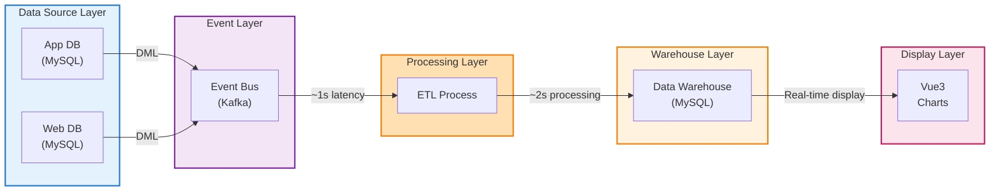
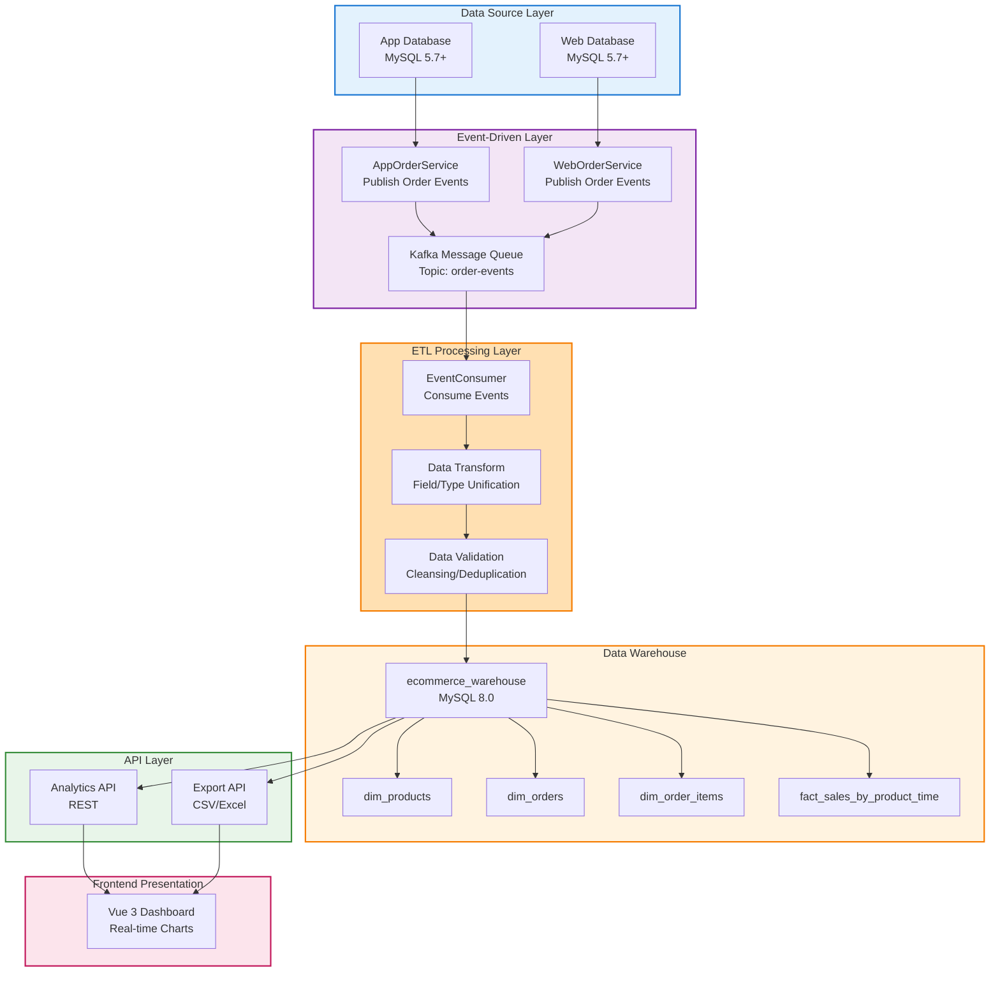
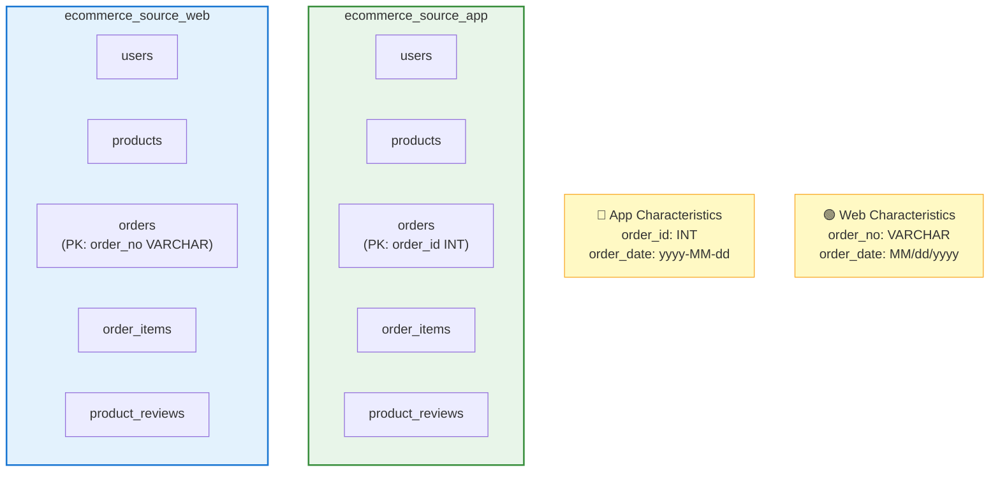
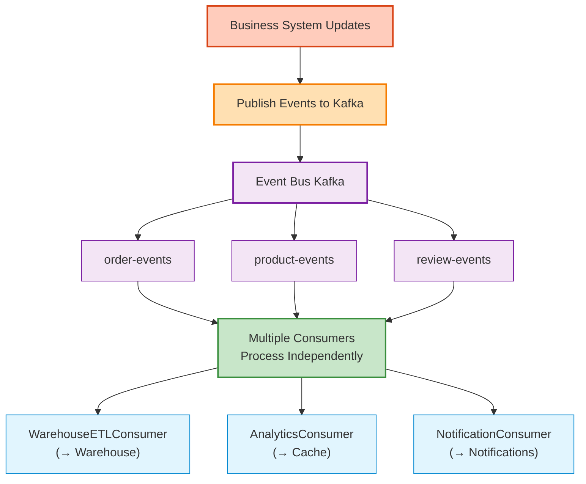
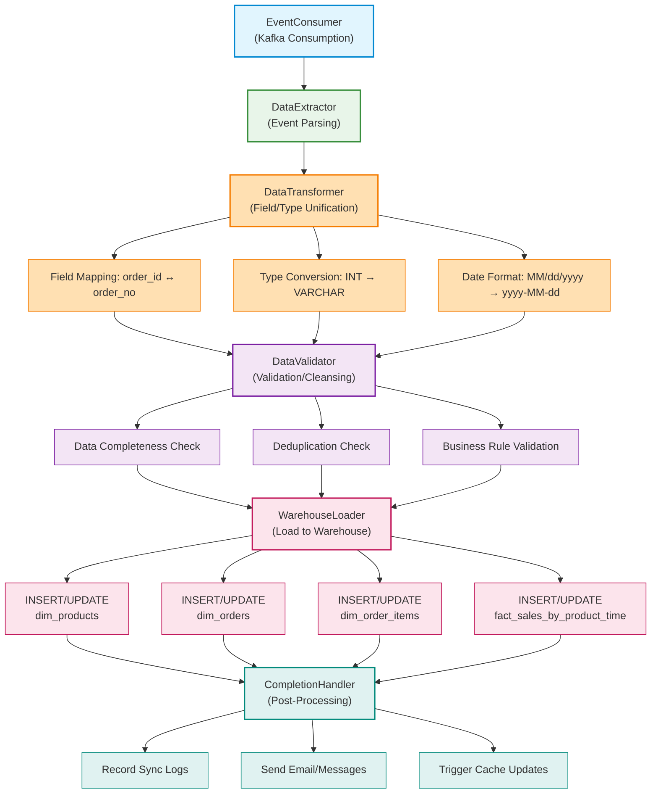
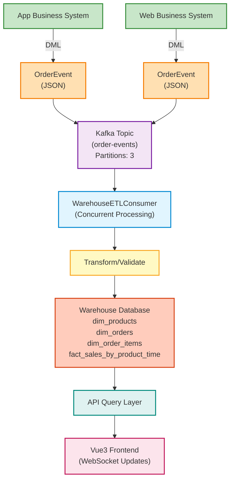
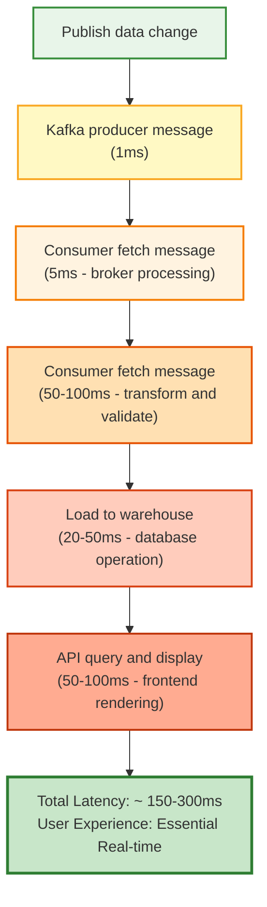
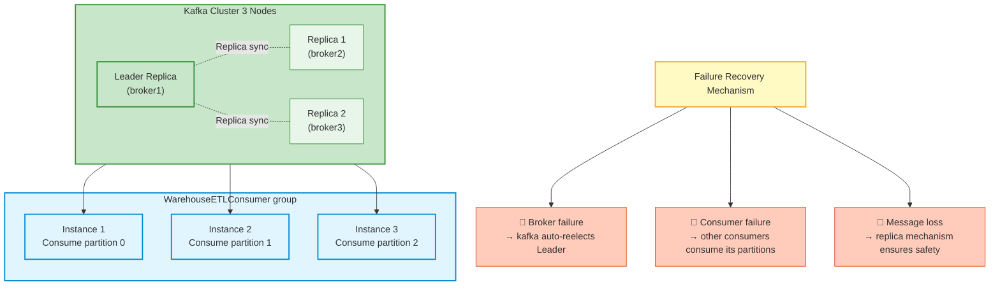

# E-Commerce Data Warehouse - Technical Solution Document

**Project Name:** E-Commerce Data Warehouse System  
**Version:** 1.0  
**Date:** 2026  
**Status:** Final Solution

---

## 📋 Table of Contents

1. [Project Overview](#project-overview)
2. [Business Architecture](#business-architecture)
3. [Technical Architecture](#technical-architecture)
4. [Technology Stack Selection](#technology-stack-selection)
5. [Layered Design Details](#layered-design-details)
6. [Real-Time Synchronization Solution](#real-time-synchronization-solution)
7. [Deployment Architecture](#deployment-architecture)
8. [Implementation Steps](#implementation-steps)
9. [Risk Management](#risk-management)

---

## Project Overview

### Objectives

Build a real-time data warehouse system that **synchronizes data in real-time** from two heterogeneous business sources (App and Web), performs data cleaning and ETL processing, and ultimately supports two core analytics requirements: sales analysis and product reviews ranking.

### Core Features

- 🔄 **Real-Time Sync**: Event-driven architecture with sub-second response times
- 🔗 **Heterogeneous Data Integration**: Unified handling of App (INT/DATE) and Web (VARCHAR/STRING) data formats
- 📊 **Multi-Dimensional Analytics**: Support for sales analysis by category and time, product review rankings
- 🏗️ **Scalable Architecture**: Modular design, easy to add new business requirements
- 🚀 **High Availability Deployment**: Containerized deployment with support for rapid scaling

---

## Business Architecture



---

## Technical Architecture

### High-Level Architecture Diagram



### Layer 1: Data Source Layer



### Layer 2: Event-Driven Layer ⭐ Core Innovation



### Layer 3: ETL Processing Layer



The actual warehouse tables are: `dim_products`, `dim_orders`, `dim_order_items`, and `fact_sales_by_product_time`.

---

## Technology Stack Selection

### Recommended Technology Stack

| Layer                    | Component            | Technology     | Version | Rationale                         |
| ------------------------ | -------------------- | -------------- | ------- | --------------------------------- |
| **Backend Framework**    | App Server           | Spring Boot    | 3.0+    | Mature, comprehensive ecosystem   |
| **ORM Framework**        | Data Access          | MyBatis-Plus   | 3.5+    | Powerful, easy to learn           |
| **Message Queue**        | Event Bus            | Apache Kafka   | 3.x     | High throughput, reliability      |
| **Event Framework**      | Event Processing     | Spring Kafka   | 3.0+    | Spring ecosystem integration      |
| **Caching**              | Hot Data Cache       | Redis          | 7.0+    | Best performance (Optional)       |
| **Database**             | Data Storage         | MySQL          | 8.0+    | Best reliability                  |
| **Frontend Framework**   | Web App              | Vue 3          | 3.3+    | Easy to use, efficient            |
| **Charting Library**     | Data Visualization   | ECharts        | 5.4+    | Feature-rich, royalty-free        |
| **UI Component Library** | UI Components        | Ant Design Vue | 4.0+    | Enterprise-grade, rich components |
| **Containerization**     | Deployment Tool      | Docker         | 24.0+   | Standardized deployment           |
| **Orchestration Tool**   | Container Management | Docker Compose | 2.20+   | Easy local deployment             |

### Message Queue Comparison

| Comparison       | Kafka                                  | RabbitMQ                   | Redis                | ActiveMQ       |
| ---------------- | -------------------------------------- | -------------------------- | -------------------- | -------------- |
| Throughput       | Ultra-high (1M+/s)                     | Medium (10K/s)             | High (100K/s)        | Medium (10K/s) |
| Latency          | Millisecond                            | Microsecond                | Microsecond          | Millisecond    |
| Reliability      | High (Replication)                     | Ultra-high                 | Medium               | High           |
| Persistence      | Disk Storage                           | Memory + Persistence       | Memory-primary       | Supported      |
| Learning Curve   | Medium                                 | Low                        | Low                  | Medium         |
| Recommendation   | ⭐⭐⭐⭐⭐                             | ⭐⭐⭐⭐                   | ⭐⭐⭐               | ⭐⭐⭐         |
| Selection Reason | ✅ High throughput, scalable consumers | Rich features but overkill | Use for caching only | Obsolete       |

---

## Layered Design Details

### Layer 1: Data Source Layer (Business System Modification)

#### App Business System Modification

```java
// Before modification
@Service
public class AppOrderService {
    @Autowired
    private OrderRepository orderRepository;

    public Order createOrder(Order order) {
        return orderRepository.save(order);
    }
}

// ↓ After modification

@Service
public class AppOrderService {
    @Autowired
    private OrderRepository orderRepository;

    @Autowired
    private KafkaTemplate<String, OrderEvent> kafkaTemplate;

    public Order createOrder(Order order) {
        // 1. Save to local database
        Order savedOrder = orderRepository.save(order);

        // 2. Publish event to Kafka
        OrderEvent event = new OrderEvent(
            "ORDER_CREATED",
            savedOrder,
            "APP",
            LocalDateTime.now()
        );
        kafkaTemplate.send("order-events",
            String.valueOf(savedOrder.getOrderId()),
            event);

        return savedOrder;
    }

    public Order updateOrder(Order order) {
        Order updated = orderRepository.save(order);

        // Publish update event
        OrderEvent event = new OrderEvent(
            "ORDER_UPDATED",
            updated,
            "APP",
            LocalDateTime.now()
        );
        kafkaTemplate.send("order-events",
            String.valueOf(updated.getOrderId()),
            event);

        return updated;
    }
}
```

#### Web Business System Modification (Same Pattern)

```java
@Service
public class WebOrderService {
    @Autowired
    private OrderRepository orderRepository;

    @Autowired
    private KafkaTemplate<String, OrderEvent> kafkaTemplate;

    public Order createOrder(Order order) {
        Order savedOrder = orderRepository.save(order);

        OrderEvent event = new OrderEvent(
            "ORDER_CREATED",
            savedOrder,
            "WEB",
            LocalDateTime.now()
        );
        kafkaTemplate.send("order-events",
            savedOrder.getOrderNo(),
            event);

        return savedOrder;
    }
    // ... similar updateOrder method
}
```

#### Event Definition

```java
@Data
@AllArgsConstructor
public class OrderEvent {
    private String eventType;        // ORDER_CREATED, ORDER_UPDATED
    private Order order;
    private String source;           // APP or WEB
    private LocalDateTime timestamp;

    // For serialization
    public static OrderEvent fromJson(String json) {
        return JsonUtils.parse(json, OrderEvent.class);
    }
}
```

### Layer 2: Event-Driven Layer (Message Queue)

#### Kafka Configuration

```yaml
# application.yml
kafka:
  bootstrap-servers: localhost:9092

  producer:
    key-serializer: org.apache.kafka.common.serialization.StringSerializer
    value-serializer: org.springframework.kafka.support.serializer.JsonSerializer
    acks: all
    retries: 3

  consumer:
    bootstrap-servers: localhost:9092
    group-id: warehouse-etl-consumer
    key-deserializer: org.apache.kafka.common.serialization.StringDeserializer
    value-deserializer: org.springframework.kafka.support.serializer.JsonDeserializer
    properties:
      spring.json.trusted.packages: "*"
    max-poll-records: 100

  topics:
    order-events: order-events
    partitions: 3
    replication-factor: 1
```

#### Kafka Topic Creation

```bash
# Create order-events topic
kafka-topics.sh --create \
  --bootstrap-server localhost:9092 \
  --topic order-events \
  --partitions 3 \
  --replication-factor 1 \
  --config retention.ms=604800000
```

### Layer 3: ETL Processing Layer ⭐ Core Processing

#### Event Consumer

```java
@Service
public class WarehouseETLConsumer {

    @Autowired
    private WarehouseService warehouseService;

    @Autowired
    private OrderTransformer orderTransformer;

    @Autowired
    private OrderValidator orderValidator;

    @Autowired
    private WarehouseLoader warehouseLoader;

    @Autowired
    private SyncLogMapper syncLogMapper;

    // Consume order events
    @KafkaListener(
        topics = "order-events",
        groupId = "warehouse-etl-consumer",
        concurrency = "3"
    )
    public void consumeOrderEvent(
        @Payload OrderEvent event,
        @Headers(KafkaHeaders.RECEIVED_PARTITION_ID) int partition,
        @Headers(KafkaHeaders.OFFSET) long offset
    ) {
        try {
            log.info("Consuming order event: {} from partition {}, offset {}",
                event.getEventType(), partition, offset);

            // 1. Extract and transform
            UnifiedOrder unifiedOrder = orderTransformer.transform(event);

            // 2. Validate
            if (!orderValidator.validate(unifiedOrder)) {
                log.error("Order validation failed: {}", unifiedOrder);
                recordSyncLog(event, "VALIDATION_FAILED");
                return;
            }

            // 3. Load to warehouse
            warehouseLoader.load(unifiedOrder);

            // 4. Record sync log
            recordSyncLog(event, "SUCCESS");

            // 5. Send notification (Optional)
            notifySync(event);

        } catch (Exception e) {
            log.error("Error processing order event", e);
            recordSyncLog(event, "ERROR: " + e.getMessage());
        }
    }

    private void recordSyncLog(OrderEvent event, String status) {
        SyncLog log = new SyncLog();
        log.setEventType(event.getEventType());
        log.setSource(event.getSource());
        log.setOrderId(event.getOrder().getId());
        log.setStatus(status);
        log.setSyncTime(LocalDateTime.now());
        syncLogMapper.insert(log);
    }
}
```

#### Data Transformer

```java
@Component
public class OrderTransformer {

    /**
     * Transform raw order event to unified format
     */
    public UnifiedOrder transform(OrderEvent event) {
        Order sourceOrder = event.getOrder();
        UnifiedOrder unified = new UnifiedOrder();

        // Handle order ID (Key transformation)
        if ("APP".equals(event.getSource())) {
            // App: INT → VARCHAR
            unified.setOrderId(String.valueOf(sourceOrder.getOrderId()));
            unified.setSource("APP");
        } else if ("WEB".equals(event.getSource())) {
            // Web: Already VARCHAR
            unified.setOrderId(sourceOrder.getOrderNo());
            unified.setSource("WEB");
        }

        // Handle date format
        if ("APP".equals(event.getSource())) {
            // App already yyyy-MM-dd, use directly
            unified.setOrderDate(sourceOrder.getOrderDate());
        } else {
            // Web: MM/dd/yyyy → yyyy-MM-dd
            LocalDate parsedDate = LocalDate.parse(
                sourceOrder.getOrderDate(),
                DateTimeFormatter.ofPattern("MM/dd/yyyy")
            );
            unified.setOrderDate(parsedDate);
        }

        // Map other fields
        unified.setUserId(sourceOrder.getUserId());
        unified.setTotalAmount(sourceOrder.getTotalAmount());
        unified.setStatus(sourceOrder.getStatus());
        unified.setEventTimestamp(event.getTimestamp());

        return unified;
    }
}
```

#### Data Validator

```java
@Component
public class OrderValidator {

    public boolean validate(UnifiedOrder order) {
        // 1. Required field check
        if (order.getOrderId() == null || order.getOrderId().trim().isEmpty()) {
            log.error("Order ID is empty");
            return false;
        }

        if (order.getUserId() == null) {
            log.error("User ID is empty");
            return false;
        }

        // 2. Amount validation
        if (order.getTotalAmount() == null || order.getTotalAmount().compareTo(BigDecimal.ZERO) < 0) {
            log.error("Invalid order amount: {}", order.getTotalAmount());
            return false;
        }

        // 3. Date validation
        if (order.getOrderDate() == null) {
            log.error("Order date is empty");
            return false;
        }

        // 4. Deduplication check
        if (isDuplicate(order)) {
            log.warn("Duplicate order detected: {}", order.getOrderId());
            return true; // Allow but mark as duplicate
        }

        return true;
    }

    private boolean isDuplicate(UnifiedOrder order) {
        // Check if order exists in warehouse
        Integer count = warehouseMapper.countByOrderId(order.getOrderId());
        return count > 0;
    }
}
```

#### Warehouse Loader

```java
@Component
public class WarehouseLoader {

    @Autowired
    private SalesFactMapper salesFactMapper;

    @Autowired
    private ProductFactMapper productFactMapper;

    public void load(UnifiedOrder order) {
        // Process order items (row-level data)
        for (OrderItem item : order.getItems()) {
            loadSalesFact(order, item);
        }

        // Process reviews (if any)
        if (order.getReviews() != null) {
            for (Review review : order.getReviews()) {
                loadProductFact(review);
            }
        }
    }

    /**
     * Load sales fact table
     */
    private void loadSalesFact(UnifiedOrder order, OrderItem item) {
        LocalDate orderDate = order.getOrderDate();

        SalesFactByCategory fact = new SalesFactByCategory();
        fact.setCategory(item.getProduct().getCategory());
        fact.setYear(orderDate.getYear());
        fact.setMonth(orderDate.getMonthValue());
        fact.setDay(orderDate.getDayOfMonth());
        fact.setQuantity(item.getQuantity());
        fact.setSalesAmount(item.getUnitPrice().multiply(
            new BigDecimal(item.getQuantity())
        ));

        // Use upsert logic
        salesFactMapper.upsert(fact);
    }

    /**
     * Load product fact table
     */
    private void loadProductFact(Review review) {
        LocalDate reviewDate = review.getReviewDate();

        // Calculate product average rating and review count
        AggregatedReview agg = productFactMapper.aggregateReviews(
            review.getProductId(),
            reviewDate.getYear(),
            reviewDate.getMonthValue(),
            reviewDate.getDayOfMonth()
        );

        ProductFactTopRated fact = new ProductFactTopRated();
        fact.setProductId(review.getProductId());
        fact.setProductName(review.getProduct().getName());
        fact.setCategory(review.getProduct().getCategory());
        fact.setAvgRating(agg.getAvgRating());
        fact.setReviewCount(agg.getReviewCount());
        fact.setYear(reviewDate.getYear());
        fact.setMonth(reviewDate.getMonthValue());
        fact.setDay(reviewDate.getDayOfMonth());

        productFactMapper.upsert(fact);
    }
}
```

### Layer 4: Data Warehouse Layer

#### Table Structure

```sql
-- Product Dimension Table
CREATE TABLE `dim_products` (
  `product_key` int NOT NULL AUTO_INCREMENT COMMENT 'Surrogate Key (Business Key: source+product_id)',
  `source` varchar(10) NOT NULL COMMENT 'APP or WEB source',
  `product_id` int NOT NULL COMMENT 'Business Key - Product ID',
  `product_name` varchar(200) NOT NULL COMMENT 'Product Name',
  `category` varchar(50) NOT NULL COMMENT 'Product Category',
  `brand` varchar(50) DEFAULT NULL COMMENT 'Brand',
  `created_at` datetime DEFAULT CURRENT_TIMESTAMP,
  `updated_at` datetime DEFAULT CURRENT_TIMESTAMP ON UPDATE CURRENT_TIMESTAMP,
  PRIMARY KEY (`product_key`),
  UNIQUE KEY `uk_source_product` (`source`,`product_id`),
  KEY `idx_source` (`source`),
  KEY `idx_category` (`category`),
  KEY `idx_brand` (`brand`)
) ENGINE=InnoDB AUTO_INCREMENT=21 DEFAULT CHARSET=utf8mb4 COLLATE=utf8mb4_0900_ai_ci COMMENT='Product Dimension Table';

-- Order Dimension Table
CREATE TABLE `dim_orders` (
  `order_id` int NOT NULL AUTO_INCREMENT COMMENT 'Order ID',
  `source` varchar(10) NOT NULL COMMENT 'APP or WEB',
  `app_order_id` int DEFAULT NULL COMMENT 'App System Order ID',
  `web_order_no` varchar(50) DEFAULT NULL COMMENT 'Web System Order Number',
  `user_id` int NOT NULL COMMENT 'User ID',
  `order_date` date NOT NULL,
  `total_amount` decimal(15,2) NOT NULL,
  `status` varchar(20) DEFAULT 'pending',
  `created_at` datetime DEFAULT CURRENT_TIMESTAMP,
  `updated_at` datetime DEFAULT CURRENT_TIMESTAMP ON UPDATE CURRENT_TIMESTAMP,
  PRIMARY KEY (`order_id`),
  UNIQUE KEY `uk_source_order` (`source`,`app_order_id`,`web_order_no`),
  KEY `idx_source` (`source`),
  KEY `idx_order_date` (`order_date`),
  KEY `idx_user_id` (`user_id`),
  KEY `idx_status` (`status`),
  KEY `idx_source_date` (`source`,`order_date`)
) ENGINE=InnoDB AUTO_INCREMENT=21 DEFAULT CHARSET=utf8mb4 COLLATE=utf8mb4_0900_ai_ci COMMENT='Order Dimension Table (App+Web)';

-- Order Items Dimension Table
CREATE TABLE `dim_order_items` (
  `item_id` int NOT NULL AUTO_INCREMENT COMMENT 'Order Item ID',
  `order_id` int NOT NULL,
  `product_id` int NOT NULL COMMENT 'Product ID',
  `product_name` varchar(200) NOT NULL COMMENT 'Product Name',
  `category` varchar(50) DEFAULT NULL COMMENT 'Product Category',
  `quantity` int NOT NULL DEFAULT '1',
  `unit_price` decimal(10,2) NOT NULL,
  `subtotal` decimal(15,2) NOT NULL,
  `created_at` datetime DEFAULT CURRENT_TIMESTAMP,
  `updated_at` datetime DEFAULT CURRENT_TIMESTAMP ON UPDATE CURRENT_TIMESTAMP,
  PRIMARY KEY (`item_id`),
  KEY `idx_order_id` (`order_id`),
  KEY `idx_product_id` (`product_id`),
  KEY `idx_category` (`category`),
  CONSTRAINT `dim_order_items_ibfk_1` FOREIGN KEY (`order_id`) REFERENCES `dim_orders` (`order_id`) ON DELETE CASCADE
) ENGINE=InnoDB AUTO_INCREMENT=36 DEFAULT CHARSET=utf8mb4 COLLATE=utf8mb4_0900_ai_ci COMMENT='Order Items Dimension Table';

-- Sales Fact Table (By Product and Time)
CREATE TABLE `fact_sales_by_product_time` (
  `fact_id` int NOT NULL AUTO_INCREMENT COMMENT 'Fact Table ID',
  `product_key` int NOT NULL COMMENT 'FK: dim_products.product_key',
  `year` int NOT NULL COMMENT 'Year',
  `month` int NOT NULL COMMENT 'Month',
  `day` int NOT NULL COMMENT 'Day',
  `total_quantity` int NOT NULL COMMENT 'Sales Quantity',
  `total_sales_amount` decimal(15,2) NOT NULL COMMENT 'Sales Amount',
  `created_at` datetime DEFAULT CURRENT_TIMESTAMP,
  `updated_at` datetime DEFAULT CURRENT_TIMESTAMP ON UPDATE CURRENT_TIMESTAMP,
  PRIMARY KEY (`fact_id`),
  UNIQUE KEY `uk_product_time` (`product_key`,`year`,`month`,`day`),
  KEY `idx_product_key` (`product_key`),
  KEY `idx_year_month_day` (`year`,`month`,`day`),
  KEY `idx_date_range` (`year`,`month`),
  CONSTRAINT `fact_sales_by_product_time_ibfk_1` FOREIGN KEY (`product_key`) REFERENCES `dim_products` (`product_key`)
) ENGINE=InnoDB AUTO_INCREMENT=45 DEFAULT CHARSET=utf8mb4 COLLATE=utf8mb4_0900_ai_ci COMMENT='Sales Fact Table (By Product and Time Dimensions)';

-- Sync Log Table (For monitoring and debugging)
CREATE TABLE sync_log (
    id INT PRIMARY KEY AUTO_INCREMENT,
    event_type VARCHAR(50),
    source VARCHAR(20),
    order_id VARCHAR(50),
    status VARCHAR(30),
    error_message TEXT,
    sync_time DATETIME,
    KEY idx_source_time (source, sync_time),
    KEY idx_status (status)
) ENGINE=InnoDB DEFAULT CHARSET=utf8mb4;
```

### Layer 5: API Layer

#### REST API Design

```java
@RestController
@RequestMapping("/api/analytics")
public class AnalyticsController {

    @Autowired
    private AnalyticsService analyticsService;

    /**
     * Get sales analytics data
     */
    @GetMapping("/sales")
    public ResponseEntity<List<SalesAnalysis>> getSalesAnalytics(
        @RequestParam(required = false) String category,
        @RequestParam(required = false) Integer year,
        @RequestParam(required = false) Integer month,
        @RequestParam(required = false) Integer day
    ) {
        List<SalesAnalysis> result = analyticsService.querySalesAnalytics(
            category, year, month, day
        );
        return ResponseEntity.ok(result);
    }

    /**
     * Get top products ranking
     */
    @GetMapping("/top-products")
    public ResponseEntity<List<TopProductAnalysis>> getTopProducts(
        @RequestParam(required = false) String category,
        @RequestParam(required = false) Integer year,
        @RequestParam(required = false) Integer month,
        @RequestParam(defaultValue = "5") Integer limit
    ) {
        List<TopProductAnalysis> result = analyticsService.queryTopProducts(
            category, year, month, limit
        );
        return ResponseEntity.ok(result);
    }

    /**
     * Export data as CSV
     */
    @GetMapping("/export/sales")
    public void exportSalesData(
        HttpServletResponse response,
        @RequestParam(required = false) Integer year
    ) throws IOException {
        response.setContentType("text/csv;charset=UTF-8");
        response.setHeader("Content-Disposition",
            "attachment;filename=sales_data.csv");

        List<SalesAnalysis> data = analyticsService.querySalesAnalytics(
            null, year, null, null
        );

        String csv = analyticsService.convertToCSV(data);
        response.getWriter().write(csv);
    }
}

@Service
public class AnalyticsService {

    @Autowired
    private SalesFactMapper salesFactMapper;

    @Autowired
    private ProductFactMapper productFactMapper;

    public List<SalesAnalysis> querySalesAnalytics(
        String category, Integer year, Integer month, Integer day
    ) {
        return salesFactMapper.querySalesAnalytics(
            category, year, month, day
        );
    }

    public List<TopProductAnalysis> queryTopProducts(
        String category, Integer year, Integer month, Integer limit
    ) {
        return productFactMapper.queryTopProducts(
            category, year, month, limit
        );
    }
}
```

### UI Function - Backend API - Database Table Mapping

The table below is aligned with the current frontend routes and page functions for easier integration and troubleshooting.

| UI / Feature     | Frontend Entry    | Backend API(s)                                                                                                                                                                                                            | Main Database Tables                                                                                                                                                                                                                                    |
| ---------------- | ----------------- | ------------------------------------------------------------------------------------------------------------------------------------------------------------------------------------------------------------------------- | ------------------------------------------------------------------------------------------------------------------------------------------------------------------------------------------------------------------------------------------------------- |
| Dashboard Home   | `/`               | `GET /api/analytics/sales/summary`, `GET /api/analytics/sales/by-date`                                                                                                                                                    | `dim_orders`, `dim_order_items`                                                                                                                                                                                                                         |
| Sales Analytics  | `/sales`          | `GET /api/analytics/sales/by-category`                                                                                                                                                                                    | `dim_orders`, `dim_order_items`                                                                                                                                                                                                                         |
| Product Insights | `/products`       | `GET /api/analytics/products/top-rated`                                                                                                                                                                                   | `dim_products`, `dim_order_items`, `dim_orders`                                                                                                                                                                                                         |
| Sync Monitor     | `/sync`           | `GET /api/analytics/sync/statistics`, `GET /api/analytics/sync/logs`                                                                                                                                                      | `sync_log`                                                                                                                                                                                                                                              |
| Unified Orders   | `/orders`         | `GET /api/unified-orders`, `GET /api/unified-orders/{id}`, `GET /api/unified-orders/overview`, `GET /api/unified-orders/stats/by-source`, `GET /api/unified-orders/stats/product-sales`                                   | `dim_orders`, `dim_order_items`, `dim_products`                                                                                                                                                                                                         |
| OLAP Analytics   | `/olap`           | `GET /api/unified-orders/analytics/rollup`, `GET /api/unified-orders/analytics/drilldown`, `GET /api/unified-orders/analytics/slice`, `GET /api/unified-orders/analytics/dice`, `GET /api/unified-orders/analytics/pivot` | `fact_sales_by_product_time`, `dim_products`                                                                                                                                                                                                            |
| Data Input Page  | `data-input.html` | `POST /api/data/import/products`, `POST /api/data/import/orders`, `POST /api/data/import/orders/sync`                                                                                                                     | `ecommerce_source_app.products`, `ecommerce_source_app.orders`, `ecommerce_source_app.order_items`, `ecommerce_source_web.products`, `ecommerce_source_web.orders`, `ecommerce_source_web.order_items`, `dim_products`, `dim_orders`, `dim_order_items` |

#### Notes

- The Dashboard page also subscribes to `/topic/warehouse-updates` via WebSocket for real-time status, but that is a message channel rather than a database table.
- `Product Insights` currently renders ratings derived from warehouse sales metrics instead of reading the `product_reviews` table directly.
- `Unified Orders` and `OLAP Analytics` are both powered by warehouse data, primarily `fact_sales_by_product_time` together with the dimension tables `dim_orders`, `dim_order_items`, and `dim_products`.

### Layer 6: Frontend Presentation Layer

#### Vue3 Component Structure

```typescript
// src/pages/Dashboard.vue
<template>
  <div class="dashboard">
    <!-- Sales Analysis -->
    <div class="sales-section">
      <div class="filters">
        <RangeSelector v-model="dateRange" />
        <CategoryFilter v-model="selectedCategory" />
      </div>

      <div class="charts">
        <Heatmap :data="salesHeatmapData" />
        <BarChart :data="salesBarChartData" />
      </div>
    </div>

    <!-- Top Products Ranking -->
    <div class="products-section">
      <ProductRankingTable
        :products="topProducts"
        :loading="loading"
      />
    </div>

    <!-- Real-Time Sync Status -->
    <div class="sync-status">
      <SyncMonitor :status="syncStatus" />
    </div>
  </div>
</template>

<script setup lang="ts">
import { ref, onMounted, onBeforeUnmount } from 'vue'
import { AnalyticsAPI } from '@/api/analytics'
import { WebSocketService } from '@/services/websocket'

const salesHeatmapData = ref([])
const salesBarChartData = ref([])
const topProducts = ref([])
const syncStatus = ref({})

// Real-time updates via WebSocket
const wsService = new WebSocketService()

onMounted(() => {
  // Initial data load
  loadAnalyticsData()

  // Subscribe to real-time updates
  wsService.subscribe('/topic/warehouse-updates', (event) => {
    syncStatus.value = event
    // Refresh data
    loadAnalyticsData()
  })
})

const loadAnalyticsData = async () => {
  const sales = await AnalyticsAPI.getSalesAnalytics()
  salesHeatmapData.value = transformToHeatmap(sales)
  salesBarChartData.value = transformToBarChart(sales)

  const products = await AnalyticsAPI.getTopProducts()
  topProducts.value = products
}

onBeforeUnmount(() => {
  wsService.disconnect()
})
</script>
```

---

## Real-Time Synchronization Solution

### Architecture Process Flow



### Key Features

| Feature                      | Description                                                    | Benefit                        |
| ---------------------------- | -------------------------------------------------------------- | ------------------------------ |
| **Event-Driven**             | Business system publishes events immediately upon data changes | Zero latency perception        |
| **Message Queue Decoupling** | Kafka acts as event bus                                        | Loose coupling between systems |
| **Scalable Consumers**       | Multiple independent consumers                                 | Easy to add new requirements   |
| **Concurrent Processing**    | 3 partitions concurrent consumption                            | High throughput capability     |
| **Real-Time Notifications**  | WebSocket push to frontend                                     | Instant user feedback          |

### End-to-End Latency Analysis



### High Availability Design



---

## Deployment Architecture

### Docker Compose Configuration

```yaml
version: "3.8"

services:
  # Kafka
  zookeeper:
    image: confluentinc/cp-zookeeper:7.4.0
    environment:
      ZOOKEEPER_CLIENT_PORT: 2181
    ports:
      - "2181:2181"
    networks:
      - warehouse-network

  kafka:
    image: confluentinc/cp-kafka:7.4.0
    depends_on:
      - zookeeper
    ports:
      - "9092:9092"
    environment:
      KAFKA_BROKER_ID: 1
      KAFKA_ZOOKEEPER_CONNECT: zookeeper:2181
      KAFKA_ADVERTISED_LISTENERS: PLAINTEXT://kafka:29092,PLAINTEXT_HOST://kafka:9092
      KAFKA_LISTENER_SECURITY_PROTOCOL_MAP: PLAINTEXT:PLAINTEXT,PLAINTEXT_HOST:PLAINTEXT
      KAFKA_INTER_BROKER_LISTENER_NAME: PLAINTEXT
      KAFKA_OFFSETS_TOPIC_REPLICATION_FACTOR: 1
      KAFKA_CREATE_TOPICS: "order-events:3:1"
    networks:
      - warehouse-network

  # MySQL Databases
  app-db:
    image: mysql:8.0
    environment:
      MYSQL_DATABASE: ecommerce_source_app
      MYSQL_ROOT_PASSWORD: root
    ports:
      - "3306:3306"
    volumes:
      - app-db-data:/var/lib/mysql
      - ./sql/app-schema.sql:/docker-entrypoint-initdb.d/schema.sql
    networks:
      - warehouse-network

  web-db:
    image: mysql:8.0
    environment:
      MYSQL_DATABASE: ecommerce_source_web
      MYSQL_ROOT_PASSWORD: root
    ports:
      - "3307:3306"
    volumes:
      - web-db-data:/var/lib/mysql
      - ./sql/web-schema.sql:/docker-entrypoint-initdb.d/schema.sql
    networks:
      - warehouse-network

  warehouse-db:
    image: mysql:8.0
    environment:
      MYSQL_DATABASE: ecommerce_warehouse
      MYSQL_ROOT_PASSWORD: root
    ports:
      - "3308:3306"
    volumes:
      - warehouse-db-data:/var/lib/mysql
      - ./sql/warehouse-schema.sql:/docker-entrypoint-initdb.d/schema.sql
    networks:
      - warehouse-network

  # Redis (Optional)
  redis:
    image: redis:7-alpine
    ports:
      - "6379:6379"
    networks:
      - warehouse-network

  # Spring Boot Application
  backend:
    build:
      context: ./backend
      dockerfile: Dockerfile
    ports:
      - "8080:8080"
    depends_on:
      - kafka
      - app-db
      - web-db
      - warehouse-db
      - redis
    environment:
      SPRING_KAFKA_BOOTSTRAP_SERVERS: kafka:29092
      SPRING_DATASOURCE_URL_APP: jdbc:mysql://app-db:3306/ecommerce_source_app
      SPRING_DATASOURCE_URL_WEB: jdbc:mysql://web-db:3306/ecommerce_source_web
      SPRING_DATASOURCE_URL_WAREHOUSE: jdbc:mysql://warehouse-db:3306/ecommerce_warehouse
      SPRING_REDIS_HOST: redis
    networks:
      - warehouse-network
    healthcheck:
      test: ["CMD", "curl", "-f", "http://localhost:8080/actuator/health"]
      interval: 10s
      timeout: 5s
      retries: 5

  # Vue3 Frontend
  frontend:
    build:
      context: ./frontend
      dockerfile: Dockerfile
    ports:
      - "5173:5173"
    depends_on:
      - backend
    networks:
      - warehouse-network

  # Nginx Proxy (Optional)
  nginx:
    image: nginx:latest
    ports:
      - "80:80"
    volumes:
      - ./nginx.conf:/etc/nginx/nginx.conf:ro
    depends_on:
      - backend
      - frontend
    networks:
      - warehouse-network

volumes:
  app-db-data:
  web-db-data:
  warehouse-db-data:

networks:
  warehouse-network:
    driver: bridge
```

---

## Implementation Steps

### Phase 1: Environment Setup (Week 1)

```bash
# Step 1: Initialize project structure
mkdir -p ecommerce-warehouse/{backend,frontend,infra}
cd ecommerce-warehouse

# Step 2: Initialize Spring Boot project
spring boot:create \
  --name warehouse-backend \
  --dependencies=web,kafka,mysql,mybatis,redis

# Step 3: Initialize Vue3 frontend
npm create vite@latest warehouse-frontend -- --template vue-ts

# Step 4: Start Docker containers
docker-compose up -d

# Step 5: Create databases and tables
mysql -h 127.0.0.1 -u root -p < sql/app-schema.sql
mysql -h 127.0.0.1 -u root -p < sql/web-schema.sql
mysql -h 127.0.0.1 -u root -p < sql/warehouse-schema.sql
```

### Phase 2: Backend Development (Week 2-3)

```bash
# Step 1: Add Kafka dependency
# pom.xml
<dependency>
    <groupId>org.springframework.kafka</groupId>
    <artifactId>spring-kafka</artifactId>
</dependency>

# Step 2: Implement event classes
# src/main/java/com/example/event/OrderEvent.java
# src/main/java/com/example/event/ReviewEvent.java

# Step 3: Implement producers (in App and Web services)
# src/main/java/com/example/service/AppOrderService.java
# src/main/java/com/example/service/WebOrderService.java

# Step 4: Implement consumer
# src/main/java/com/example/consumer/WarehouseETLConsumer.java

# Step 5: Implement transformation, validation, loading
# src/main/java/com/example/transformer/OrderTransformer.java
# src/main/java/com/example/validator/OrderValidator.java
# src/main/java/com/example/loader/WarehouseLoader.java

# Step 6: Implement API layer
# src/main/java/com/example/controller/AnalyticsController.java
# src/main/java/com/example/service/AnalyticsService.java

# Step 7: Test
mvn test
```

### Phase 3: Frontend Development (Week 4)

```bash
cd warehouse-frontend

# Step 1: Install dependencies
npm install
npm install echarts ant-design-vue axios pinia ws

# Step 2: Create API layer
# src/api/analytics.ts

# Step 3: Create WebSocket service
# src/services/websocket.ts

# Step 4: Create components
# src/components/SalesAnalytics.vue
# src/components/TopProducts.vue
# src/components/SyncMonitor.vue

# Step 5: Create pages
# src/pages/Dashboard.vue

# Step 6: Run dev server
npm run dev
```

### Phase 4: Testing and Optimization (Week 5)

```bash
# Step 1: Performance testing
jmeter -t test/warehouse-load-test.jmx

# Step 2: Integration testing
mvn integration-test

# Step 3: Configure monitoring
# Configure Prometheus + Grafana

# Step 4: Write documentation
# Deployment docs, API docs, operations manual

# Step 5: Production deployment
docker-compose -f docker-compose.prod.yml up -d
```

---

## Risk Management

### Technical Risks

| Risk                      | Impact                 | Probability | Mitigation                                 |
| ------------------------- | ---------------------- | ----------- | ------------------------------------------ |
| **Kafka Message Loss**    | Data out of sync       | Medium      | ✅ Configure replication factor=3, ACK=all |
| **Consumer Lag**          | Slow warehouse updates | Low         | ✅ Increase consumer concurrency           |
| **Database Performance**  | Slow writes            | Medium      | ✅ Optimize indexes, batch inserts         |
| **Network Partition**     | Kafka split            | Low         | ✅ Cluster monitoring and alerts           |
| **Duplicate Consumption** | Data duplication       | Medium      | ✅ Implement idempotency or deduplication  |

### Business Risks

| Risk                                      | Impact               | Mitigation                                      |
| ----------------------------------------- | -------------------- | ----------------------------------------------- |
| **Source System Modification Difficulty** | Implementation delay | Early communication, provide modification guide |
| **Data Format Incompatibility**           | ETL failures         | Thorough testing, reserved compatibility fields |
| **Low User Adoption**                     | Project failure      | Regular demos, collect feedback                 |

### Emergency Plans

```
If Kafka fails:
→ Auto-failover to backup Kafka cluster
→ Buffer messages to local queue
→ Auto-sync after recovery

If consumer fails:
→ Other consumers auto-take over partitions
→ Resume consumption from offset

If database fails:
→ Messages retained in Kafka (configurable retention)
→ Re-consume after database recovery

If real-time performance degrades:
→ Fallback to batch sync mode (every minute)
→ Notify ops team
```

---

## Monitoring and Alerting

### Key Metrics

```yaml
# Kafka Metrics
- message.produce.rate: Message production rate
- message.consume.lag: Consumer lag
- broker.disk.usage: Broker disk usage

# Application Metrics
- etl.process.time: ETL processing time
- etl.success.rate: ETL success rate
- warehouse.insert.count: Warehouse write count

# Database Metrics
- db.connection.pool.size: Connection pool size
- db.query.duration: Query duration
- db.replication.lag: Replication lag
```

### Alert Rules

```yaml
- alert: KafkaLagTooHigh
  expr: kafka_consumer_lag > 10000
  for: 5m

- alert: ETLProcessTimeHigh
  expr: etl_process_time_ms > 5000
  for: 10m

- alert: WarehouseSyncFailureRate
  expr: rate(etl_failures_total[5m]) > 0.01
  for: 5m
```

---

## Summary

### Project Highlights

✅ **Event-Driven Architecture** - Complete system decoupling  
✅ **Real-Time Sync Capability** - Sub-second data latency  
✅ **High Availability Design** - Multi-replica auto-failover  
✅ **Scalable Framework** - Easy to add data sources or consumers  
✅ **Complete Monitoring** - Operational visibility and debugging

### Future Optimization Directions

1. **Upgrade to Microservices** - Domain-driven decomposition
2. **Add Stream Processing** - Use Flink for complex analytics
3. **Multi-Cloud Expansion** - Cross-region disaster recovery
4. **AI Integration** - Predictive analytics

---

**Document Update Frequency**: Quarterly  
**Maintenance Responsibility**: Data Warehouse Team  
**Last Updated**: 2024
