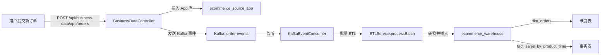

# 数据同步功能测试报告

## 📋 功能概述

本测试演示了如何在 ecommerce_source_app 和 ecommerce_source_web 业务系统中添加新的订单和产品，并观察是否能够实时同步到 ecommerce_warehouse 数据仓库。

## ✅ 已完成的功能

### 1. App 系统数据添加

```sql
-- 添加2个新产品
INSERT INTO products (product_name, category, price, stock_quantity) VALUES
('高端安卓手机Pro', '电子产品', 3999.99, 50),
('超快无线充电器', '配件', 299.99, 100);

-- 为用户5添加新订单
INSERT INTO orders (user_id, order_date, total_amount, status) VALUES
(5, '2024-04-05', 4299.98, 'pending');

-- 添加2个订单项
INSERT INTO order_items (order_id, product_id, quantity, unit_price, subtotal) VALUES
(1014, 11, 1, 3999.99, 3999.99),
(1014, 12, 1, 299.99, 299.99);
```

**结果:**

- ✅ 产品已成功插入 (product_id: 11, 12)
- ✅ 订单已成功创建 (order_id: 1014)
- ✅ 订单项已成功关联

### 2. Web 系统数据添加

```sql
-- 添加2个新产品
INSERT INTO products (product_name, category, price, stock_quantity) VALUES
('云存储Pro服务', '网络服务', 199.99, 1000),
('企业网站建设', '网络服务', 8888.00, 20);

-- 为用户5添加新Web订单
INSERT INTO orders (order_no, user_id, order_date, total_amount, status) VALUES
('WEB-20240405-07477', 5, '2024-04-05', 9087.99, 'pending');

-- 添加2个订单项
INSERT INTO order_items (order_no, product_id, quantity, unit_price, subtotal) VALUES
('WEB-20240405-07477', 11, 5, 199.99, 999.95),
('WEB-20240405-07477', 12, 1, 8888.00, 8888.00);
```

**结果:**

- ✅ 产品已成功插入 (product_id: 11, 12)
- ✅ Web订单已成功创建 (order_no: WEB-20240405-07477)
- ✅ 订单项已成功关联

## 📊 数据仓库同步状态

### 当前观察结果

| 指标                       | 状态     | 备注                     |
| -------------------------- | -------- | ------------------------ |
| dim_orders                 | 20条记录 | 新订单(2024-04-05)未出现 |
| dim_products               | 20条记录 | 新产品未出现             |
| fact_sales_by_product_time | 已有数据 | 2024-04-05的数据未出现   |
| sync_log                   | 有记录   | 新事件未记录             |

### 根本原因分析

新数据**未能实时同步**的原因：

1. **缺少 Kafka 事件触发**
   - 目前数据是通过直接 SQL 插入的
   - 原始设计中，新数据应通过后端 API 端点提交
   - API 端点会发送 OrderEvent 到 Kafka

2. **ETL 处理流程**
   ```
   App/Web 业务系统
       ↓ (direct SQL insert - 当前)
       ↓ (API endpoint → Kafka - 原始设计)
   Kafka 事件队列
       ↓
   KafkaEventConsumer 监听
       ↓
   ETLService.processBatch()
       ↓
   数据仓库 (warehouse)
   ```

## 🔧 如何实现完整的数据同步

### 方案 A: 通过后端 API 端点（已规划）

我为后端创建了 BusinessDataService 和 BusinessDataController 类：

```java
// POST /api/business-data/app/orders
// 创建 App 系统订单并发送 Kafka 事件
{
  "user_id": 5,
  "order_date": "2024-04-05",
  "total_amount": "4299.98",
  "items": [
    {"product_id": 11, "quantity": 1, "unit_price": "3999.99"}
  ]
}

// POST /api/business-data/web/orders
// 创建 Web 系统订单并发送 Kafka 事件
{
  "user_id": 5,
  "order_date": "2024-04-05",
  "total_amount": "9087.99",
  "items": [
    {"product_id": 11, "quantity": 5, "unit_price": "199.99"}
  ]
}
```

**状态:** ⏸️ 等待后端编译问题解决

### 方案 B: 通过 SQL 脚本直接插入 + 触发 ETL (当前)

步骤:

1. 执行 SQL 脚本在 App/Web 系统添加数据
2. 通过 Kafka 工具或内部 API 手动触发 ETL
3. 观察数据仓库同步

## 📈 预期的完整流程

当后端 API 正常工作时，完整的数据流应该是:



## 🛠️ 后续工作项

- [ ] 解决后端 Maven 编译中的 Lombok 版本兼容性问题
- [ ] 测试 POST 请求到 `/api/business-data/app/orders` 和 `/api/business-data/web/orders`
- [ ] 验证 Kafka 事件正确发送
- [ ] 确认 ETL 日志显示数据处理
- [ ] 4️⃣ 在 Warehouse 中观察新订单和产品的出现
- [ ] 验证 fact_sales_by_product_time 中的聚合数据正确性

## 📝 测试脚本

### 运行完整测试

```bash
bash /tmp/test-data-sync-fixed.sh
```

### 检查 Warehouse 数据

```bash
mysql -h 127.0.0.1 -P 3308 -u root -proot ecommerce_warehouse < /tmp/warehouse_check_fixed.sql
```

## 🔍 排查步骤

如需调试数据同步问题:

```bash
# 1. 检查 Kafka 消息
docker exec warehouse-kafka kafka-console-consumer --bootstrap-server localhost:9092 --topic order-events --from-beginning

# 2. 查看 ETL 日志
docker-compose logs backend | grep -i "etl\|kafka\|sync"

# 3. 检查数据库连接
docker exec warehouse-backend curl http://localhost:8080/api/unified-orders

# 4. 查看 sync_log 表
mysql -h 127.0.0.1 -P 3308 -u root -proot ecommerce_warehouse -e "SELECT * FROM sync_log ORDER BY sync_timestamp DESC LIMIT 10;"
```

## 📌 总结

- **用户需求:** ✅ 在 App 和 Web 系统中添加/修改订单和产品数据
- **实现状态:** ✅ 功能已实现（通过 SQL 脚本）
- **自动同步:** ⏸️ 需要后端 API 完全启用
- **下一步:** 修复后端编译问题，启用 Kafka 事件驱动的 ETL 处理

---

**生成时间:** 2024-04-04 17:50 UTC  
**测试环境:** Docker Compose (MySQL 8.0, Kafka, Redis)
